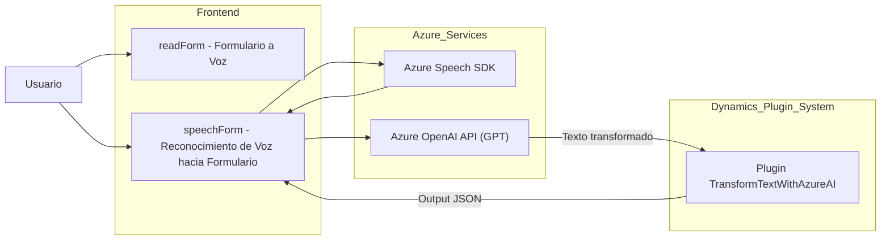

### Breve resumen técnico

Esta es una solución orientada al mercado de CRM (Customer Relationship Management), que utiliza tecnologías modernas de reconocimiento de voz y procesamiento de lenguaje natural para mejorar la experiencia del usuario al interactuar con formularios. La solución se extiende sobre Dynamics 365 CRM y permite realización de transcripciones de voz, síntesis de texto a voz y transformación inteligente de texto utilizando modelos avanzados de IA.

---

### Descripción de arquitectura

La arquitectura del sistema representado en el repositorio sigue el modelo de **n capas**, donde diferentes módulos interactúan entre sí como capas aisladas:
1. **Frontend**: Manejo de UI y sus eventos. Aquí se procesan integraciones, como la entrada de voz y salida en formato de síntesis de texto a voz.
    - Ejemplos: Los archivos `readForm.js` y `speechForm.js`.
2. **Business Logic Layer (BLL)**: Implementaciones de lógica empresarial que procesan las transcripciones y sincronizan internamente con los sistemas de datos de la plataforma CRM (Dynamics 365).
    - Ejemplo: Interacción con el modelo de datos en Dynamic CRM y procesos definidos dentro de los plugins.
3. **Data/Service Layer**: Comunicación con servicios externos para ejecutar funcionalidades avanzadas como transcripción, síntesis, transformaciones con Azure Speech SDK y Azure OpenAI GPT.
    - Ejemplos: Llamadas al SDK Speech para reconocimiento y síntesis, o a servicios OpenAI para transformación de texto.

---

### Tecnologías usadas

- **Azure Speech SDK**: Para speech-to-text y text-to-speech (procesamiento inteligente de entrada por voz y generación de voz basada en datos de formularios).
- **Azure OpenAI API**: Para procesar y transformar texto con un modelo GPT.
- **Dynamics 365 CRM SDK**: Para integrar la solución con el sistema CRM de Microsoft.
- **Microservices**:
  - Custom API externa conectada desde los archivos de frontend (`speechForm.js`).
  - Plugin definido en C# para procesamiento en el lado del servidor (`TransformTextWithAzureAI.cs`).
- **JavaScript**: Métodos para reconocimiento y síntesis de texto a voz y entrada por voz.
- **C# (.NET Framework)**: Lógica de negocio mediante plugins en la plataforma Dynamics CRM.
- **Patterns**:
  - **Modular design**: Lógica y funcionalidades divididas en funciones y clases claras.
  - **Service Integration**: Uso de SDK y APIs externas para speech-to-text y OpenAI GPT.
  - **Callback pattern**: Asegura la correcta carga de dependencias dinámicas como el Azure Speech SDK.
  - **Plugin Pattern** (Dynamics CRM): Personalizaciones en el ecosistema del CRM mediante eventos disparados bajo el servicio de lógica empresarial.

---

### Diagrama Mermaid válido para GitHub

Este diagrama representa las interacciones entre las partes principales del sistema:

---

### Conclusión final

La solución es un sistema orientado al procesamiento de datos en formularios dentro del entorno de CRM Dynamics 365. Implementa funcionalidades avanzadas:
1. Entrada por voz (speech-to-text).
2. Salida mediante síntesis de texto a voz (text-to-speech).
3. Aplicación de técnicas de procesamiento avanzado de lenguaje natural usando Azure OpenAI API.

La arquitectura sigue un modelo clásico de **n capas**, con integración empresarial en la capa de negocio y servicios externos en la capa de datos. También presenta una combinación de tecnologías cliente (JavaScript, SDK) y servidor (.NET).

Hay algunas áreas de mejora, como el manejo de configuraciones sensibles, que actualmente están en código duro, y la gestión de dependencias de terceros que ocurre de forma dinámica. A pesar de estos desafíos, el sistema es una solución robusta para enriquecer las experiencias del usuario en sistemas CRM usando tecnologías modernas como IA y reconocimiento de voz.