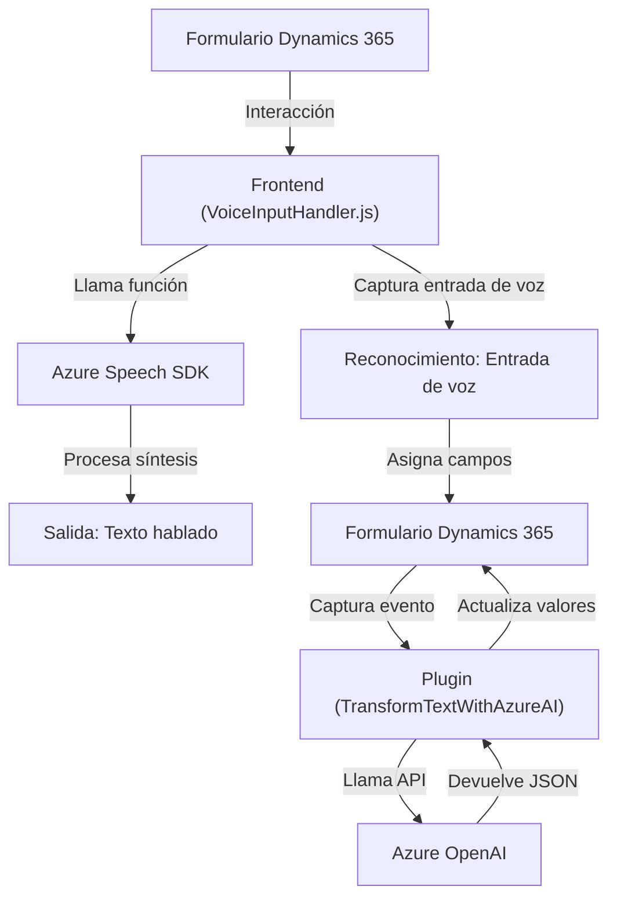

### Breve resumen técnico  
El repositorio contiene múltiples componentes relacionados con **Dynamics 365** para proporcionar funcionalidades avanzadas como entrada y salida de voz, reconocimiento de datos desde formularios y transformación estructurada a través de inteligencia artificial. Utiliza tecnologías como **Azure Speech SDK**, **Dynamics 365 Web API**, y **Azure OpenAI** para crear soluciones integradas y extensibles.

---

### Descripción de arquitectura  
#### Tipo de solución  
- **Híbrida**: El repositorio incluye funcionalidades cliente (frontend en JavaScript) y componentes backend (plugins de Dynamics CRM en C#).
- Está diseñada para integrarse con **Dynamics 365**, actuando en formularios como complementos o extensiones mediante eventos y plugins.

#### Tipo de arquitectura  
1. **Frontend (JavaScript)**: Este se centra en la interacción directa del usuario y provee acceso a servicios de voz y APIs externas. Adopta una arquitectura basada en componentes modulares acoplados mediante eventos.
2. **Backend (C# Plugin)**: Sigue un patrón de arquitectura extensible para CRM, utilizando el **modelo de plugin** de Dynamics 365.

---

### Tecnologías usadas  
- **Frontend:**
  - JavaScript.
  - **Azure Speech SDK**: Síntesis y reconocimiento de voz.
  - Dynamics 365 JavaScript SDK (`Xrm` variable).

- **Backend:**
  - C# (.NET Framework).
  - Dynamics CRM Plugin SDK.
  - **Azure OpenAI** para transformación de texto.

- **Comunes:**  
  Uso de servicios API para microtransacciones como síntesis de voz, procesamiento de transcripciones y transformación de texto.

#### Patrón/Principios utilizados  
- **Separación de responsabilidades**:
  - El código está dividido entre tareas específicas: manejo de datos visibles del formulario, carga de SDKs, y procesamiento de eventos.
- **Arquitectura orientada a microservicios externos**:
  - Conexiones a APIs como Azure Speech y Azure OpenAI.
- **Dependencias de SDK externos**:
  - Uso explícito de Azure Speech SDK y Dynamics Web API.

---

### Dependencias o componentes externos  
#### Identificados en el análisis:  
1. **Azure Speech SDK**: Para síntesis y reconocimiento de voz.  
2. **Dynamics 365 Web API / SDK**: Ver `Xrm` y ejecución de operaciones API o queries basados en plugin.  
3. **Azure OpenAI API**: Para transformar texto en JSON estructurado.  

#### Potencial adicional:  
- **HTML/CSS Frameworks**: Podría usarse en el frontend para mejorar las interfaces de usuario.
- **React/Vue/Angular** (sin confirmar): Posibles frameworks si el frontend se expande hacia SPA (Single Page Application).
- **Responsabilidad de access keys**: Azure tiene dependencias críticas como las claves (`azureKey`, `azureRegion`), cuya gestión debe ser tratada con seguridad.

---

### Diagrama Mermaid válido para GitHub

---

### Conclusión final  
El repositorio implementa una solución modular e híbrida que integra frontend basado en JavaScript con backend extensible de Dynamics CRM (C# Plugins). Utiliza una arquitectura orientada a eventos y se basa en la comunicación con microservicios externos (como Azure Speech y Azure OpenAI API). Si bien la estructura de los archivos está bien definida, algunos puntos podrían optimizarse:  
1. **Gestión de seguridad**: Evitar claves definidas como valores fijos en el código, empleando soluciones como Azure Key Vault.  
2. **Manejo de errores**: Robustecer el código en el frontend y backend, especialmente para conexiones fallidas con servicios externos.  
3. **Modularización avanzada**: Separar componentes específicos en el frontend para facilitar la escalabilidad y mantenimiento.  

Si se implementan correctamente, las funcionalidades integradas de voz e IA pueden generar una experiencia dinámica y personalizada para los usuarios que trabajan con Dynamics 365.