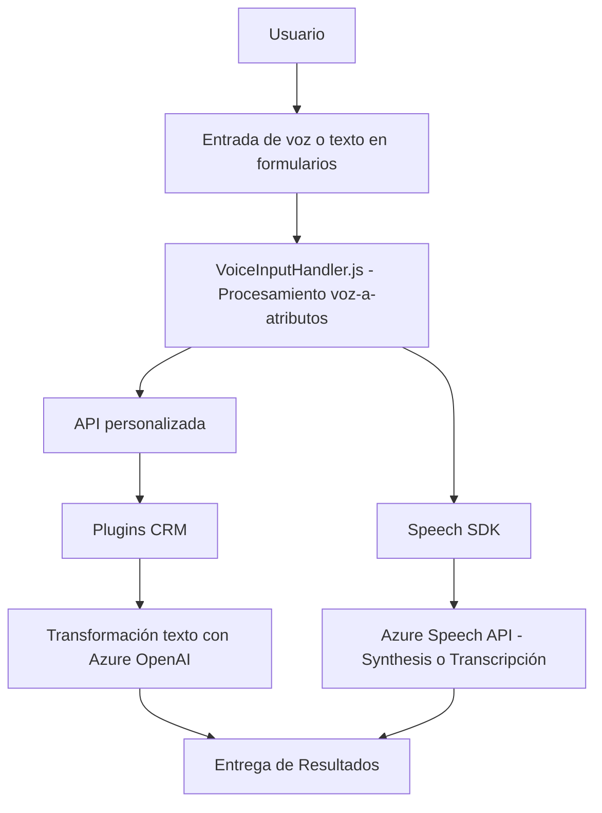

### Breve resumen técnico
El repositorio contiene archivos relacionados con la interacción del usuario en un sistema basado en formularios (probablemente Microsoft Dynamics 365). Su principal objetivo es manejar datos mediante interacción con APIs externas y componentes de IA. Incluye funcionalidades como síntesis de voz, procesamiento de texto, reconocimiento de voz, y plugins para transformación de texto usando Azure OpenAI.

---

### Descripción de arquitectura
La solución está semidistribuida y modular, con principios de desacoplamiento. Se evidencia una arquitectura de n capas:
1. **Capa frontend**: Implementada en JavaScript, provee funcionalidad interactiva en el navegador utilizando servicios como Azure Speech SDK.
2. **Capa backend**: Plugins en .NET, extensibles al sistema Dynamics CRM, trabajan como una capa middleware entre el sistema CRM y servicios externos como Azure OpenAI API.
3. **Servicios externos**: Integra componentes como Azure Speech SDK y Azure OpenAI para funcionalidades avanzadas (síntesis de voz, procesamiento de texto y manejo de IA).

Se observa:
- **Responsabilidad única**: Los módulos son específicos y enfocan tareas concretas.
- **Integración basada en SDK**: Uso de Azure Speech SDK y Dynamics CRM SDK para conectar funcionalidad externa.
- **Carga dinámica de dependencias**: Scripts o SDKs se verifican o cargan según necesidad.  

---

### Tecnologías usadas
- **Frontend**:
  - JavaScript.
  - Azure Speech SDK.
  - DOM API.
- **Backend**:
  - Microsoft Dynamics SDK.
  - C# (.NET Framework).
  - Azure OpenAI API.
  - System.Net.Http y Newtonsoft.Json para tratamientos de datos JSON.

---

### Diagrama Mermaid

---

### Conclusión final
Este repositorio contiene una solución para integrar funcionalidades de reconocimiento y síntesis de voz, mapeo y procesamiento de datos en formularios interactivos, y transformación avanzada de texto mediante IA. Adopta una arquitectura de n capas y presenta un diseño modular enfocado en interacción con servicios externos clave como Azure Speech SDK y OpenAI. La carga dinámica de SDKs y el uso de plugins del CRM hacen que el sistema sea extensible y robusto en ambientes relacionados a Dynamics 365 o CRM similares.