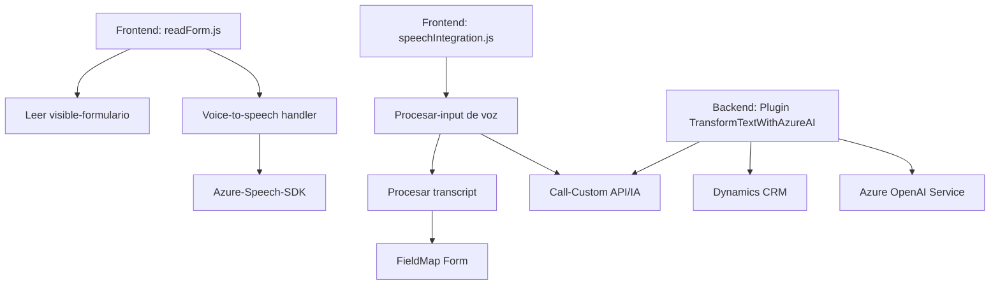

### Breve resumen técnico

El repositorio descrito consta de tres componentes principales que se integran para ofrecer una solución orientada a la captura, procesamiento y transformación de datos de formularios usando entrada de voz mediante **Azure Speech SDK** y operaciones avanzadas mediante **Azure OpenAI Service**. Está diseñado especialmente para ser integrado con Dynamics CRM.

---

### 1. Descripción de arquitectura

La solución representa una **arquitectura híbrida** entre un cliente de frontend (JS) y componentes de backend distribuidos. Los módulos de frontend proporcionan integración directa con el usuario, capturando y procesando datos de formularios dinámicamente mediante voz. El backend (Plugin .NET) opera sobre una arquitectura de microservicios que extiende las funcionalidades de Dynamics CRM interactuando con **Azure OpenAI Service**.

**Arquitectura predominante:**  
- **Frontend:** Orientado a presentación (pseudomonolito).
- **Backend:** Enfocado a microservicios para la interacción con servicios externos.

---

### 2. Tecnologías usadas

#### Frontend/JS Files (`readForm.js` y `speechForm.js`):
1. **Frameworks externos:**
   - **Azure Speech SDK:** Usado para entrada y síntesis de voz.
2. **Dinámicas del navegador:**
   - Dinámico uso de scripts externos condicionados.
   - Compatibilidad directa con formularios de Dynamics 365.
3. **Patrones:**
   - Modularidad: Funciones con diseño cohesivo y principios de responsabilidad única.
   - Dynamic Loading: Script cargado en tiempo de ejecución.

#### Backend Plugin (`TransformTextWithAzureAI.cs`):
1. **Frameworks externos:**
   - **Microsoft.Xrm.Sdk:** Interacción con Dynamics CRM.
   - **Newtonsoft.Json:** Parseo y manipulación de objetos JSON.
   - **System.Net.Http:** Comunicación con servicios externos.
   - **Azure OpenAI Service:** Implementación de modelos GPT para la transformación y estructura del texto.
2. **Patrones:**
   - **Plugin architecture**: Extensión personalizada para Dynamics CRM.
   - **Microservicio:** Descentralización de lógica pesada hacia servicios externos (Azure y OpenAI).

---

### 3. Dependencias o componentes externos

1. **Azure Speech SDK:** Usado para síntesis de voz y reconocimiento de entrada.
2. **Azure OpenAI Service:** Gestión avanzada con modelos GPT para procesar texto en formato JSON.
3. **Dynamics CRM SDK:** Coordinación e interacción directa con formularios y atributos organizacionales.
4. **API personalizada:** Subproceso implementado en el backend que permite procesar texto mediante una API interna o externa configurada.

---

### Diagrama **Mermaid** compatible con código descrito

---

### Conclusión final

El repositorio engloba una solución que integra componentes en **frontend** dinámico y un **plugin backend** orientado a microservicios, facilitando la interacción entre sistemas CRM y mecanismos inteligentes de reconocimiento/transcripción de voz. Su arquitectura modular basada en principios como responsabilidad única y patrón orientado a servicios (SOA) hace que sea extensible, escalable y adaptable para sistemas CRM modernos. Para asegurar mayor seguridad y optimizar rendimiento, recomendaciones como un diseño seguro para el manejo de claves de Azure o la implementación de sistemas de caché/reintento en los servicios externos serían ideales.
