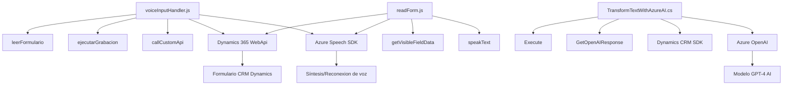

## Breve resumen técnico
El repositorio parece estar orientado al desarrollo para entornos empresariales donde se combinan funcionalidades relacionadas con formularios, reconocimiento/síntesis de voz, e integración con servicios externos como Azure Speech SDK, Azure OpenAI y Dynamics CRM. La estructura muestra funcionalidades para interacción en frontend con formularios, procesamiento de datos mediante voz o texto, y un componente backend plugin que extiende funcionalidades de Dynamics 365.

---

## Descripción de arquitectura
Este repositorio tiene un enfoque híbrido basado en una **arquitectura en capas** con servicios específicos:

1. **Frontend:** Implementa lógica para la captura de datos en formularios CRM, procesamiento de voz, y actualización directa de campos utilizando las APIs de Dynamics 365. Tiene funciones reutilizables para reconocimiento y síntesis de voz, mapeo de campos y compatibilidad con IA.
   
2. **Backend (Plugin):** Extiende la funcionalidad del sistema CRM mediante una arquitectura de plugins. Usa integración directa con Azure OpenAI para trabajar con generación de texto automatizada y procesamiento avanzado. Este componente es completamente desacoplado y basado en eventos disparados por el CRM.

3. **Dependencias externas:** Integra servicios como Azure Speech SDK para síntesis y reconocimiento de voz, Azure OpenAI para transformación de texto, y las APIs de Dynamics 365 para manipulación de datos en formularios.

Por el modelo descrito, la arquitectura es **híbrida**, donde el frontend está estructurado como una arquitectura **modular** orientada a interacción del usuario y el backend sigue el patrón **Plugin Architecture** en Dynamics CRM.

---

## Tecnologías usadas
### Frontend:
- **JavaScript:** Lenguaje principal para el manejo de lógica y formularios.
- **Azure Speech SDK:** Para la síntesis y reconocimiento de voz en aplicaciones de navegador.
- **Dynamics 365 Web API:** Para integración directa con formularios y manipulación de datos en el CRM.
   
### Backend:
- **C#:** Para la implementación del plugin en Dynamics CRM.
- **Azure OpenAI:** Servicio de procesamiento de lenguaje natural para generación de texto y transformación.
- **Newtonsoft.Json:** Para manipulación y parsing de datos JSON.
- **Dynamics CRM SDK:** Para extender la funcionalidad del CRM.

Además, el diseño aplica patrones como:
- **Dependency Injection:** En el procesamiento de datos y funciones.
- **Adapter Pattern:** En el mapeo y manejo entre voz y campos del formulario.
- **Service Integration:** Comunicación directa entre Dynamics CRM y servicios externos como Azure OpenAI.

---

## Diagrama Mermaid válido para GitHub

---

## Conclusión final
### Observaciones:
1. Existe un fuerte enfoque en la integración de servicios externos (Azure Speech SDK y Azure OpenAI), lo que asegura escalabilidad y capacidades avanzadas como IA y reconocimiento de voz.
2. El frontend es modular con una lógica interna bien segmentada, destacando el uso de adaptadores y procesamiento dinámico de datos de formularios.
3. El backend sigue la arquitectura típica de plugins en Dynamics CRM, permitiendo extensibilidad mediante eventos y métodos integrados.

### Recomendaciones:
- Implementar un almacén seguro (por ejemplo, Azure Key Vault) para gestionar claves de Azure Speech SDK y OpenAI.
- Validar la compatibilidad de las soluciones de frontend (especialmente SDKs) para distintos navegadores y dispositivos.
- Considerar herramientas de prueba automatizada para el backend y plugins, especialmente en contextos con múltiples integraciones API.

Este repositorio representa una solución sólida orientada a entornos empresariales donde la interacción basada en IA y servicios externos agrega valor. Combina capacidades modernas como síntesis de voz con la integración directa en sistemas CRM.