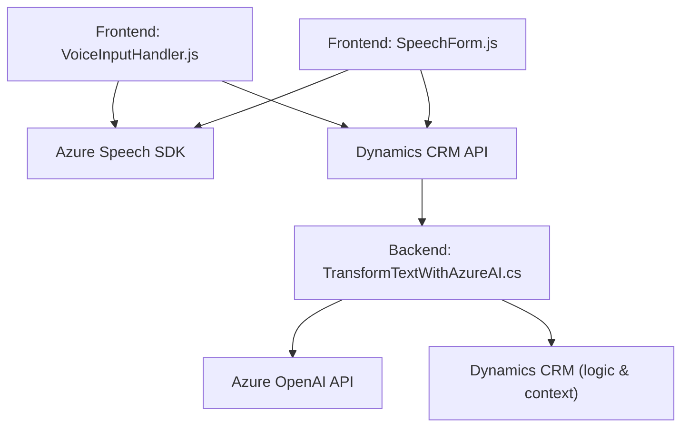

# Breve resumen técnico

El repositorio implementa funcionalidades clave para un sistema Dynamics CRM mediante una interfaz enriquecida en el **frontend** basada en **Azure Speech SDK** y complementada por un **plugin backend en Dynamics CRM** que utiliza la **Azure OpenAI API** para procesamiento avanzado de texto. Se emplean tecnologías modernas para habilitar una solución que integra reconocimiento y síntesis de voz, así como transformación de datos utilizando inteligencia artificial.

---

# Descripción de arquitectura

La arquitectura global puede describirse como **cliente-servidor con extensibilidad hacia un patrón orientado a servicios (SoA)**. 

1. **Frontend (VoiceInputHandler.js y SpeechForm.js)**:
   - Funciona como una aplicación cliente que interactúa con Dynamics CRM y usa servicios basados en el navegador. Este módulo utiliza el Speech SDK de Azure para capturar voz, transcribirla, sintetizar texto y procesar datos del usuario interactivamente.
   - Integración directa con APIs de Dynamics CRM y Azure Speech SDK.

2. **Backend (TransformTextWithAzureAI.cs)**:
   - Un plugin desarrollado en .NET que usa el patrón de integración en Dynamics CRM mediante la interfaz `IPlugin`.
   - Encapsula la lógica de transformación de texto utilizando preguntas hacia la Azure OpenAI API para crear respuestas estructuradas.

---

# Tecnologías usadas

### **Frontend**
- **Azure Speech SDK**: Para integración de reconocimiento y síntesis de voz.
- **Vanilla JavaScript**: Implementación directa sin frameworks adicionales.
- **Dynamics CRM API (Xrm.WebApi.online)**: Para manipular el contexto del formulario dinámico.

### **Backend**
- **C# (.NET Framework)**: Desarrollo de plugins CRM.
- **Microsoft.Xrm.Sdk**: SDK oficial para interacción con Dynamics CRM.
- **Azure OpenAI API**: Procesamiento de datos desde el lado CRM hacia los servicios de IA.
- **HTTP Client (System.Net.Http)**: Para realizar consultas hacia servicios externos.

---

# Diagrama **Mermaid** válido para GitHub

---

# Conclusión final

La solución presentada implementa una arquitectura eficaz para un sistema Dynamics CRM basado en funcionalidades complementarias en el **frontend** y extensibilidad mediante un **plugin backend**. La integración directa de servicios como **Azure Speech SDK** y **Azure OpenAI API** demuestra el uso de un patrón orientado a servicios (SoA) enriquecido por componentes en la nube que optimizan la experiencia del usuario y aprovechan el potencial de IA. La modularización y encapsulación del código por funciones claras facilita la escalabilidad y mantenimiento del sistema.