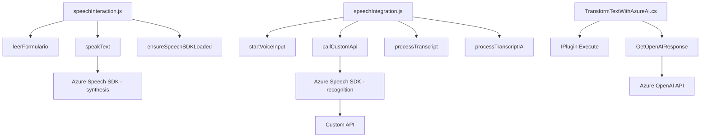

### Breve Resumen Técnico
El repositorio presentado parece estar relacionado con una solución para la eficiencia en la interacción con formularios web y CRM (Microsoft Dynamics) a través de servicios basados en reconocimiento y síntesis de voz, junto con procesamiento de datos mediante inteligencia artificial (Azure Speech SDK y Azure OpenAI). 
- El componente **`speechInteraction.js`** se centra en la lectura y síntesis de contenido de formularios.
- **`speechIntegration.js`** gestiona la recogida de datos mediante la conversión de voz a texto, apoyado en APIs personalizadas y lógica de negocio para integrar servicios externos.
- **`TransformTextWithAzureAI.cs`** actúa como un plugin de Dynamics CRM que utiliza el servicio Azure OpenAI para aplicar inteligencia artificial y transformar datos textuales.

---

### Descripción de Arquitectura
La solución tiene una arquitectura **modular y orientada a servicios** que se compone de tres elementos principales:
1. **Capa Frontend (JavaScript)**:
   Procesa la interacción del usuario (como lectura de formularios: `speechInteraction.js`) y transforma voz en texto para actualizar formularios y consumir APIs externas (`speechIntegration.js`).

2. **Plugins del CRM (C#)**:
   Extiende funcionalidades de Microsoft Dynamics CRM mediante la capa de integración, interactuando directamente con Azure OpenAI para realizar tareas adicionales basadas en inteligencia artificial.

3. **Servicios Externos (Azure Speech SDK & OpenAI)**:
   Proporciona mecanismos de síntesis de voz, reconocimiento de habla y generación avanzada de respuestas estructuradas.

La arquitectura utiliza múltiples capas y patrones comunes:
- **Patrón de Plugin** para extensibilidad en Dynamics CRM.
- **Microservicios en la nube** mediante Azure AI para operaciones asincrónicas y basadas en eventos.
- **Frontend modular** para desacoplar la lógica de negocio.
- **SOA (Arquitectura Orientada a Servicios)** al depender de APIs externas como Azure Speech.

---

### Tecnologías Usadas
1. **Frontend**
   - **JavaScript/ES6**: Para la lógica del cliente y manejo de interacciones del usuario.
   - **Azure Speech SDK**: Framework para reconocimiento de voz y síntesis de habla.
   - **Dynamic CRM Web API (Xrm.WebApi)**: Para manipular datos de formularios.
   
2. **Backend (Plugins)**
   - **C#**: Lenguaje principal para la creación del plugin.
   - **Microsoft Dynamics CRM SDK**: Extensiones y desarrollo dentro del ecosistema Dynamics.
   - **Azure OpenAI (GPT)**: Procesamiento avanzado de lenguaje natural.
   - **Newtonsoft.Json & System.Text.Json**: Manipulación de estructuras JSON.
   - **HTTP Client (System.Net.Http)**: Integración con servicios externos a través de solicitudes HTTP.
   
---

### Diagrama Mermaid

---

### Conclusión Final
La solución integra tecnologías de vanguardia en **inteligencia artificial** junto con capacidades extensibles de una plataforma CRM como **Microsoft Dynamics**. Se estructura sobre un modelo sólido, modular y orientado a servicios, permitiendo que cada componente cumpla tareas específicas:

- El **Frontend**, escrito en JavaScript, delega tareas complejas como el reconocimiento y síntesis de voz hacia **Azure Speech SDK**.
- En el **backend**, el plugin en C# aprovecha directamente una integración con **Azure OpenAI** usando un enfoque **Service-Oriented Architecture**, adecuando los resultados para fines empresariales específicos.
- El diseño general sugiere una arquitectura fácilmente escalable y adaptable, ideal para aplicaciones empresariales que requieren interacción vía voz y datos dinámicos.

El uso de APIs y servicios en la nube como Azure garantiza flexibilidad, escalabilidad y acceso a potentes capacidades de inteligencia artificial. Sin embargo, se determinaría como una solución híbrida conformada por Frontend y Backend centralizado (gestionado desde Dynamics CRM) pero extendido vía microservicios de Azure.