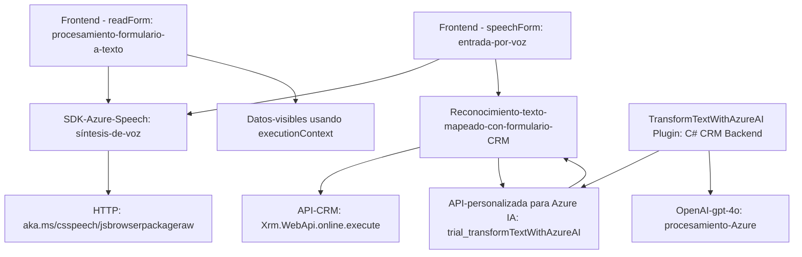

### Análisis técnico del repositorio

#### Breve resumen técnico
Este repositorio contiene tres componentes principales:
1. **`readForm.js` (Frontend)**: Extrae los datos visibles de un formulario y los convierte a formato de audio usando Azure Speech SDK.
2. **`speechForm.js` (Frontend)**: Implementa entrada de datos por voz con Azure Speech SDK y apoya la interacción con APIs externas y el procesamiento de IA.
3. **`TransformTextWithAzureAI.cs` (Backend/CRM Plugin)**: Un plugin para Dynamics CRM que utiliza Azure OpenAI API para la transformación de texto con reglas personalizadas.

---

#### Especialización funcional de la solución
La solución se puede categorizar como un **integrador de servicios de voz para CRM** que combina funcionalidades front-end (procesamiento de formularios y entrada/salida por voz) con un plugin backend para transformar texto usando IA en un entorno CRM (Dynamics 365).

---

#### Descripción de la arquitectura
La arquitectura parece ser una combinación de:
1. **N capas** dentro de un frontend/back-end. El frontend interactúa con el usuario (formulario CRM) y los servicios (Azure Speech y APIs externas). El backend utiliza una arquitectura basada en plugins típicos de Dynamics CRM.
2. **Hexagonal**: El plugin sigue aspectos del diseño de arquitectura hexagonal al separar claramente las capas de dominio (lógica de negocio) y la infraestructura (servicios externos como Azure OpenAI).

---

#### Tecnologías usadas
1. **Frontend:**
   - **JavaScript**: Desarrollo de las funcionalidades de entrada y salida de voz.
   - **Azure Speech SDK**: Para la síntesis y reconocimiento de voz en el navegador.
   - **API personalizada CRM**: Backend para transformar texto con IA.

2. **Backend (`TransformTextWithAzureAI.cs`):**
   - **C# y Dynamics SDK**: Implementación del plugin en el contexto de Microsoft Dynamics CRM.
   - **Azure OpenAI API**: Para integración con modelos de lenguaje avanzados (GPT).
   - **Newtonsoft.Json**: Para procesamiento de JSON.

---

#### Dependencias posibles o componentes externos
1. **Azure Speech SDK**: Sintetiza voz y reconoce patrones durante la entrada y salida de audio.
2. **Azure OpenAI Service**: Utiliza GPT para transformar texto en el backend.
3. **Microsoft Dynamics CRM SDK**: Framework para desarrollo con plugins en Dynamics CRM.
4. **API personalizada (`trial_TransformTextWithAzureAI`)**: Ayuda con el procesamiento de texto en un sistema CRM.

---

### Diagrama **Mermaid** 100% compatible con **GitHub Markdown**

---

### Conclusión final
Este repositorio implementa una solución híbrida con funcionalidades avanzadas de entrada y salida por voz, interacción dinámico-modular en el frontend, y un plugin orientado a servicios con AI en el backend. Utiliza tecnologías modernas como Azure Speech SDK y Azure OpenAI integradas en un entorno CRM. Además, la arquitectura se basa en la dependencia de SDK y APIs externas, haciéndola altamente escalable y orientada a servicios, adecuada para aplicaciones empresariales.