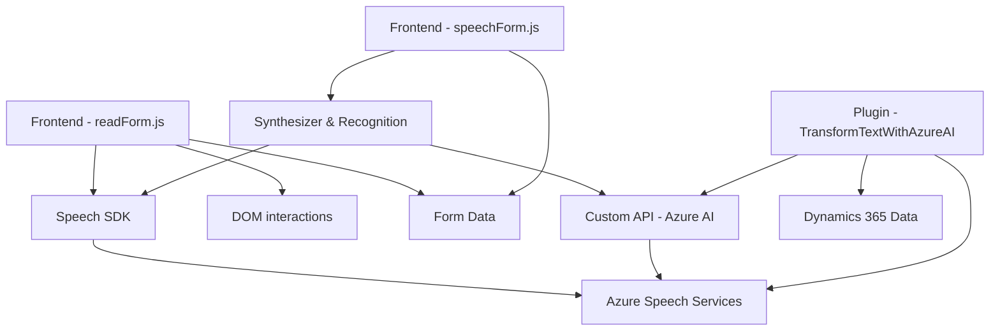

### Breve resumen técnico

El repositorio parece estar diseñado como un sistema de **integración de voz y procesamiento de texto con servicios de Azure**, aplicable a escenarios de formularios dinámicos en plataformas como Dynamics 365 (CRM). Involucra tres componentes principales:

1. **Frontend/JS**:
   - Implementa funcionalidades de síntesis y reconocimiento de voz a través de Azure Speech SDK.
   - Modularización en funciones para especificidad y flexibilidad.
   - Lazy loading del SDK de Azure.

2. **Plugin para Dynamics (`TransformTextWithAzureAI.cs`)**:
   - Realiza transformaciones avanzadas de texto mediante el servicio Azure OpenAI (GPT-4), en el contexto de eventos de Dynamics 365.
   - Utiliza un enfoque basado en configuraciones y reglas para producir respuestas estructuradas.

---

### Descripción de arquitectura

El sistema tiene una **arquitectura de integración multicapas** con enfoque **modular** y uso de servicios en la nube (Azure). Aunque el frontend y backend están separados, la arquitectura en su estado actual es más cercana a un sistema monolítico de **dos capas**: 
1. **Frontend (ReadForm & SpeechForm)**: Interactúa directamente con el usuario final y utiliza servicios externos como Azure Speech SDK.
2. **Backend (Plugin)**: Específico para Dynamics 365 (modelo de plugin), proporcionando lógica adicional y gestionando interacciones con el servicio Azure OpenAI para transformar datos.

No se utiliza una arquitectura completamente desacoplada como la hexagonal o microservicios. Sin embargo, la presencia de servicios dinámicos como la carga del SDK o la utilización de Azure OpenAI proporciona cierto nivel de separación de preocupaciones.

---

### Tecnologías, frameworks y patrones usados

#### Tecnologías y frameworks:
1. **Microsoft Dynamics 365 SDK**:
   - Para definir e integrar plugins en el CRM Microsoft Dynamics 365.
2. **Azure Speech SDK**:
   - Utilizado en el front para la síntesis y el reconocimiento de texto a voz/voz a texto.
3. **Azure OpenAI (GPT-4)**:
   - Usado en el plugin (`TransformTextWithAzureAI.cs`) para procesar contenido con IA avanzada.
4. **Node.js (o ejecución en navegador)**:
   - Base probable para los archivos frontend JS exhibidos (`readForm.js` y `speechForm.js`).

---

#### Patrones:
1. **Modularización**:
   - Separación de responsabilidades en funciones específicas para facilitar el mantenimiento y escalabilidad.
2. **Lazy Loading**:
   - El SDK de Azure Speech se carga dinámicamente solo cuando se necesita (`ensureSpeechSDKLoaded`).
3. **Event-driven development**:
   - Uso de callbacks y triggers para manejar eventos, especialmente en el Frontend.
4. **Plug-in Architecture**:
   - Ideal para la integración dentro de una infraestructura como Dynamics 365, donde cierta lógica reside en plugins aislados.
5. **Integration Pattern**:
   - Comunicación con APIs externas (Azure Speech y OpenAI).

---

### Dependencias o componentes externos

1. **Azure Speech SDK**:
   - Reconocimiento y síntesis de voz.
2. **Azure OpenAI (GPT-4)**:
   - Respuesta avanzada para procesamiento de lógica a texto.
3. **Custom APIs**:
   - Parece haber una implementación personalizada en Azure para otras transformaciones.
4. **Dynamics 365 SDK**:
   - Interacción directa con la base de datos y estructuras de Dynamics CRM.
5. **HTTP Client Integration**:
   - Comunicación con servicios de terceros.

---

### Diagrama Mermaid válido para GitHub

---

### Conclusión final

El repositorio parece ser una **solución integrada específicamente diseñada para usar capacidades de voz y procesamiento de texto en aplicaciones de CRM como Dynamics 365**, interactuando con servicios de Azure como Speech y OpenAI. La arquitectura está desarrollada bajo conceptos de modularidad y separación de capas (frontend/backend). A pesar de integrar servicios externos, el sistema sigue siendo monolítico y centralizado debido a su fuerte dependencia del Dynamics y las tecnologías asociadas.

Una posible mejora podría ser transformar la arquitectura hacia un enfoque **por microservicios o hexagonal**, donde la lógica de negocio, las integraciones con Azure, y las interfaces dinánimas de usuario, sean más independentes y escalables, facilitando su reajuste o actualización en el tiempo.