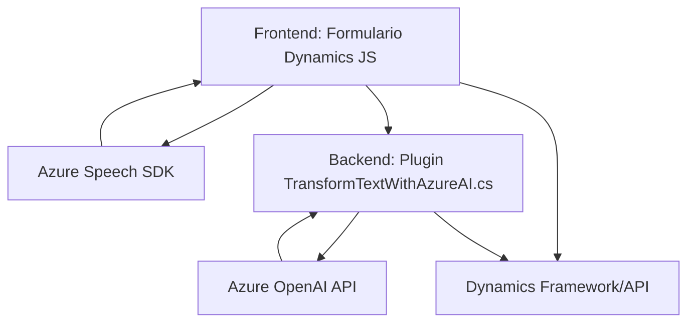

### Breve resumen técnico

El repositorio parece ser parte de una solución de software interactiva que aprovecha un ecosistema compuesto de un **frontend** basado en JavaScript (integrado a Microsoft Dynamics 365) y un **backend** en .NET (C#), que utiliza el servicio Azure OpenAI para añadir capacidades avanzadas de procesamiento de voz y texto.

---

### Descripción de la arquitectura

La solución tiene dos componentes principales:

1. **Frontend**:
   - Está diseñado para ser integrado directamente con formularios de Dynamics 365 como parte de extensiones personalizadas (scripts JS). Los archivos en esta sección utilizan el contenedor de cliente proporcionado por Dynamics (`executionContext`) y el **Azure Speech SDK** para habilitar funcionalidades de entrada por voz, síntesis de audio y generación de texto en tiempo real.

2. **Backend**:
   - Implementado como un **plugin de Dynamics CRM**, aprovecha las APIs del sistema y externa para recibir texto desde el frontend, procesarlo a través de **Azure OpenAI API** utilizando un conjunto de reglas, y devolver un JSON transformado al cliente.

La arquitectura tiene componentes separables, lo que refleja una aproximación similar al diseño de **microservicios**. Sin embargo, dado que todo está acoplado a Dynamics CRM, adopta un enfoque más cercano a **arquitectura modular** con fases orientadas a eventos para procesamiento.

---

### Tecnologías usadas

**Frontend:**
- **JavaScript**:
  - Lógica interactiva.
  - Integración directa con Dynamics 365 (`executionContext` y `formContext`).
- **Azure Speech SDK**:
  - Reconocimiento y síntesis de texto a voz.

**Backend:**
- **C#**:
  - Desarrollo de plugins.
- **Microsoft Dynamics CRM SDK**:
  - Extensiones y acceso al contexto CRM.
- **Azure OpenAI API**:
  - Procesamiento avanzado de texto utilizando modelos GPT.

**Dependencias comunes:**
- `Newtonsoft.Json`, `System.Net.Http`: Para manejo de API y JSON data.

**Patrones:**
- **Integración SDK**: Comunicación externa con Azure Speech SDK para voice capabilities.
- **Event-driven architecture**: Basada en triggers dentro del frontend y backend.
- **Service Layer**: División funcional donde cada segmento realiza tareas específicas.

---

### Diagrama Mermaid

---

### Conclusión final

La solución exhibe una arquitectura modular orientada a resolver un caso específico: interactuar con Dynamics 365 mediante voz, procesamiento de texto y manipulación de formularios. La integración entre frontend (JavaScript/Dynamics) y backend (Plugin en C#) demuestra un diseño bien estructurado para aprovechar servicios externos (Azure Speech/OpenAI) y adaptarse al modelo de negocio. Aunque no es estrictamente una arquitectura de microservicios, sí delimita muy bien las responsabilidades de cada componente en un entorno centralizado como Dynamics 365.