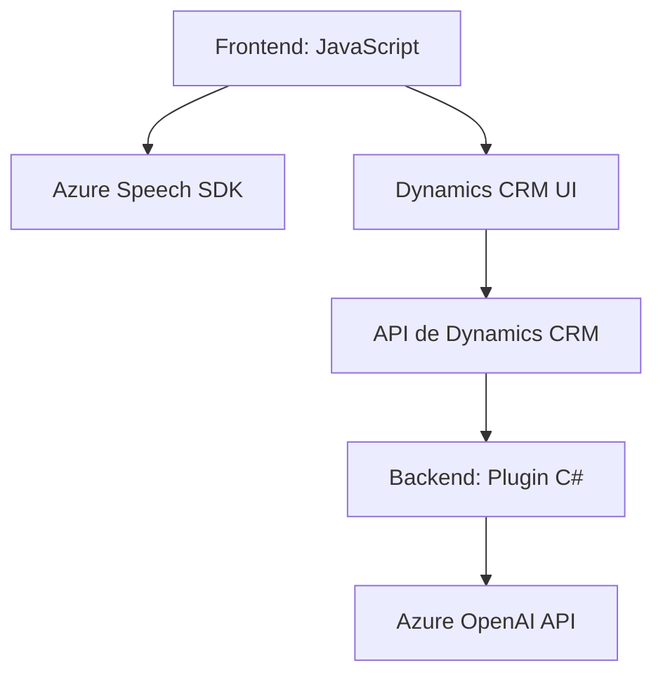

### Breve resumen técnico
Con base en el análisis de los archivos proporcionados, el repositorio parece contener la lógica para una solución integrada entre un **frontend JavaScript** y una **lógica de backend (plugin)**, diseñada específicamente para trabajar con **Microsoft Dynamics CRM**. Se habilitan funcionalidades de procesamiento de voz, interacción con formularios virtuales, y transformación de texto utilizando servicios de **Azure** y **Azure OpenAI**. Es fundamental para aplicaciones CRM que requieren capacidades de voz y procesamiento avanzado de datos.

---

### Descripción de arquitectura
1. **Tipo de solución:**  
   Esta solución parece ser una combinación de diferentes componentes:
   - **Frontend:** Manejo de formularios, lectura y escritura de voz en Dynamics CRM utilizando el Azure Speech SDK.
   - **Backend:** Un plugin de Dynamics CRM que transforma texto a JSON mediante Azure OpenAI.
   
2. **Arquitectura:**  
   La arquitectura general es **n-capas**, con divisiones claras entre frontend, manejo de datos en el CRM y lógica de transformación mediante un plugin. También se emplea integración con servicios externos (Azure Speech SDK y Azure OpenAI).  

3. **Flujos de trabajo:**  
   - **Frontend capacitado para voz:** Permite lectura y entrada de voz en formularios de Dynamics CRM.
   - **Backend para procesamiento avanzado:** Aplica IA para transformar entradas de texto en estructuras útiles dentro del CRM.

---

### Tecnologías usadas
- **Frontend:**
  - **JavaScript**: Principal lenguaje para manejar lógica del lado del cliente.
  - **Azure Speech SDK**: Usado para síntesis de voz y entrada por voz.
  - **Browser APIs**: Para la manipulación del DOM y gestión de formularios.
  - **Dynamics CRM APIs**: Integración con los datos del CRM mediante estructuras como `executionContext`.
  - **Promesas y asíncronos:** Para llamadas externas al SDK y servicios de API.  

- **Backend:**
  - **C#**: Lenguaje utilizado para el desarrollo del plugin.
  - **Microsoft Dynamics CRM SDK**: Para integrar el plugin al flujo empresarial del CRM.
  - **Azure OpenAI (GPT-4o)**: Para transformación avanzada de texto.
  - **Libraries:** Manipulación de JSON (`Newtonsoft.Json`, `System.Text.Json`) y solicitudes HTTP (`HttpClient`).

---

### Dependencias o componentes externos
1. **Azure Speech SDK**: 
   - Sintetización y captura de voz en aplicaciones web.
   - Configuración mediante `azureRegion` y `azureKey`.
   
2. **Azure OpenAI API**:
   - Transformación de texto en JSON estructurado.
   - Modelo como GPT-4o para tareas semánticas avanzadas.
   
3. **Microsoft Dynamics CRM**:
   - API propias para interacción con formularios (`Xrm.WebApi`).
   - Plugins para lógica empresarial extendida.
   
4. **Browser APIs**:
   - APIs del navegador para manipulación del DOM y entrada de voz.
   
---

### Diagrama Mermaid
El siguiente diagrama muestra los componentes principales y su interacción:

---

### Conclusión final
La solución implementada en este repositorio es una arquitectura **n-capas**, que ofrece funcionalidad avanzada para formularios en Dynamics CRM mediante texto y voz, con soporte de **inteligencia artificial** (Azure OpenAI). Combina de manera efectiva tecnologías de frontend (JavaScript) y backend (C# y plugins) para lograr capacidades como entrada/salida por voz, transformación de texto y automatización. La integración de servicios externos como **Azure Speech SDK** y **Azure OpenAI** aporta escalabilidad y potencia en los procesos empresariales.

Es una estructura modular, diseñada para facilitar la interacción entre usuarios y formularios con herramientas modernas, y destaca por su enfoque hacia la automatización en entornos CRM basada en IA.