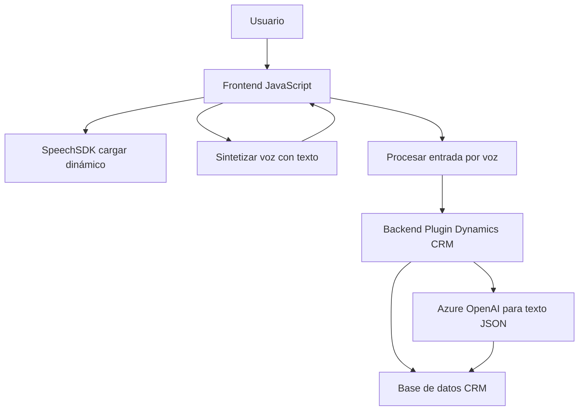

### Análisis Técnico

#### 1. Tipo de solución:
La solución es una **aplicación híbrida** que consiste en:
- Un **frontend dinámico basado en JavaScript** que utiliza Azure Speech SDK.
- Incorporación de **plugins personalizados** en Dynamics 365 CRM, con integración de Azure OpenAI para procesamiento avanzado de textos y formularios.

Esta solución gestiona tanto los datos en los formularios como la interacción por voz, en un sistema CRM extendido.

---

#### 2. Tecnologías, frameworks y patrones detectados:
**Frontend:**
- Tecnología: **JavaScript**.
- Sistema externo: **Azure Speech SDK**.
- Frameworks: No se detectaron explícitamente en el código.
- Patrones:
  - Encapsulación de flujo (funciones como `leerFormulario`).
  - Integración con dependencias dinámicas (`SpeechSDK`).
  - Modularidad funcional (cada función realiza tareas específicas).

**Backend:**
- Tecnología: **C# (.NET Framework o Core)**.
- Plugins de **Dynamics CRM** (Microsoft.Xrm.SDK).
- Sistema externo: **Azure OpenAI**.
- Patrones:
  - Plugin Pattern (herencia de `IPlugin`).
  - Service-Oriented Architecture (SOA), integración de un servicio externo (OpenAI).
  - Encapsulación, organizando lógica dentro de métodos específicos.

---

#### 3. Tipo de arquitectura:
La arquitectura de la solución es híbrida y presenta características de **arquitectura de n capas**:
- **Capa de presentación**: Frontend basado en JavaScript para interacción visual, captura y síntesis de voz.
- **Capa lógica de negocio**: Plugins gestionan la transformación de datos mediante estándares (Azure AI y CRM).
- **Capa de integración**: Utiliza servicios externos (Azure Speech SDK y OpenAI) y APIs internas (Dynamics CRM).
- **Capa de datos**: Principalmente gestionada por Dynamics CRM y APIs personalizadas.

---

#### 4. Dependencias o componentes externos:
- **Azure Speech SDK**: Para el procesamiento de entrada/salida de voz (Text-to-Speech y Speech-to-Text).
- **Azure OpenAI**: Utilizado en el backend para analizar y estructurar el texto en JSON.
- **Dynamics CRM**: A través de Microsoft.Xrm.SDK para procesamiento de formularios y datos asociados.
- Opcionales:
  - **Custom APIs**: Ejemplo es el llamado a `trial_TransformTextWithAzureAI API`, que parece un servicio adicional.

---

#### 5. Diagrama Mermaid válido:

---

### Conclusión:
La solución presenta un diseño especializado para integrar voz, procesamiento de datos mediante inteligencia artificial, y manipulación de información en sistemas CRM como Dynamics 365. Usa Azure Speech SDK para interacción por voz y Azure OpenAI para estructuración avanzada de texto, lo que permite capturar y actualizar campos de formularios en tiempo real.

Si bien cumple con principios de encapsulación y modularidad, podría beneficiarse de medidas de seguridad adicionales (gestión de credenciales). Además, la arquitectura híbrida entre frontend dinámico y un backend extensible permite escalabilidad a largo plazo.