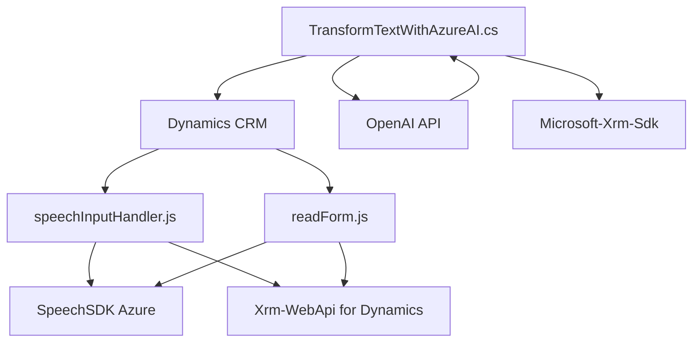

### Resumen Técnico
El repositorio contiene una solución que utiliza tecnologías front-end (JavaScript) y back-end (.NET/C#) para integraciones con Microsoft Dynamics CRM y plataformas de IA de Azure, orientada al reconocimiento y procesamiento de voz y texto. Específicamente, involucra integración con el **Azure Speech SDK** y **Azure OpenAI** para generación de voz, transcripción y procesamiento de instrucciones en formularios dinámicos.

---

### Descripción de Arquitectura
1. **Tipo de solución:** 
   - La solución incluye un **front-end con funcionalidades de interacción mediante voz** y un plugin back-end (.NET) diseñado para procesar texto con servicios de inteligencia artificial.
   - Puede considerarse como una **aplicación extensible tipo "SDK-integrated module"**, utilizada dentro de formularios de Microsoft Dynamics CRM.

2. **Patrón arquitectónico:**
   - **Front-end:** Modular con carga dinámica de dependencias (lazy-loading, SDK integration).
   - **Back-end:** Cliente REST integrado en un sistema **plugin** siguiendo el patrón de extensibilidad propio de Dynamics CRM.
   - La arquitectura general se asemeja a una **n capas combinada con plugins.**
   - **Event-driven architecture**: Forma en la que se cargan dinámicamente elementos (Ej: Speech SDK) y en la que el plugin responde a eventos de Dynamics CRM.

---

### Tecnologías usadas:
**Front-end:**
- **Azure Speech SDK:** Para transcripción de voz a texto y síntesis de audio.
- **JavaScript:** Estructura modular con gestión de funciones independientes.
- **Dynamics CRM SDK:** Para acceso y manipulación de datos en formularios.
- APIs JavaScript estándar y DOM para manipulación de elementos de formularios.

**Back-end:**
- **C# y .NET:** Uso del framework .NET para implementar el plugin (`TransformTextWithAzureAI`).
- **Microsoft.Xrm.Sdk:** Para integración con Dynamics CRM.
- **Azure OpenAI API:** Llamadas HTTP para procesamiento avanzado de texto.
- **JSON libraries (System.Text.Json, Newtonsoft.Json):** Para manejo de datos estructurados.

---

### Dependencias o Componentes Externos:
1. **Azure Speech Services (Speech SDK):** Para el reconocimiento de voz y síntesis de audio en el front-end.
2. **Azure OpenAI API (GPT Models):** Para procesamiento y transformación avanzada de texto en el plugin.
3. **Microsoft Dynamics CRM:** Contextos del modelo de entidad y servicios de datos.
4. **Web APIs de Dynamics CRM (Xrm.WebApi):** Para buscar y modificar información en entidades del sistema.
5. **JavaScript Runtime (browser environment):** Ejecuta los scripts front-end con acceso dinámico a formularios interactivos.
6. **C#:** Todo el back-end está desarrollado como un plugin en .NET con herramientas propias para integración con servicios REST y CRM.

---

### Diagrama Mermaid compatible con GitHub Markdown

---

### Conclusión Final
Este repositorio presenta una solución integrada para manejar interacción por voz y capacidades de procesamiento avanzado de texto, en colaboración con los servicios de Azure y Microsoft Dynamics CRM. La elección de tecnologías y arquitectura sugiere una herramienta empresarial orientada a mejorar la experiencia del usuario en formularios dinámicos mediante procesos de entrada y salida de voz y capacidades avanzadas de inteligencia artificial. Mientras que el front-end proporciona interactividad y acceso directo al usuario, el back-end actúa como un procesador de reglas de negocio y puente para servicios de IA externamente integrados.