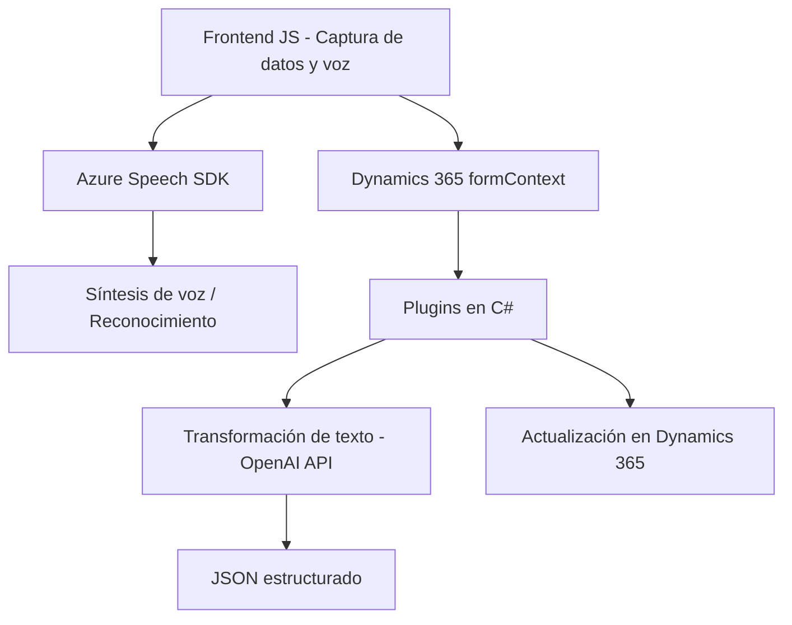

### Breve Resumen Técnico
El repositorio contiene archivos de un sistema que combina un frontend con procesamiento de datos dinámicos en formularios y tecnologías de reconocimiento de voz (Azure Speech SDK), una arquitectura basada en Microsoft Dynamics 365, y plugins para transformación de texto utilizando Azure OpenAI. El objetivo general del sistema es mejorar la accesibilidad mediante síntesis de voz, entrada por voz y procesamiento de texto avanzado.

---

### Descripción de Arquitectura
1. **Multicapa tecnológica**: El sistema se divide en frontend (procesamiento de datos y voz), backend (Dynamics 365 plugins) y servicios externos (Azure Speech SDK y Azure OpenAI).
   - **Frontend**: JavaScript interpreta datos del formulario y gestiona la síntesis y entrada de voz.
   - **Backend**: Dynamics 365 SDK maneja lógica propia de CRM, ampliada mediante plugins que interactúan con Azure OpenAI.
   - **Servicios externos**: Azure Speech SDK y OpenAI se conectan dinámicamente para sintetizar voz y transformar texto.

2. **Arquitectura general**:
   - Predominantemente utiliza **n capas**: cada herramienta tiene bien separados los roles para entrada de datos, procesamiento y servicios remotos.
   - La lógica asociada a Microsoft Dynamics CRM complementa una arquitectura extensible basada en **plugins (event-driven)**.

3. **Patrones observados**:
   - **Dependency Injection**: En frontend, el `formContext` es inyectado en las funciones JavaScript para lograr modularidad y separación de responsabilidades.
   - **Adapter Pattern**: La lógica de mappings entre transcripciones de voz y campos dinámicos utiliza un patrón adaptador para vincular etiquetas visibles con atributos internos.
   - **Pipeline funcional**: En los archivos frontend, los datos se procesan en pasos claramente definidos (recolección de datos del formulario, transformación, síntesis o entrada).
   - **Plugin Architecture**: El backend utiliza plugins y métodos asincrónicos para extender Dynamics 365.

---

### Tecnologías Usadas
1. **Lenguajes y entorno**:
   - Javascript (frontend, manipulación de DOM y SDK de Azure Speech).
   - C# (.NET Framework) para los plugins.

2. **Frameworks y SDKs**:
   - **Microsoft Dynamics CRM SDK**: Base de extensibilidad y desarrollo de lógica de negocio para Dynamics 365.
   - **Azure Speech SDK**: Reconocimiento de voz y síntesis de texto.
   - **Azure OpenAI API**: Integración con modelos lingüísticos avanzados (GPT).

3. **Servicios y componentes externos**:
   - Azure Speech API (síntesis y reconocimiento).
   - Azure OpenAI para procesamiento textual avanzado.
   - APIs externas personalizadas en Dynamics para gestionar datos del formulario.

---

### Diagrama Mermaid 
A continuación, se describe la arquitectura del sistema con un diagrama simple usando la sintaxis **Mermaid**:

---

### Conclusión Final
El sistema está diseñado para integrar la entrada y salida de datos con accesibilidad y procesamiento remoto. Utiliza tecnologías modernas como Azure Speech y OpenAI para sintetizar información de formularios y generar funciones adaptativas basadas en voz. La arquitectura está bien segmentada en capas funcionales (frontend, backend CRM, y servicios externos), emplea patrones bien definidos para la modularidad y extensibilidad, y muestra una gran cohesión entre componentes. Es ideal para entornos empresariales que demandan integración avanzada de datos y accesibilidad.