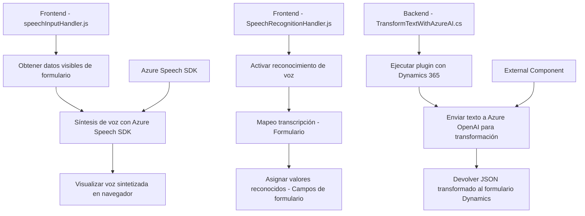

## Resumen técnico

El repositorio representa una solución en la que se integran funcionalidades de síntesis de voz y reconocimiento de voz mediante **Azure Speech SDK**, además de un plugin backend para procesamiento de texto con **Azure OpenAI**. La solución utiliza Dynamics 365 como base de operación y realiza interacciones con APIs externas mediante peticiones HTTP, lo que indica un fuerte enfoque en la interoperabilidad con servicios cloud.

---

## Descripción de arquitectura

### **Tipo de solución:**
La solución representa un sistema híbrido orientado a interacción por voz y procesamiento de texto para formularios de Dynamics 365. Es una mezcla de módulos de frontend en JavaScript, integrados con Dynamics 365, soportados por un plugin backend desarrollado en C# para realizar tareas avanzadas con IA mediante Azure OpenAI Service.

### **Tipo de arquitectura:**
La arquitectura tiene componentes distribuidos que siguen un modelo de **n capas**:  
1. **Capa de presentación (Frontend)**: Archivos JavaScript (`speechInputHandler.js`, `SpeechRecognitionHandler.js`) ejecutan tareas como la recopilación de datos en voz y escritura, así como la síntesis de voz.  
2. **Capa de procesamiento y negocio (Logística)**: El plugin en **C# (`TransformTextWithAzureAI.cs`)** maneja la interacción entre Dynamics 365 y Azure OpenAI para obtener respuestas inteligentes.  
3. **Capa de integración (Servicios externos)**: Se conectan con servicios como Azure Speech SDK y Azure OpenAI mediante HTTP y CDN, procesando datos en la nube.

Además, debido al uso de servicios distribuidos como APIs de Azure y la integración con Dynamics 365, el diseño global tiene características de una **arquitectura orientada a microservicios**.

### **Patrones utilizados**:
1. **Plugin Pattern** (en el backend): Encapsulación de lógica en un plugin de Dynamics 365 para extensibilidad y modularidad.  
2. **Factory Method**: Creación del cliente y configuraciones del Azure Speech SDK (`SpeechConfig.fromSubscription`) y el uso del SDK en el backend con factories.  
3. **Pipeline de procesamiento de datos**: El flujo modular para obtener datos del formulario -> procesarlos -> transformarlos -> asignarlos o sintetizarlos.  
4. **Separation of Concerns**: Frontend, servicios externos y plugins tienen responsabilidades claras y separadas.

---

## Tecnologías usadas

1. **Frontend**:
   - **Lenguaje**: JavaScript.
   - **Framework**: Dependencias no explícitas (puede ser Vanilla JS basado en Dynamics 365).
   - **SDK**: Azure Speech SDK.
   - **Contexto**: Integra `formContext` y objetos relacionados con Dynamics 365.

2. **Backend**:
   - **Lenguaje**: C#.
   - **Framework**: Dynamics 365 SDK (se extiende la interfaz `IPlugin`).
   - **Librerías externas**:
     - `Newtonsoft.Json.Linq` y `System.Text.Json`: Manipulación de JSON.
     - `System.Net.Http`: Comunicación con APIs REST de Azure.
     - `Microsoft.Xrm.Sdk`: Contexto de ejecución para Dynamics 365 plataformas.

3. **Servicios externos**:
   - **Azure OpenAI**: Utilización del modelo GPT para la transformación de texto.
   - **Azure Speech SDK**: Síntesis y reconocimiento de voz a partir de texto y audio.

---

## Diagrama **Mermaid** compatible con **GitHub Markdown**

---

## Conclusión final

Esta solución demuestra una integración avanzada entre tecnologías frontend (JavaScript) y backend (C#) utilizando Dynamics 365. A nivel funcional, los módulos frontend permiten realizar tareas de interacción de voz con los formularios, proporcionadas por Azure Speech SDK, mientras que el componente backend orquesta el procesamiento de texto mediante Azure OpenAI.

La arquitectura adopta un diseño distribuido basado en **n capas**, destacándose elementos de **microservicios** debido a las interacciones con APIs externas. Esto lo convierte en una solución sumamente escalable y eficiente para aplicaciones empresariales orientadas a generación y procesamiento de voz y texto estructurado.