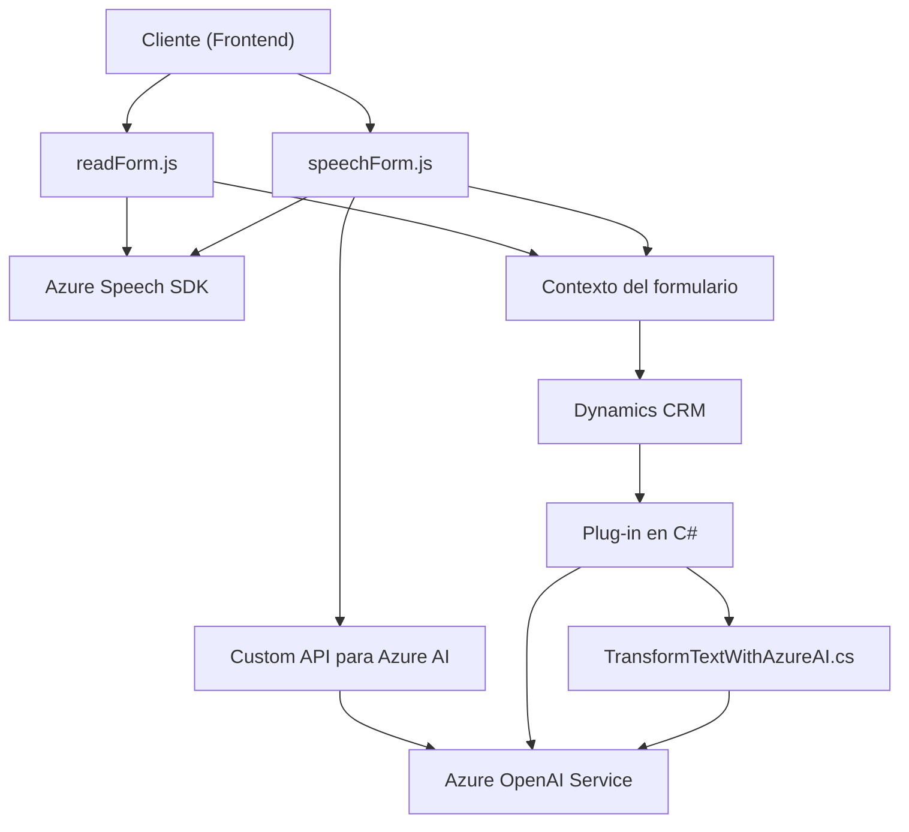

**Breve Resumen Técnico:**
El repositorio combina archivos relacionados con la integración entre una interfaz de usuario (frontend) y un sistema CRM (Dynamics 365) para realizar operaciones basadas en texto y voz mediante servicios de Azure, incluyendo Speech SDK y Azure OpenAI. La solución está orientada a habilitar accesibilidad, procesamiento de voz y automatización de textos en formularios.

---

### **Descripción de arquitectura:**
1. **Tipo de solución:**  
   - Una combinación de Frontend y Plugins para integrar funciones de accesibilidad y procesamiento en Dynamics CRM.
   - Destacando la implementación de un plugin en C# que se conecta a Azure OpenAI y archivos JavaScript para capturar y procesar voz o texto con Azure Speech SDK.

2. **Patrones de diseño:**
   - **Modularización:** Cada función y archivo tiene una responsabilidad clara, facilitando su comprensión y reutilización.
   - **Event-driven architecture:** Los archivos JavaScript dependen de eventos como el inicio de grabación o la carga del SDK de Azure Speech.
   - **Service-oriented architecture (SOA):** Arquitectura orientada a servicios, integrando múltiples APIs externas (Azure OpenAI, Azure Speech SDK, Dynamics Web API).
   - **Hexagonal Architecture en el plugin:** Uso de puertos y adaptadores en Dynamics CRM para mantener las dependencias hacia servicios externos (Azure OpenAI).

---

### **Componentes/Dependencias:**
- **Frameworks/Servicios:**
  - **Azure Speech SDK:** Habilita síntesis de voz y reconocimiento de voz.
  - **Azure OpenAI:** Para procesamiento de texto transformado a JSON.
  - **Dynamics CRM API:** Para realizar acciones sobre formularios, grabar y ejecutar operaciones CRM.
- **Librerías externas:**
  - `Newtonsoft.Json`: Parsing JSON para interactuar con API REST.
  - `HttpClient` y clases relacionadas de .NET: Llamadas HTTPS al servicio OpenAI en C#.
- **Dependencias internas:**
  - `executionContext`, `formContext` (contexto de Dynamics 365 para formularios y plugins).

---

### **Arquitectura:**
- El sistema combina **arquitectura de microservicios** para el uso de Azure Speech / Azure OpenAI con una solución **basada en plugins** en Dynamics CRM.
- Los archivos frontend presentan una separación por capas:
  - Cliente (UI) -> Interacciones con SDK y formularios.
- El Plugin muestra prácticas de arquitectura hexagonal con integración de servicios externos y lógica centralizada en la capa `IPlugin`.

---

### **Tecnologías Usadas:**
1. **Backend:** 
   - Microsoft Dynamics CRM Plugin (C#).
   - Azure OpenAI (usando HTTP Requests).
2. **Frontend:** 
   - JavaScript ES6 modular.
   - Azure Speech SDK.
3. **Dependencias Comunes:**
   - Dynamics CRM SDK.
   - JSON manipulación (`Newtonsoft`, `System.Text.Json`).

---

### **Diagrama Mermaid:**

---

### **Conclusión Final:**
El repositorio utiliza una solución híbrida que combina un frontend basado en JavaScript y plugins backend desarrollados en C# para integrar funcionalidades avanzadas en Dynamics CRM. La arquitectura modular facilita el consumo de servicios basados en Azure (Speech SDK y OpenAI) mientras interactúa con formularios de CRM. Este diseño es ideal para empresas que requieren mejorar la accesibilidad y optimizar la entrada y procesamiento de datos en plataformas empresariales preexistentes.