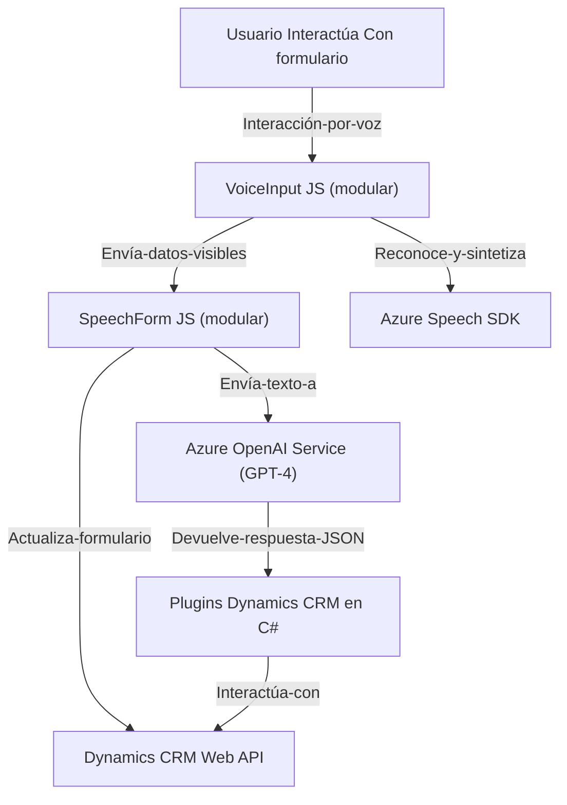

### Breve resumen técnico
Se trata de una solución que combina un **frontend** basado en JavaScript para la interacción con formularios mediante reconocimiento y síntesis de voz, junto con un **plugin backend** desarrollado en C# para Dynamics CRM que utiliza **Azure OpenAI Service** para transformar texto. La solución recurre al SDK de Azure Speech para reconocer y sintetizar voz, además de la integración del modelo GPT-4 de Azure OpenAI para procesar texto avanzado.

---

### Descripción de arquitectura
La arquitectura es **híbrida** y se puede describir como una combinación de **microfrontends** y extensiones cloud a través de plugins y servicios web. En el frontend, se observa una lógica funcional y modular, mientras que en el backend se emplea el paradigma de **plugin CRM** con consumo de APIs Rest externas. Se adhiere a principios de **separación de responsabilidades** en ambas capas: el frontend interactúa con el usuario y el backend realiza transformaciones avanzadas en la nube.

Características principales:
1. **Frontend** es modular y utiliza la arquitectura de n capas para separar la lógica de datos, negocio y presentación.
2. **Backend plugin** opera bajo los principios de un **patrón de extensibilidad**, integrándose al pipeline de Dynamics CRM. Además, implementa un **Cliente de Servicio** para interactuar con Azure OpenAI.

---

### Tecnologías, frameworks y patrones usados
1. **Frontend**:
   - **Lenguaje:** JavaScript.
   - **Tecnología/SDK:** Azure Speech SDK.
   - **API:** Dynamics 365 Web API (para llamadas Custom API y datos).
   - **Patrones:** Modularización funcional y callbacks para la carga dinámica del SDK Azure Speech.

2. **Backend**:
   - **Lenguaje:** C#.
   - **Framework:** .NET Framework (Dynamics CRM Plugin).
   - **Bibliotecas:** Newtonsoft.Json, System.Net.Http.
   - **API:** Azure OpenAI Service (GPT-4) para transformación de texto.
   - **Patrones:** Plugin Pattern, Client-Server Model, Separation of Concerns.

3. **Integraciones externas**:
   - **Azure Speech SDK:** Manejo creativo de voz (reconocimiento y síntesis) en tiempo real.
   - **Azure OpenAI Service:** Conversión de entrada de texto a JSON estructurado siguiendo normas.
   - **Dynamics CRM Web API:** Para realizar actualizaciones a los formularios.

---

### Diagrama Mermaid válido para GitHub Markdown

---

### Conclusión Final
La solución presentada es una arquitectura modular orientada a la integración entre **frontend** (formulario dinámico con voz) y **backend** basado en plugins para Dynamics CRM. Utiliza servicios avanzados de Azure, incluyendo **Azure Speech SDK** para reconocimiento de voz y síntesis y **Azure OpenAI Service** para transformar texto mediante inteligencia artificial. La arquitectura es adecuada para entornos acoplados como Dynamics CRM, pero presenta ciertos riesgos, como el manejo de claves de API, que deben ser mitigados para garantizar la seguridad en producción.