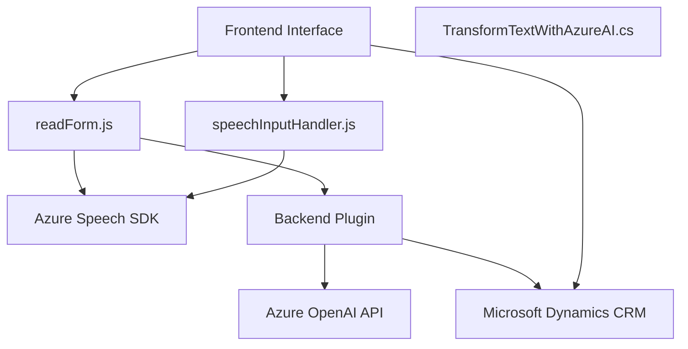

### Breve resumen técnico
El repositorio presenta ejemplos de integración de servicios externos para procesar y transformar datos mediante tecnologías de Microsoft y Azure. Los archivos analizados muestran una solución con funcionalidad enfocada en la interacción entre usuarios, un frontend basado en JavaScript, una capa de integración con Azure Speech SDK para reconocimiento y síntesis de voz, y un plugin para Microsoft Dynamics CRM que utiliza Azure OpenAI para procesamiento avanzado de lenguaje natural.

---

### Descripción de arquitectura
La solución tiene componentes que se ajustan a una arquitectura **n-capas**:
1. **Capa de presentación**: Archivos como `readForm.js` y `speechInputHandler.js` procesan interacciones del usuario (voz, formulario) en el frontend y aseguran la conectividad con SDKs externos.
2. **Capa de negocio**: El plugin `TransformTextWithAzureAI.cs` define reglas de negocio avanzadas para transformar texto utilizando un modelo GPT alojado en Azure OpenAI. Proporciona una respuesta estructurada en JSON.
3. **Capa de integración**: Se realiza la conexión tanto desde el frontend como desde el plugin con servicios externos, como Azure Speech SDK y Azure OpenAI API.
   
### Tecnologías usadas
1. **Frontend**:
   - **JavaScript**: Base para las funciones de interacción con el usuario y manipulación de formularios.
   - **Azure Speech SDK**: Incorporado dinámicamente en los scripts para funcionalidades de texto a voz y reconocimiento de voz.
   - **Custom API**: Utilizada para transformar datos procesados por el reconocimiento de voz.

2. **Backend**:
   - **Microsoft Dynamics CRM SDK**: Utilizado en el plugin para manejar eventos y manipular datos dentro de la plataforma CRM.
   - **Azure OpenAI API**: Servicio externo para transformación de texto usándose como una capa de procesamiento semántico.
   - **HttpClient**: Para llamadas API REST desde el plugin.

3. **External Libraries**:
   - **Newtonsoft.Json** y **System.Text.Json**: Utilizados para manejar objetos y estructuras JSON.
   - **System.Net.Http**: Facilitando la comunicación HTTP con la API de Azure OpenAI.

### Dependencias o componentes externos
La solución depende de las siguientes herramientas y servicios:
1. **Azure Speech SDK**.
2. **Azure OpenAI API**, con soporte para modelos GPT.
3. **Microsoft Dynamics CRM SDK**, para interacción directa con CRM.
4. **Custom API** (desconocida, según referencia en el código de frontend).
5. **Newtonsoft.Json** y **System.Text.Json**, para la manipulación de datos JSON.
   
---

### Diagrama Mermaid válido para GitHub Markdown

### Conclusión final
La solución analizada es una implementación tecnológica centrada en la integración de servicios de Microsoft y Azure para gestionar datos estructurados y enriquecer las capacidades de entrada y salida mediante reconocimiento de voz y textos. La arquitectura es predominantemente de **n-capas**, utilizando los principios de modularidad, separación de responsabilidades y empleo de servicios externos bajo patrones de integración API y plugins.

Los puntos a mejorar incluyen:
1. Gestionar las credenciales de API mediante configuraciones externas o servicios seguros en lugar de colocarlas directamente en el código fuente.
2. Definir pruebas unitarias para asegurar la robustez de las funciones, especialmente para la integración con servicios de terceros y frente a posibles errores o límites de API.
