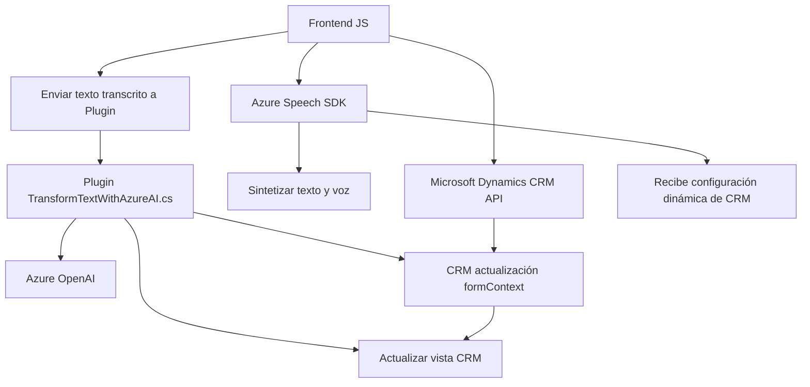

### Breve Resumen Técnico

El análisis del repositorio indica que los componentes se centran en la integración entre una interfaz de usuario basada en formularios (frontend) y múltiples servicios de Azure, como **Azure Speech SDK** y **Azure OpenAI**, junto con la personalización dentro de **Microsoft Dynamics CRM**. Esto conecta flujos de voz, síntesis de texto y transformación de datos mediante arquitecturas modulares y patrones clásicos de desarrollo.

---

### Descripción de Arquitectura

La solución sigue una arquitectura **multi-capa** con elementos encapsulados para cumplir roles específicos:
1. **Frontend:** Implementado en JavaScript, captura datos de entrada y los comunica con servicios de voz (Azure Speech SDK).
2. **Backend Plugin:** Un plugin en C#, integrado con Microsoft Dynamics CRM, procesa datos utilizando Azure OpenAI y expande la funcionalidad del CRM.
3. **CRM API:** Utiliza el modelo de Plugin Pattern para interceptar solicitudes y aplicar lógica de negocio avanzada.
4. **Servicios Externos:** Comunicación con servicios de Azure, como el Speech SDK y Azure OpenAI, en una arquitectura orientada a servicios.

La arquitectura no es microservicios porque está principalmente construida sobre Dynamics CRM, pero utiliza patrones como **API Gateway** para interoperar con Azure.

---

### Tecnologías Usadas

1. **Frontend:**
   - Lenguaje: JavaScript.
   - Azure Speech SDK: Para entrada de voz y síntesis.
   - Microsoft Dynamics CRM API: Para actualizar datos en formularios.

2. **Backend Plugin:**
   - Lenguaje: C#.
   - Framework: Dynamics CRM SDK (`Microsoft.Xrm.Sdk`).
   - Azure OpenAI: Para transformación de texto basada en inteligencia artificial.
   - Librerías de JSON: `Newtonsoft.Json`, `System.Text.Json`.

3. **Patrones Arquitectónicos Usados:**
   - **Plugin Pattern:** En plugins para CRM.
   - **Event-driven programming:** Procesos desencadenados por eventos en el frontend y backend.
   - **Dependency Injection:** Manejo de dependencias como Speech SDK y Organization Service en CRM.
   - **API Gateway:** Interacción con servicios externos como OpenAI.
   - **Module Pattern:** Código JavaScript y C# bien encapsulado.

---

### Diagrama Mermaid

A continuación, se presenta el diagrama **Mermaid** que representa los principales flujos y dependencias:

---

### Conclusión Final

Este proyecto representa una solución avanzada que combina varias tecnologías y patrones de diseño. La interacción entre frontend (formulario dinámico), servicios cognitivos como el Speech SDK y Azure OpenAI, y la plataforma de backend Dynamics CRM permite realizar operaciones sofisticadas como síntesis de voz y transformación de datos mediante IA.

Aunque el sistema utiliza componentes distribuidos, no se clasifica como arquitectura de microservicios. Es una mezcla de la arquitectura de **n capas** y **SOA** (arquitectura orientada a servicios), con gran dependencia en Dynamics CRM como plataforma base.  

El diseño modular, la integración con APIs externas y el uso de patrones de encapsulación hacen que esta solución sea extensible y altamente adaptable.