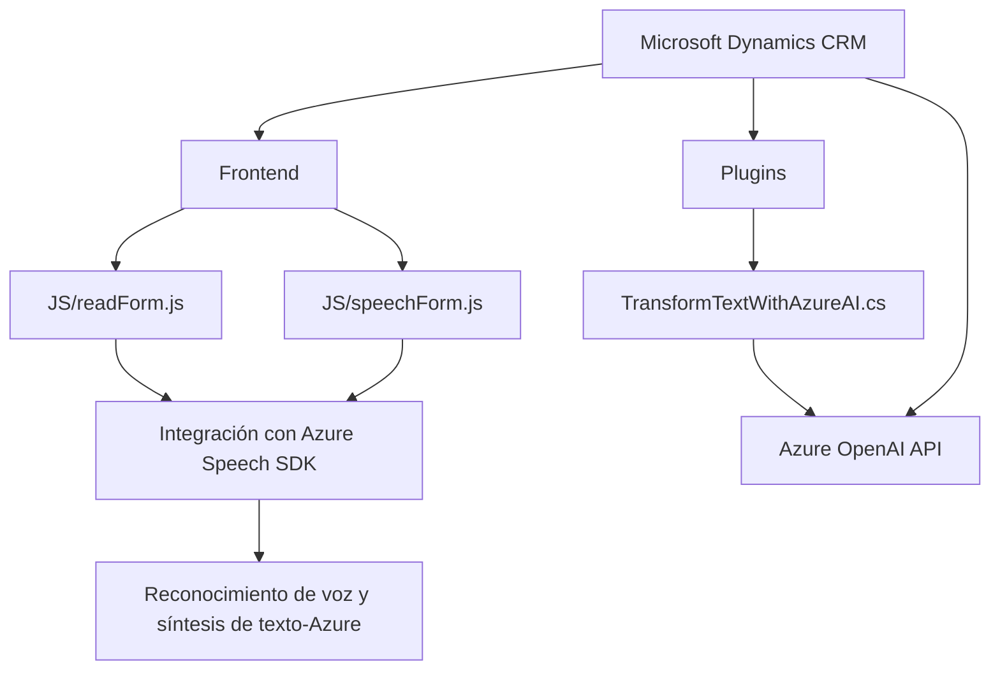

# Breve resumen técnico

Este repositorio forma parte de una solución integral que combina tecnologías frontend, plugins backend y servicios externos. La solución permite interactuar con formularios en Microsoft Dynamics CRM mediante integración con Azure Speech SDK para reconocimiento de voz, síntesis de texto a voz, y procesamiento avanzado de texto con Azure OpenAI API.

---

# Descripción de arquitectura

### Tipo de arquitectura:
La funcionalidad en este repositorio utiliza una arquitectura híbrida orientada a servicios (Service-Oriented Architecture) y event-driven. Se compone de tres capas principales: 

1. **Capa de presentación (Frontend)**: Incluye scripts en JavaScript para interactuar con formularios vía reconocimiento de voz y síntesis de texto.
2. **Capa de API externa**: Utiliza SDK y APIs de Azure (Speech SDK y OpenAI) para el procesamiento de voz y texto.
3. **Capa empresarial (Plugin para Microsoft Dynamics CRM)**: implementa un plugin que actúa como enlace entre los servicios de Azure y los datos del sistema CRM.

---

# Tecnologías usadas

1. **Frontend**:
   - **JavaScript**: Lenguaje utilizado para manejar interacciones con Dynamics CRM.
   - **Azure Speech SDK**: Implementación tanto para síntesis de voz como reconocimiento. Gestione el flujo voz-texto-voz.
   - **APIs nativas del navegador**: Para manipulación del DOM y eventos.

2. **Backend**:
   - **C# (.NET)** para el desarrollo del plugin de Dynamics CRM.
   - **Microsoft Dynamics CRM SDK**: Para interacción directa con datos y componentes CRM.
   - **Azure OpenAI API**: Realiza transformaciones avanzadas de texto a través de modelos de lenguaje de IA.
   - **System.Net.Http**: Para manejar comunicación HTTP con servicios externos.
   - **Newtonsoft.Json / System.Text.Json**: Para parseo y manipulación de JSON.

3. **Patrones de Diseño**:
   - Modularidad: Código estructurado para dividir responsabilidades.
   - SOA (Service-Oriented Architecture).
   - Orientado hacia eventos (en frontend, respuesta a interacciones del usuario con la interfaz).
   - Factories: Inicialización dinámica de configuraciones en Azure Speech SDK.

---

# Diagrama Mermaid válido para GitHub

---

# Conclusión final

Este repositorio proporciona una solución Service-Oriented Architecture (SOA) que integra una capa frontend basada en JavaScript para reconocimiento y síntesis de voz, enlazada con un plugin en C# para procesamiento intensivo de texto y comunicación con Microsoft Dynamics CRM. A su vez, se conecta con servicios externos como Azure Speech SDK y Azure OpenAI API, lo cual permite añadir capacidades de procesamiento de lenguaje natural y voz dentro del flujo de trabajo CRM. 

Este enfoque, estructurado en módulos y orientado a la interacción usuario-servicios, destaca por su diseño extensible y adaptable, que permite incorporar nuevas funcionalidades sin alterar el núcleo de las interacciones.