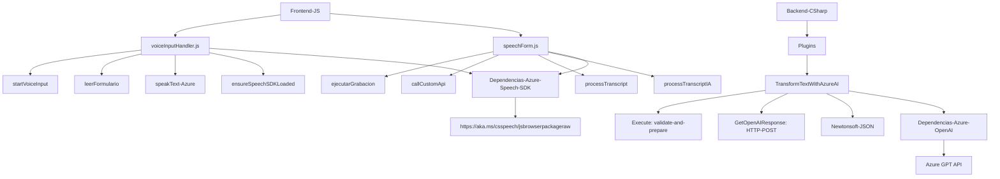

### Breve resumen técnico

El repositorio describe componentes de una solución que integra procesamiento de voz y texto con Microsoft Dynamics 365, utilizando el Azure Speech SDK y Azure OpenAI Services. Las funcionalidades incluyen:
1. **Frontend**: para manejar datos de formularios mediante reconocimiento de voz e integración con texto a voz (Azure Speech SDK).
2. **Backend plugin**: para realizar procesamiento avanzado de texto mediante el servicio de Azure OpenAI.

### Descripción de arquitectura

La solución tiene una **arquitectura de n capas**, donde:
- **Presentation Layer (Frontend):** Se encargan de capturar datos del usuario (entrada de voz), procesarlos e interactuar con el formulario de Dynamics 365.
- **Business Logic Layer:** Plugins de Dynamics CRM contienen la lógica para transformar y procesar datos en la capa intermedia que interactúa con un servicio.
- **Data Access Layer:** Parte de Dynamics CRM maneja los datos y la lógica del sistema (entidades y atributos).
- **External Service Integration:** Azure Speech SDK y Azure OpenAI integran servicios de reconocimiento, síntesis de voz, y transformación avanzada de texto.

### Tecnologías usadas

1. **Frontend:**
   - Lenguaje: **JavaScript**.
   - Frameworks/SDK: **Azure Speech SDK** y Dynamics 365 (JavaScript APIs).
   - Patrones:
     - Utilitario: funciones individuales para realizar acciones específicas.
     - Carga dinámica: carga condicional de scripts.
     - Eventos y callbacks: disparar procesos en respuesta a eventos.

2. **Backend:**
   - Lenguaje: **C# (.NET)**.
   - Frameworks: **Dynamics CRM SDK** y dependencias como JSON serialization (`System.Text.Json`, `Newtonsoft.Json.Linq`).
   - Integración: **Azure OpenAI Services** API.
   - Patrones:
     - Delegación de responsabilidades: manejo de entrada y lógica en métodos separados como `GetOpenAIResponse`.
     - Plugin Factory Framework.

---

### Diagrama Mermaid válido para **GitHub Markdown**

---

### Conclusión final

La solución está construida en un **modelo de n capas**, donde la capa de presentación maneja funcionalidades en el cliente Dynamics 365 (vía JS y Azure Speech SDK), y los plugins del backend proporcionan procesamiento avanzado e inteligencia utilizando Azure OpenAI Services integrado al SDK de Dynamics CRM. Los patrones incluyen manejo de eventos en el frontend y delegación en el backend, lo que permite una arquitectura modular y muy reutilizable. La integración de servicios externos como Azure demuestra una orientación hacia soluciones basadas en la nube para procesamiento de lenguaje y voz.