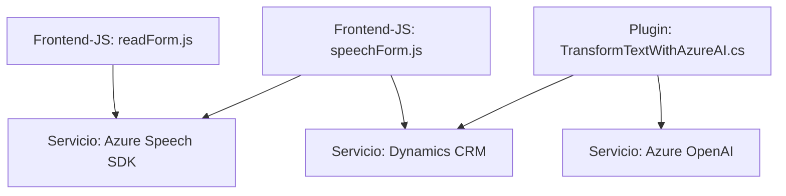

### Breve resumen técnico

El repositorio define funcionalidades para formularios interactivos en un entorno Dynamics 365. Incluye:
1. **Frontend**: Utilización de reconocimiento y síntesis de voz con Azure Speech SDK mediante scripts JavaScript.
2. **API personalizada (plugin de Dynamics)**: Un plugin en C# que integra Azure OpenAI para transformar texto en JSON estructurado, mejorando la interacción y procesamiento de datos en CRM.

---

### Descripción de arquitectura

1. **Arquitectura global**:
   - **Modelo híbrido de capas y servicios**. Utiliza una arquitectura basada en herramientas de Dynamics 365 (para lógica CRM), combinada con servicios externos como Azure Speech y OpenAI. Aunque Dynamics gestiona el backend con una arquitectura de capas, el sistema introduce un enfoque **SOA** (Service-Oriented Architecture) para interactuar con servicios externos.

2. **Arquitectura interna del JavaScript**:
   - Implementa **funciones modulares** donde cada unidad realiza tareas especializadas (lectura de datos, conversión de valores, etc.).
   - Uso del patrón de **callback**, garantizando que servicios externos se carguen antes de su ejecución.

3. **Arquitectura interna del plugin en C#**:
   - Implementa el patrón **Plugin Dynamics CRM**, un modelo centrado en eventos del ciclo de vida de la plataforma CRM.
   - Se integra mediante una arquitectura **orientada a servicios** para procesar texto con Azure OpenAI.

---

### Tecnologías usadas

1. **Lenguajes**:
   - **JavaScript**: Para lógica en frontend, interactuando con el SDK (Azure Speech).
   - **C#**: Para el plugin que transforma texto en backend (Dynamics CRM).
2. **Servicios externos**:
   - **Azure Speech SDK**: Suministra capacidades de reconocimiento y síntesis de voz.
   - **Azure OpenAI**: Realiza transformaciones avanzadas de texto (estructura JSON).
3. **Frameworks y Dependencias**:
   - Dynamics 365 SDK (`Microsoft.Xrm.Sdk`) para interacción con CRM.
   - `Newtonsoft.Json` y `System.Text.Json` para manejo de JSON.
   - APIs REST para conexión con Azure OpenAI.
   
---

### Diagram Mermaid válido para GitHub

---

### Conclusión final

La solución implementa una **arquitectura híbrida** que combina elementos de capas internas de Dynamics CRM con llamadas externas a servicios en la nube (Azure Speech y OpenAI). Esto proporciona:
1. **Frontend dinámico** orientado a mejorar la interacción con el usuario mediante capacidades de reconocimiento y síntesis de voz.
2. **Backend potente**, ampliado mediante plugins personalizados que usan herramientas de IA para transformar y estructurar datos (Azure OpenAI).

La solución destaca por su **modularidad** y **orientación a servicios**, aprovechando herramientas modernas para enriquecer la experiencia del usuario y los procesos de datos en el entorno Dynamics 365.