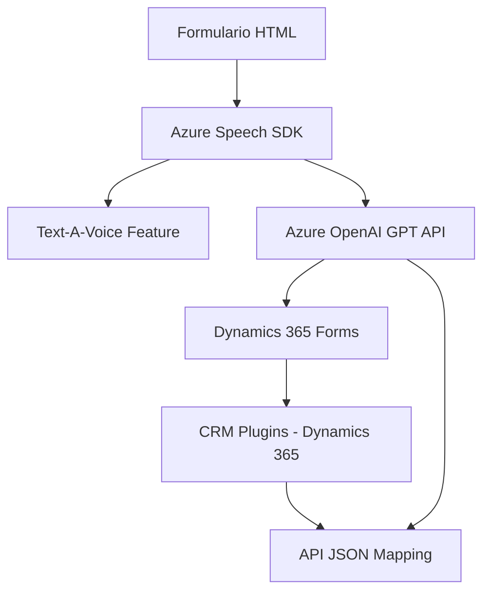

### Breve resumen técnico
El repositorio pertenece a una solución que combina la gestión y operación de formularios empresariales basados en **Dynamics 365** con herramientas avanzadas de procesamiento como **Azure Speech SDK** y **Azure OpenAI (GPT-4)**. Su objetivo es mejorar la integración de sistemas, accesibilidad y automatización, mediante funcionalidades como la síntesis de voz, comandos basados en transcripción y transformación de texto dinámico por inteligencia artificial.

---

### Descripción de la arquitectura
La solución sigue un **modelo n-capas** con un enfoque híbrido:
1. **Frontend:**
   - Maneja la interacción del usuario directamente en el navegador, proporcionando acceso a los formularios con capacidades extendidas de lectura de datos visibles y síntesis de audio (usando Azure Speech SDK).
   - Usa JavaScript para procesar datos en tiempo real y comunicarse con servicios externos mediante APIs.

2. **Backend:**
   - Implementa lógica empresarial avanzada a través de **Plugins de Dynamics 365**, utilizando el framework .NET para integraciones nativas.
   - Realiza llamadas externas particularmente hacia **Azure OpenAI** para transformar texto y estructurarlo según reglas específicas.

La solución se integra eficientemente con servicios externos mediante el patrón **Gateway de API** (Azure Speech SDK y Azure OpenAI) y aprovecha la arquitectura orientada a eventos de **Dynamics CRM Plugins**.

---

### Tecnologías usadas
Las principales tecnologías y herramientas empleadas incluyen:
- **Frontend (JavaScript):**
  - **Azure Speech SDK:** Para síntesis de voz y transcripción.
  - **DOM API:** Manipulación dinámica de scripts e interacción con el DOM.

- **Backend (.NET/Plugins en Dynamics 365):**
  - **Microsoft.Xrm.Sdk:** Ayuda a interactuar con el contexto del CRM.
  - **Newtonsoft.Json y System.Text.Json:** Manejo de serialización/deserialización JSON.
  - **Azure OpenAI (GPT-4):** Implementa transformación de texto.
  - **Dynamics Web APIs (Xrm.WebApi):** Ejecución de operaciones CRUD y llamadas a APIs personalizadas.

**Patrones utilizados:**
- **Integración de SDK externo:** Sincronización dinámica de servicios de Azure.
- **N-Capas:** División del sistema en lógica de representación, procesamiento de negocio y almacenamiento/gestión empresarial.
- **Callback pattern:** Para asegurarse de la carga del SDK de Azure (en el frontend).
- **Mapping:** Uso de funciones para convertir texto estructurado al formato utilizado por Dynamics CRM, con enfoque en accesibilidad.

---

### Genera un diagrama **Mermaid** 100 % compatible con **GitHub Markdown**

---

### Conclusión final
Este repositorio representa una solución empresarial que extiende funcionalidades de **Dynamics 365** con capacidades avanzadas para mejorar la accesibilidad (lectura en voz alta) y la automatización (procesamiento de transcripción y texto dinámico). Aunque opera como un módulo independiente en cada capa, está altamente dependiente de servicios de Azure y Web APIs, lo que lo hace una arquitectura híbrida con componentes de **n capas** y **microservicios vía APIs externas**.