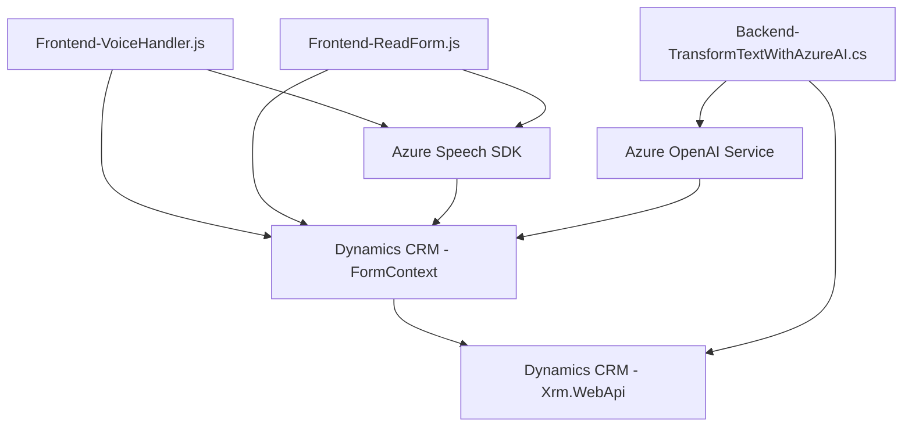

### **Breve resumen técnico**
El repositorio se centra en la integración de reconocimiento y síntesis de voz, manipulación de formularios de Dynamics 365 (CRM) y procesamiento avanzado de texto mediante Azure AI. Combina tecnologías front-end (JavaScript) y back-end (.NET) para ofrecer funcionalidad basada en servicios externos, como Azure Speech SDK y Azure OpenAI.

---

### **Descripción de la Arquitectura**
La solución presenta una arquitectura híbrida basada en **n capas** con integración de **servicios externos**. Principalmente utiliza:
1. **Capa de presentación (Frontend)** con JavaScript orientado a formularios dentro del CRM.
2. **Capa de lógica de negocio (Plugins)** en .NET, trabajando con Dynamics CRM y conectándose a servicios de Azure para procesamiento avanzado.
3. **Capa de integración y servicios externos** mediante APIs como Azure Speech SDK y Azure OpenAI.

Aunque la estructura modular y el uso de servicios externos sugieren componentes desacoplados, no se identifica una arquitectura puramente microservicios, sino una **arquitectura basada en capas** donde cada módulo tiene su rol bien definido.

---

### **Tecnologías usadas**
1. **Frontend**: 
   - **JavaScript** para manipulación y configuración de formularios, usando funciones orientadas a la síntesis de voz y reconocimiento.
   - **Azure Speech SDK** para síntesis y reconocimiento de voz.
   - **Dynamics CRM front-end APIs** (`Xrm.WebApi`) para comunicación con la base de datos y manipulación de formularios.
2. **Backend**: 
   - **C# (.NET Framework)** para desarrollo de plugins personalizados de Dynamics CRM que conectan con Azure OpenAI Services.
   - **Azure OpenAI GPT-4** para procesamiento de texto basado en IA.
   - **Newtonsoft.Json y System.Text.Json** para manejo estructurado de datos en JSON.
3. **Servicios externos**:
   - **Azure Speech Services**: Reconocimiento y síntesis de voz.
   - **Azure OpenAI**: Transformación avanzada de texto.

---

### **Diagrama Mermaid**

---

### **Conclusión final**
La solución implementa una arquitectura basada en capas, donde se desacoplan responsabilidades entre el frontend (manipulación y procesamiento de datos en Dynamics CRM) y el backend (procesamiento avanzado de texto con Azure AI). El uso de servicios externos como Azure Speech y Azure OpenAI refuerza la modularidad y escalabilidad del sistema, permitiendo manejar tareas específicas con alta eficiencia.

Aunque no es estrictamente un sistema de microservicios, los componentes muestran coexistencia armoniosa entre sistemas distribuidos. Esto lo convierte en una solución adecuada para implementar en entornos empresariales que dependan de CRM extendido con capacidades avanzadas de IA y reconocimiento/síntesis de voz.