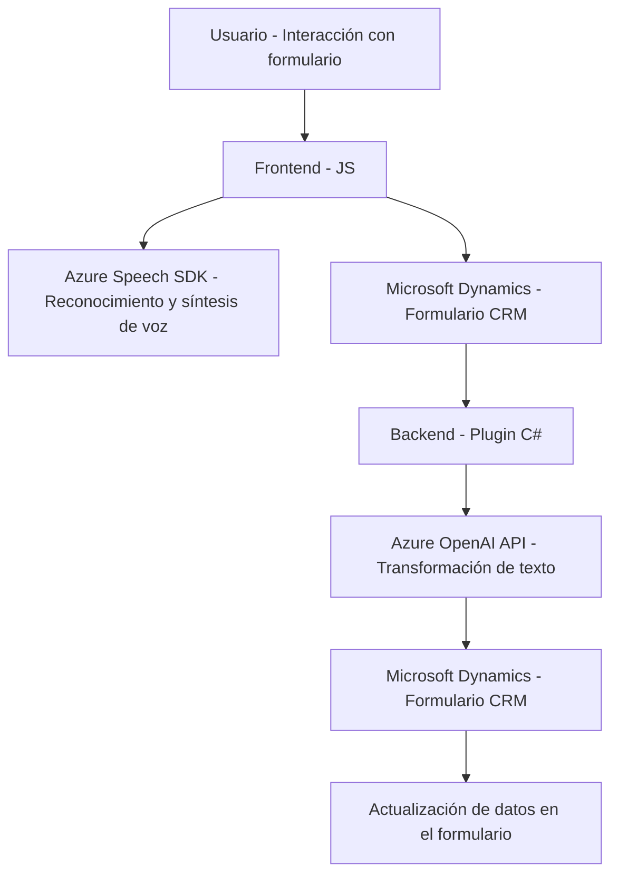

### Breve resumen técnico
Este repositorio mezcla código frontend y backend con un enfoque hacia la interacción entre usuarios y el CRM de Microsoft Dynamics, facilitando entrada y salida de datos mediante voz y APIs externas. Utiliza una combinación de JavaScript en el frontend para sintetizar y procesar voz con Azure Speech SDK y un plugin en C# en el backend para transformar texto con Azure OpenAI.

---

### Descripción de arquitectura
La arquitectura detectada combina elementos de **arquitectura n-capas** y **microservicios**, con una capa frontend que realiza interacciones de usuario, transformaciones de voz y comunicación con APIs y una capa backend que aplica lógica de negocios y transforma texto mediante Azure AI. Está diseñada para facilitar la integración con servicios externos (Azure SDK y APIs) y con el entorno de Dynamics CRM.

---

### Tecnologías usadas
1. **Frontend (JS)**:
   - Azure Speech SDK: Usado para reconocimiento y síntesis de voz.
   - Microsoft Dynamics Framework: Para la interacción con formularios CRM.
   - JavaScript: Realiza procesamiento de voz, carga de SDK dinámico y gestión de formularios.

2. **Backend (C#)**:
   - Microsoft Dynamics SDK: Usado para desarrollar plugins.
   - Azure OpenAI API: Usada para estructurar datos ingresados como texto.
   - Newtonsoft.Json: Para manipulación de datos en formato JSON.
   - System.Net.Http: Para realizar solicitudes HTTP hacia Azure OpenAI.

---

### Diagrama Mermaid válido para GitHub

---

### Conclusión final
Este repositorio implementa una solución híbrida que combina **n-capas** con integración de **microservicios externos** para enriquecer la experiencia dentro de un sistema CRM. El frontend se encarga de interacción con el usuario mediante voz, mientras el backend transforma y estructura información usando APIs de Azure. Esta solución está bien diseñada para entornos empresariales donde la entrada basada en voz y la transformación dinámica de datos son críticos. Sin embargo, podría mejorarse implementando mayor validación de errores en el plugin y optimizando la carga del SDK en el frontend.