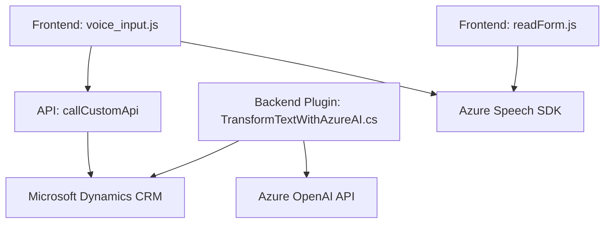

### Breve resumen técnico

Este sistema es una solución híbrida que incluye componentes de frontend y backend, diseñados para integrar entradas por voz y procesamiento de texto con servicios de Microsoft Azure. El frontend se utiliza para capturar y procesar información visible de formularios y manejar resultados de síntesis/reconocimiento de voz. El backend incorpora un plugin de Dynamics CRM que transforma texto mediante Azure OpenAI. 

### Descripción de arquitectura

La arquitectura del sistema tiene características de **microservicios y n capas**:
1. **Frontend (JavaScript)**:
   - Comunicaciones con Azure Speech SDK para reconocimiento de voz, síntesis y mapeo a formularios dinámicos.
   - Uso de APIs de Dynamics CRM para persistencia y lógica de negocio.
2. **Backend (C# Plugin)**:
   - Basado en plugins para Microsoft Dynamics CRM.
   - Plugins diseñados para extender funcionalidades mediante eventos del sistema.
   - Comunicación con el servicio Azure OpenAI mediante API Rest para realizar transformaciones de texto avanzado.

### Tecnologías usadas

1. **Frontend**:
   - Lenguaje: JavaScript.
   - Framework: Micro aplicaciones basadas en Dynamics CRM.
   - SDK externo: Azure Speech SDK.
  
2. **Backend**:
   - Lenguaje: C#.
   - SDK: Microsoft Dynamics CRM (via Microsoft.Xrm.Sdk).
   - API externa: Azure OpenAI API para procesamiento de texto mediante GPT-4.

### Diagrama Mermaid válido para GitHub:

### Conclusión final

Este repositorio presenta una solución arquitectónica basada en la integración entre frontend, APIs externas y backend, con Microsoft Dynamics CRM como base. Por un lado, el frontend maneja la entrada por voz y usa Azure Speech SDK para habilitar capacidades de síntesis y reconocimiento de voz. Por otro lado, el backend extiende la funcionalidad de Dynamics CRM mediante un modelo de plugin y utiliza Azure OpenAI para realizar tareas de procesamiento más avanzadas. Esta arquitectura permite a los desarrolladores construir un sistema escalable y orientado a eventos con un fuerte acoplamiento a servicios de Azure.