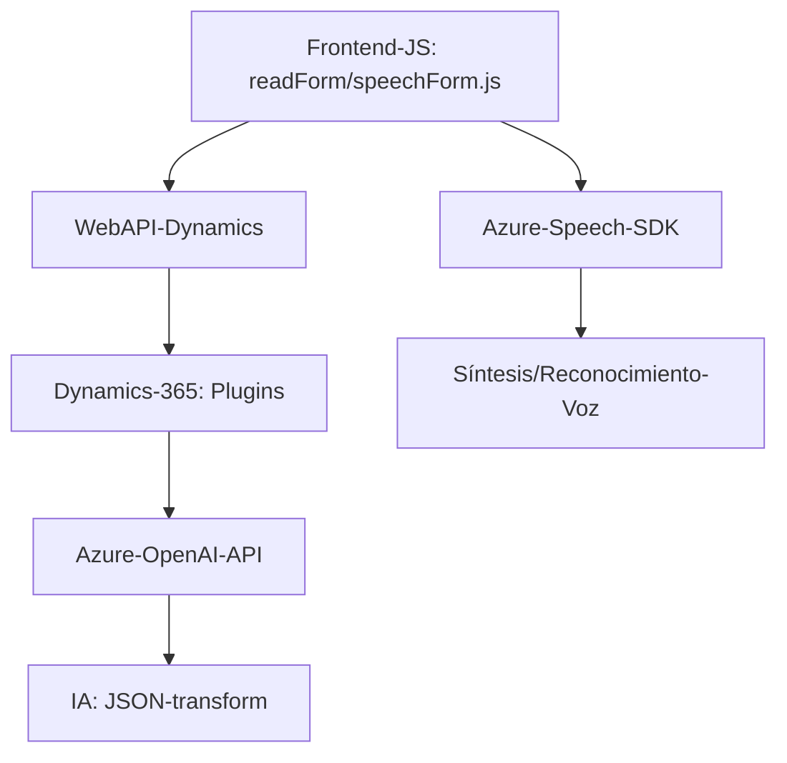

### Resumen técnico

Este repositorio presenta un sistema híbrido que utiliza elementos de un frontend en JavaScript junto con plugins de Dynamics CRM y APIs basadas en servicios externos como Azure Speech SDK y Azure OpenAI. Las soluciones están específicamente diseñadas para interactuar con formularios digitales en Dynamics CRM, procesar datos de voz y texto, y transformarlos mediante servicios de IA.

---

### Descripción de la arquitectura

#### Tipo de solución:
El proyecto se clasifica como una solución **híbrida** donde:
1. **Frontend / JavaScript**: Maneja la interacción del usuario, la síntesis, y el reconocimiento de voz, además de manipular datos del formulario.
2. **Backend / Dynamics CRM plugins**: Procesa texto avanzado mediante Azure OpenAI y actúa como intermediario con APIs externas.

#### Arquitectura:
La arquitectura refleja el patrón **n-capas**, donde cada capa cumple una función clara:
- **Capa de presentación**:
  - Archivos en `FRONTEND/JS` implementan la lógica del cliente.
  - Permiten la interacción entre usuarios finales y formularios usando el navegador.
  - Procesan datos y generan solicitudes al backend de Dynamics CRM.
  
- **Capa de servicios / negocios**:
  - Los plugins como `TransformTextWithAzureAI.cs` implementan lógica específica como el procesamiento de texto con IA.
  - Aprovechan Azure Speech SDK y Azure OpenAI para transformar texto y realizar síntesis o procesamiento en tiempo real.

- **Capa de integración**:
  - Integración profunda con servicios externos como Azure Speech SDK y OpenAI.
  - Llamadas directas a Dynamics CRM API usando `Xrm.WebApi.online`.

#### Características adicionales:
- Modularidad en funciones.
- Aplicación de patrones como **facade** para facilitar la interacción con APIs externas.
- Uso de **IoC (Inversion of Control)** en plugins para obtener servicios.
- Arquitectura **event-driven** al depender de disparadores en Dynamics CRM para ejecutar procesos.

---

### Tecnologías usadas

1. **Frontend:**
   - **JavaScript:** Para manejo del DOM, manipulación de formularios y llamadas a APIs externas como Azure Speech SDK.
   - **Libraries**:
     - Azure Speech SDK: Síntesis y reconocimiento de voz.
     - Web APIs de Dynamics CRM: Para interacción en tiempo real.

2. **Backend:**
   - **Plugins:** Implementados en C# para Dynamics CRM.
   - **Azure OpenAI API:** Procesamiento de texto utilizando IA.
   - **Newtonsoft.Json:** Manejo de operaciones JSON.
   - **HTTP Client:** Comunicación con servicios externos.

3. **Integration Layer:**
   - Azure services (Speech SDK, OpenAI, CSP libraries).

4. **Architecture Patterns:**
   - **n-capas** (Separación entre presentación, negocio, e integración).
   - **Facilitation Layer:** En frontend para el manejo de formulario.
   - **External Dependency Management:** Integraciones modulares con SDKs y APIs (Azure Speech SDK y Dynamics CRM Web API).

---

### Diagrama Mermaid

Puedes usar este diagrama para explicar cómo interactúan las diferentes capas y componentes del sistema presentado.

---

### Conclusión final

El sistema está diseñado para resolver desafíos técnicos asociados con la integración entre funciones de voz, automatización de formularios y procesamiento de texto con IA. La elección de una arquitectura n-capas permite una adecuada separación funcional, escalabilidad y mantenibilidad. Sin embargo, ciertos aspectos requieren atención, como la seguridad en la gestión de claves de acceso (como claves de Azure Speech SDK).

Recomendaciones:
1. **Seguridad mejorada**: Utilizar almacenes de secretos como Azure Key Vault para gestionar claves sensibles.
2. **Optimización**: Reducir dependencias innecesarias en las llamadas API para mejorar la eficiencia.
3. **Extensibilidad:** Modularizar más las funciones de frontend para soportar múltiples configuraciones de formularios y múltiples idiomas.