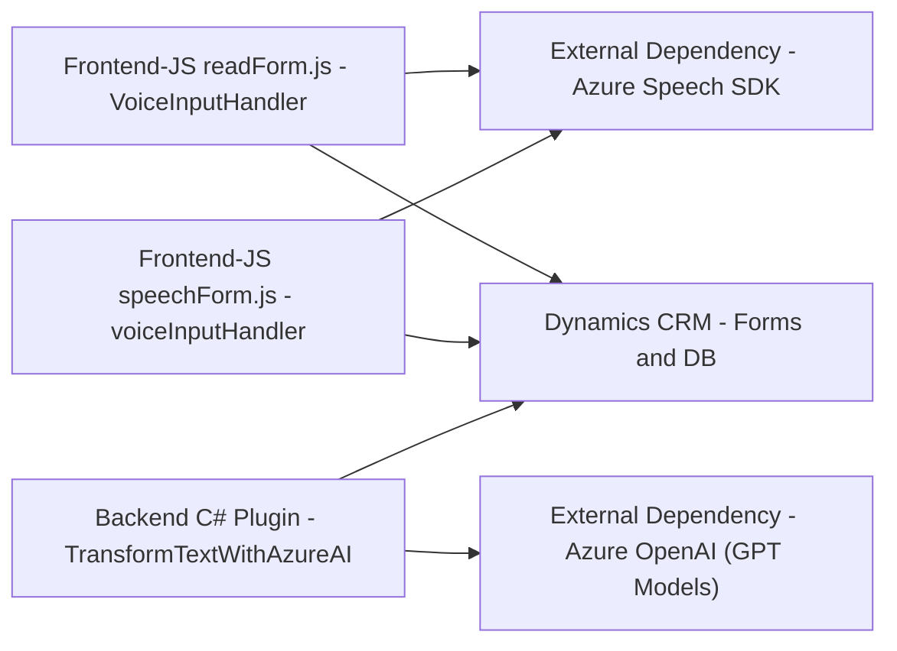

### Breve resumen técnico

Este repositorio contiene diversos archivos que implementan funcionalidades que complementan sistemas de formularios y la integración con servicios externos como Azure Speech SDK y Azure OpenAI. Se trata de una solución que amplía las capacidades de Dynamics 365 mediante operaciones de reconocimiento de voz, síntesis de voz y generación de contenido con inteligencia artificial.

---

### Descripción de la arquitectura

La solución tiene una arquitectura **modular y orientada a servicios**. Los principales componentes del sistema son:

1. **Frontend (JavaScript)**: Ofrece herramientas basadas en reconocimiento de voz y síntesis de voz con Azure Speech SDK. Estas funciones interactúan con los formularios de Dynamics 365 para enriquecer la experiencia del usuario. Ejemplos incluyen convertir texto del formulario en voz y actualizar formularios basándose en transcripciones de voz procesadas con IA.
   
2. **Backend (C# Plugins)**: Implementa un plugin en Dynamics CRM para invocar la API de Azure OpenAI y procesar texto proporcionado por el usuario a un formato deseado.

La arquitectura se podría clasificar como una solución **híbrida de integración de servicios**. Mientras Dynamics CRM actúa como el núcleo para administrar los datos y el flujo del sistema, se integran servicios externos (Azure Speech y OpenAI) que realizan tareas específicas que serían difíciles de implementar localmente en el sistema.

---

### Tecnologías usadas

- **Frontend (JavaScript)**:
  - **Azure Speech SDK**: Para reconocimiento y síntesis de voz.
  - **Dynamics 365 Web API**: Para interactuar con formularios y realizar operaciones CRUD.
  - **ES6 JavaScript**: Con uso de funciones asincrónicas (`async/await`) y promesas (`Promise`).

- **Backend (C#)**:
  - **Azure OpenAI API**: Para integrar servicios de IA que transforman texto.
  - **Microsoft Dynamics SDK**: Manejo de contextos y servicios internos de CRM.
  - **Newtonsoft.Json**: Procesamiento de datos en formato JSON.
  - **System.Net.Http**: Para realizar solicitudes HTTP al API de Azure OpenAI.

- **Patrones utilizados**:
  - Modularización: Ambos proyectos tienen bien definidos los componentes y funcionalidades con responsabilidades claras.
  - Integración con APIs: Uso de servicios externos distribuidos y especializados.
  - Encapsulación: Métodos y clases con responsabilidades específicas.
  - Factory Method: Configuración y manejo dinámico de SDKs (Azure Speech SDK).
  - Plugin Architecture: Aplicado al backend con el uso del patrón que facilita la integración con Dynamics CRM.

---

### Dependencias o componentes externos presentes

1. **Azure Speech SDK**:
   - Gestión del reconocimiento y síntesis de voz.
   - Carga dinámica desde: `https://aka.ms/csspeech/jsbrowserpackageraw`.

2. **Azure OpenAI Service**:
   - Modelos preentrenados basados en GPT-4 para transformación avanzada de texto.

3. **Microsoft Dynamics SDK**:
   - Módulo interno de Dynamics para desarrollo de plugins CRM.
   - Interacción con `IServiceProvider`, `Xrm.WebApi`.

4. **Librerías externas del backend**:
   - `Newtonsoft.Json`
   - `System.Text.Json`
   - `System.Net.Http`

5. **Hosting en Azure**:
   - Backend y API alojadas y gestionadas en Azure, incluida la interacción con OpenAI y Speech SDK.

6. **Integration Architecture**:
   - El sistema se apoya en tecnologías estanqueadas entre frontend y plugins backend, haciendo uso de APIs REST y contextos CRM.

---

### Diagrama Mermaid

---

### Conclusión final

Este repositorio corresponde a una solución técnica diseñada para enriquecer la experiencia de usuario en **Dynamics 365** mediante servicios de IA y reconocimiento de voz. La arquitectura utiliza una división clara entre frontend, complementos de backend y servicios en la nube. Mediante módulos como Azure Speech SDK y OpenAI, la complejidad de funcionalidades avanzadas se delega a servicios externos, beneficiando el diseño general al modularizar tareas específicas.

Esta solución tiene un enfoque híbrido, integrando herramientas nativas de Dynamics con microservicios en la nube especializados para reconocimiento de voz y generación de texto.