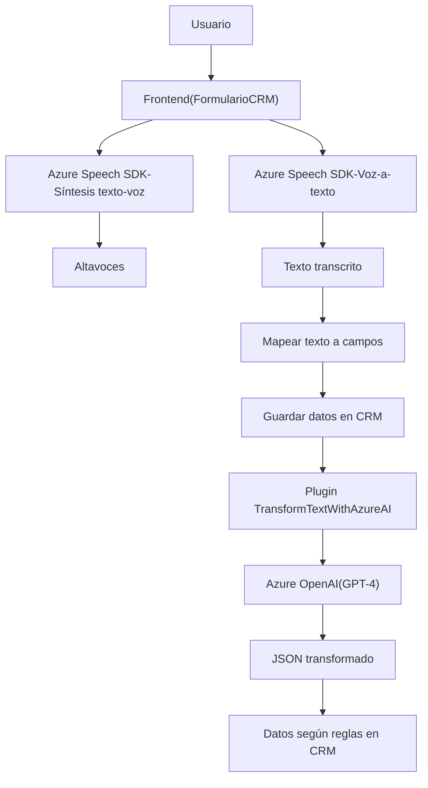

### Breve resumen técnico

El repositorio se orienta a proporcionar una solución de interacción avanzado entre el usuario y formularios dinámicos mediante la integración de funcionalidades de voz y análisis de texto. Usa APIs externamente (Azure Speech SDK y Azure OpenAI) para síntesis de voz, reconocimiento de voz, y transformación de texto en un entorno CRM como Dynamics 365.

---

### Descripción de arquitectura

La arquitectura usa un enfoque híbrido:
1. **Segregación funcional**:
   - **Frontend (JavaScript)** gestiona la interacción del usuario a través de voz con formularios dinámicos.
   - **Plugins (C#)** actúan como extensiones que interactúan con Dynamics 365 para transformar texto mediante Azure OpenAI.
2. **Integración de Microservicios**:
   - Usa servicios externos de Microsoft Azure (Speech SDK y OpenAI) como microservicios para agregar capacidades avanzadas.
3. **Plataforma CRM**:
   - Extiende capacidades sobre Dynamics 365 con eventos y plugins.

### Tecnologías usadas

#### **Lenguajes**:
- **JavaScript:** Para el desarrollo del frontend.
- **C#:** Desarrollo de plugins de Dynamics CRM.

#### **Frameworks y Servicios**:
1. **Microsoft Azure Speech SDK**:
   - Síntesis y reconocimiento de voz.
   - Dinámicamente cargado en el frontend.
2. **Azure OpenAI (GPT-4)**:
   - Proceso y transformación de texto.
3. **Microsoft Dynamics CRM SDK**:
   - Interacción con APIs de CRM.
4. **Newtonsoft.Json:** Para deserealización/serialización JSON en .NET.

#### Patrones:
- Observador (espera a que el SDK esté disponible antes de ejecutar lógicas).
- Modularidad (separación clara de funcionalidades por archivos y métodos).
- Plugin-based Architecture para eventos en CRM.

---

### Qué dependencias o componentes externos podrían estar presentes

1. **Azure Speech SDK** (Frontend):
   - Carga dinámica del paquete JS necesario para soporte de síntesis y reconocimiento de voz.
2. **Azure OpenAI GPT-4** (Backend C# Plugin):
   - API configurada según parámetros predeterminados.
3. **Dynamics CRM-specific Libraries**:
   - `Microsoft.Xrm.Sdk` para manejar eventos plugin y manipular objetos CRM.
4. **JSON Libraries** (Newtonsoft, System.Text.Json).

Opcionalmente:
- CRM Web API (`Xrm.WebApi`) para manipulación directa de datos.

---

### Diagrama **Mermaid**

---

### Conclusión final

El sistema propuesto es una solución híbrida que extiende las capacidades de interactividad y accesibilidad en un entorno CRM. Los archivos incluyen lógica para síntesis de voz, reconocimiento de voz, y procesamiento AI del texto. La arquitectura emplea la modularidad, plugins en CRM, y microservicios basados en Azure para una interacción rica con datos de formularios dinámicos.