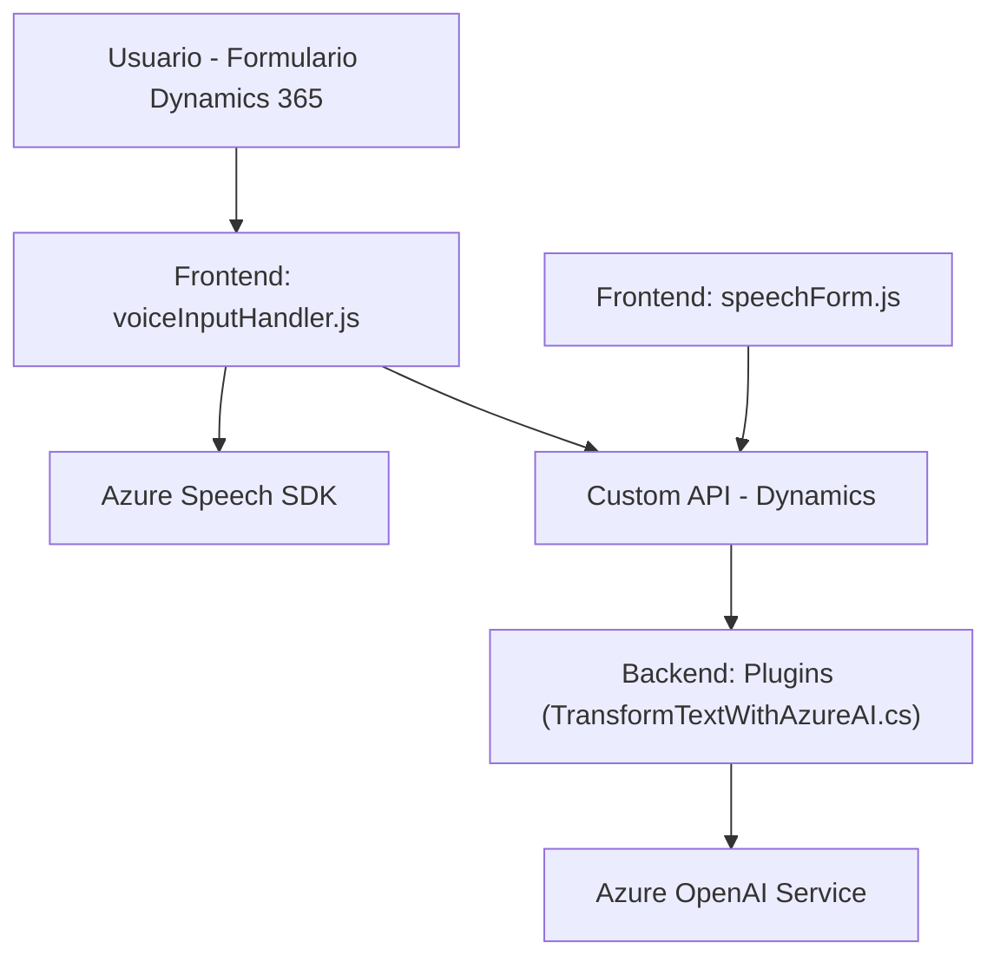

### Breve resumen técnico:
El repositorio contiene principalmente módulos de frontend en JavaScript y plugins en C# orientados a la integración de tecnología avanzada para la transformación de texto, junto con la comunicación entre formularios y servicios externos. Utiliza **Azure Speech SDK** para reconocimiento y síntesis de voz, y **Azure OpenAI Service** para transformar texto según reglas personalizadas. La solución se encuentra integrada con **Microsoft Dynamics 365**, actuando como un sistema que mejora la interacción vocal y textual entre el usuario y los datos de CRM.

---

### Descripción de arquitectura:
Este proyecto implementa una arquitectura de **n capas integrada**, donde diferentes niveles se enfocan en roles específicos:
1. **Frontend (Presentación)**: Gestiona interacción con el usuario y tecnología de voz mediante Azure Speech SDK.
2. **Intermedio (Lógica de Aplicación)**: Mapeo y transformación de datos antes de aplicarlos a formularios de Dynamics 365.
3. **Backend (Plugins y Microservicios)**: Extiende funcionalidades del CRM mediante plugins desarrollados en C#, procesando datos con Azure OpenAI Service.

Adicionalmente, se observa una integración **API-Driven** mediante el uso de Azure Speech SDK, OpenAI API, y API de Dynamics CRM (Custom APIs y `Xrm.WebApi.online.execute`) para obtener y aplicar datos.

---

### Tecnologías usadas:
1. **Frontend:**
   - **JavaScript** para manipulación de formularios y comunicación con Azure Speech SDK.
   - Dependencias:
     - Azure Speech SDK (`https://aka.ms/csspeech/jsbrowserpackageraw`).

2. **Backend:**
   - **C#** para lógica de transformación de datos mediante Azure OpenAI Service.
   - Frameworks:
     - **.NET** para el desarrollo de plugins en Dynamics CRM.
     - **Microsoft Dynamics SDK** (interacción con CRM).
   - Dependencias:
     - `System.Net.Http` y `Newtonsoft.Json` para comunicación con OpenAI.
     - **Azure OpenAI Service** para generación de texto estructurado.

3. Integración y Servicios:
   - Microsoft Dynamics CRM con plugins personalizados ejecutándose en eventos.
   - APIs REST de Azure Speech SDK y OpenAI Service.

4. Arquitectura:
   - **n capas**, con separación entre presentación, lógica de aplicación y lógica del backend.
   - **Integración modular** de servicios externos como SDKs y APIs.

---

### Diagrama Mermaid:

---

### Conclusión final:
El repositorio implementa una solución avanzada para integrar procesamiento de voz y texto en un entorno CRM mediante **Microsoft Dynamics 365**, **Azure Speech SDK**, y **Azure OpenAI Service**. La arquitectura modular y orientada a n capas permite una fácil escalabilidad y mantenimiento. Este sistema facilita la interacción del usuario con formularios mediante comandos vocales y transforma texto en estructuras JSON para su aplicación directa en el CRM. Es ideal para entornos corporativos donde se requiere automatización y mejora de la experiencia del usuario.