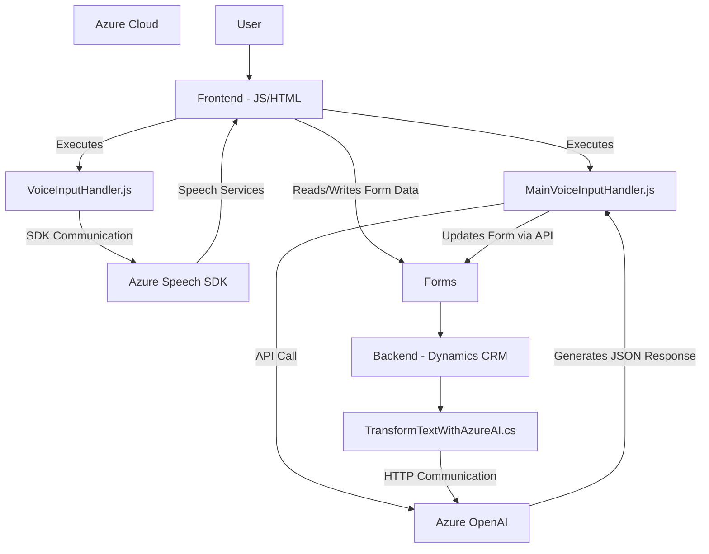

### Breve resumen técnico
El código muestra un sistema que combina capacidades frontend (JavaScript en el navegador) y backend (Plugins en Dynamics CRM) para integrar servicios de Azure, específicamente Speech SDK, OpenAI y capacidades del Dynamics Web API. El enfoque está en proporcionar funcionalidades avanzadas de entrada/salida de texto y voz, incluyendo transformación mediante inteligencia artificial (IA).

### Descripción de arquitectura
La solución tiene una arquitectura **cliente-servidor híbrida**, donde el frontend actúa como el consumidor de servicios de backend (API de Dynamics CRM y Azure). Integra paradigmas como eventos del usuario en la interfaz y patrones comunes como el **plugin para Dynamics CRM** y **proxy para servicios externos**. El backend (plugins y servicios externos) sigue el diseño **n capas** porque las operaciones de lógica, comunicación externa y transformación de datos están separadas.

### Tecnologías usadas
- **Frontend:**
  - JavaScript ECMAScript (módulos funcionales).
  - Azure Speech SDK.
  - Dynamics Web API (`Xrm.WebApi.online`).
- **Backend:**
  - C# (.NET Framework/SDK).
  - Microsoft Dynamics CRM SDK.
  - Azure OpenAI Service.
  - Newtonsoft.Json para manipulación de JSON.
  - System.Text.Json y System.Net.Http para solicitudes HTTP.
- **Infraestructura:**
  - Azure para servicios externos (Speech SDK, OpenAI).
  - Dynamics CRM para gestión de formularios y procesamiento.
  
### Diagrama Mermaid válido para GitHub

### Conclusión final
La solución es un **frontend-backend integration** orientada a formularios y servicios basados en voz. Se utiliza una arquitectura **n capas** en el backend (separación entre interfaz de administración de datos y lógica) y patrones como plugins para Dynamics CRM y comunicación de APIs externas. El diseño permite expandir funcionalidades gracias al desacoplamiento de los componentes con servicios externalizados (Azure APIs). Aunque robusto, hay aspectos a mejorar como la externalización de las configuraciones sensibles (e.g., claves de API y endpoint de OpenAI) y optimización en la modularidad del código.