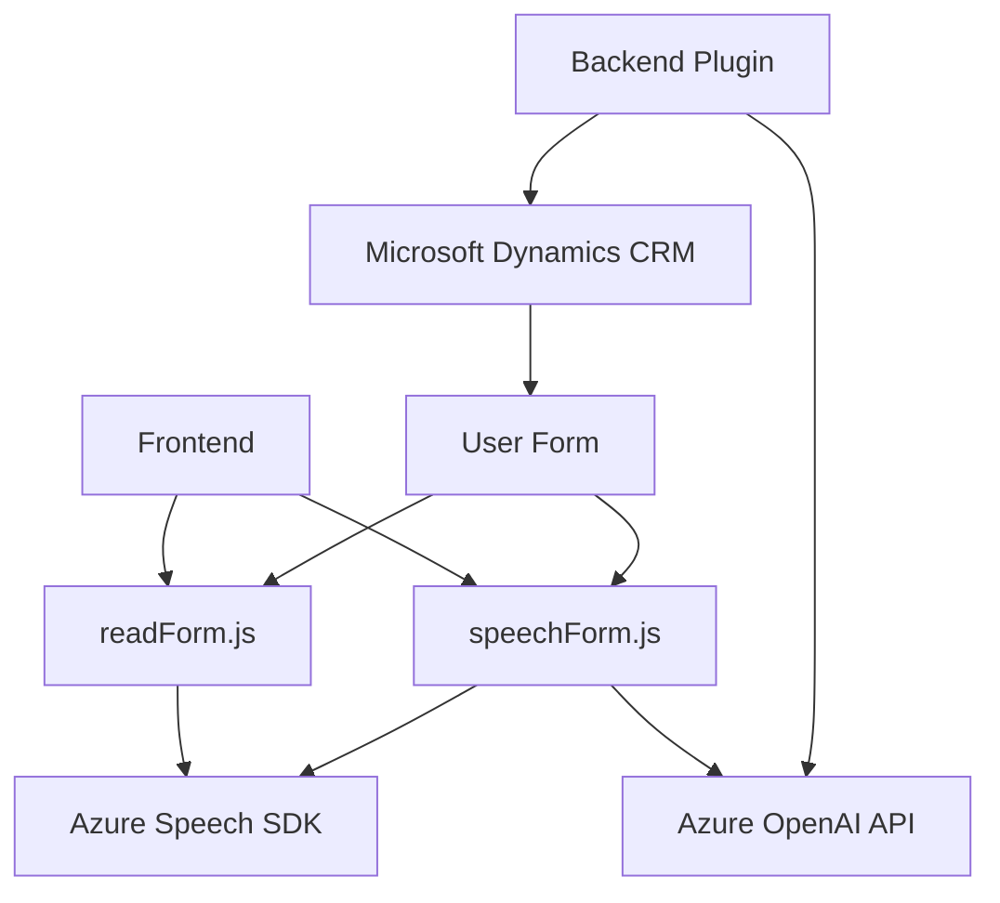

### Análisis técnico del repositorio

#### Breve resumen técnico
El repositorio está compuesto por tres archivos principales, cada uno con una funcionalidad específica en relación a un sistema que utiliza **Azure Cognitive Services**, **Azure OpenAI** y **Microsoft Dynamics 365**. Estas funcionalidades están orientadas al procesamiento de formularios, entrada de voz y transformación de texto con integración de inteligencia artificial. El sistema parece diseñado para mejorar la experiencia del usuario mediante una interfaz enriquecida en voz y procesamiento automatizado de datos.

---

### 1. Descripción de arquitectura
El sistema utiliza componentes modulares que interactúan entre sí y con servicios externos. La arquitectura parece orientada a un enfoque **n capas** con integración de servicios distribuidos (Azure Speech SDK y OpenAI API). Este enfoque permite desacoplar el frontend de los servicios externos y mantener una interacción fluida entre formularios de Dynamics 365 y adaptaciones mediante procesamiento de voz e IA.

**Organización del repositorio:**
1. **Frontend** (archivos `readForm.js` y `speechForm.js`): 
   - Se encargan de la interacción del usuario y la lógica de síntesis/transcripción de voz para formularios.
   - Modularidad alta y patrones de evento para interacción en tiempo real.

2. **Backend (Plugin)**:
   - Plugin de Dynamics 365 (`TransformTextWithAzureAI.cs`) para procesamiento avanzado de texto con Azure OpenAI.
   - Actúa como microservicio interno encapsulado.

---

### 2. Tecnologías y patrones usados
#### Tecnologías
1. **Lenguajes**:
   - JavaScript para el frontend.
   - C# para el backend de Dynamics.
2. **Servicios externos**:
   - **Azure Speech SDK**: Sintetización y transcripción de voz.
   - **Azure OpenAI API**: Procesamiento avanzado de texto mediante IA.
3. **Frameworks**:
   - **Microsoft Dynamics 365 SDK**: Extensión de CRM.
   - **Newtonsoft.Json y System.Text.Json**: Procesamiento JSON en C#.
4. **Web APIs**:
   - **Xrm.WebApi**: Llamadas API dentro de Dynamics.
   - **HttpClient**: Solicitudes HTTP en el plugin de backend.
5. **Librerías adicionales**:
   - Uso de un script dinámico para cargar el SDK (desde `https://aka.ms/csspeech/jsbrowserpackageraw`).
   
#### Patrones usados
1. **Event-Driven**: 
   - Procesamiento desencadenado por interacción del usuario (entrada de voz, selección de campos).
2. **Wrapper SDK**: 
   - Funciones para abstraer la carga y uso del Azure Speech SDK.
3. **Microservicios**:
   - Integración con servicios API como un componente especializado.
4. **DTO (Data Transfer Object)**:
   - Uso de JSON para estructurar y transferir datos entre el cliente y los servicios API.

---

### 3. Dependencias o componentes externos
- **Azure Speech SDK**: Sintetización y transcripción de voz.
- **Azure OpenAI API**: Procesamiento de texto avanzado.
- **Xrm.WebApi**: Integración de backend desde Dynamics CRM.
- **Microsoft Dynamics SDK**: Extensión del CRM mediante plugins.
- **SDK de JavaScript** cargado desde Azure para comunicación con Speech Services.

---

### 4. Diagrama **Mermaid**

---

### Conclusión final
El repositorio combina las capacidades de un sistema **frontend con procesamiento de voz**, **plugins backend**, y el uso de **servicios avanzados de inteligencia artificial** en **Microsoft Dynamics CRM**. La arquitectura está dividida en módulos con responsabilidades específicas, siguiendo patrones de diseño modernos (event-driven, SDK wrapper y modularidad). La elección de tecnologías y servicios muestra un enfoque en la escalabilidad y la integración en plataformas cloud como **Azure**, además de una sólida estrategia orientada a mejorar las interacciones del usuario final mediante tecnología de voz e IA.