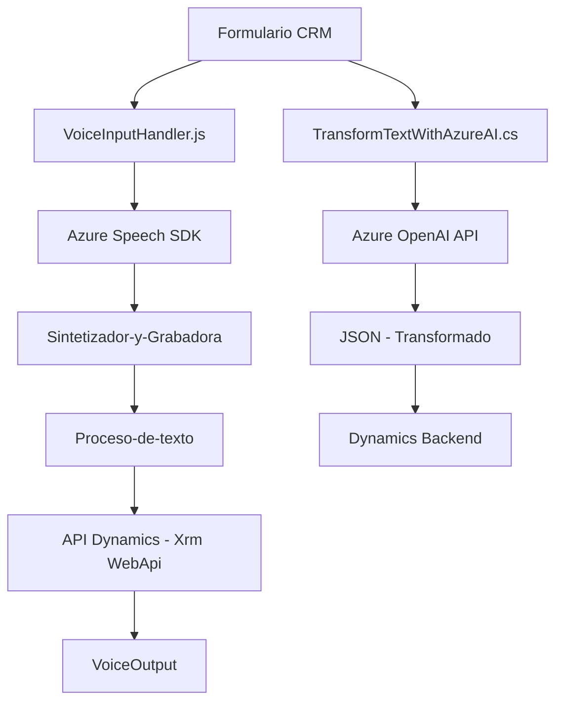

### Breve Resumen Técnico
El repositorio implementa una solución híbrida que combina diferentes componentes para integrar **Azure Speech SDK** y **Azure OpenAI API** con un sistema CRM (como Dynamics 365). La finalidad principal de los scripts y plugins es facilitar la interacción por voz y texto con formularios CRM, permitiendo transformación avanzada de datos mediante **AI-as-a-Service**.

---

### Descripción de Arquitectura
1. **Tipo de Solución**:
   - El repositorio representa una solución de **integración de voz y procesamiento de texto** en un sistema CRM backend (Dynamics 365). Combina funcionalidades como entrada por voz, síntesis de salida de voz, manejo de datos de formularios visibles y enriquecimiento de texto utilizando servicios AI en Azure.

2. **Arquitectura Observada**:
   - **N capas** (Front-End con lógica de interacción y Back-End basado en plugins de Dynamics CRM).
   - **Event-Driven Architecture**: Tanto el Frontend (`VoiceInputHandler.js`) como el Plugin (`TransformTextWithAzureAI.cs`) responden a eventos específicos: grabación de voz o ejecución en el contexto del CRM.
   - **Integración de Microservicios**: Uso de servicios externos como **Azure Speech SDK** y **Azure OpenAI API**, lo que introduce elementos de una arquitectura basada en microservicios.
   - Modularización y bajo acoplamiento: Cada script y plugin encapsula su funcionalidad, permitiendo intercambios con servicios externos sin interdependencias rígidas.

---

### Tecnologías Usadas
#### Frontend
- **JavaScript (readForm.js y voiceInputHandler.js)**: Lógica de interacción con formularios, grabación de voz y síntesis de texto.
- **Azure Speech SDK**: Biblioteca JavaScript para convertir voz a texto y texto a voz, con capacidades multilingües.
- **API de Dynamics CRM**: Métodos para manipular registros y datos del CRM (Xrm.WebApi).

#### Backend
- **C# Plugins para Dynamics CRM**:
  - **IPlugin**: Punto de entrada para ejecutar lógica personalizada en eventos CRM.
  - **Azure OpenAI API**: Servicio externo de IA para transformar texto a JSON estructurado.
- **Librerías**:
  - Newtonsoft.Json.Linq: Para la manipulación avanzada de JSON.
  - System.Net.Http: Para enviar solicitudes HTTP a servicios externos.

---

### Dependencias o Componentes Externos
1. **Azure Speech SDK**:
   - Usada en el frontend para manejar voz a texto y texto a síntesis de voz.
   - Proporciona integración en tiempo real, cargada dinámicamente desde el navegador.

2. **Azure OpenAI API**:
   - Transformación avanzada de texto basada en normas mediante **GPT-4**.
   - Se accede vía plugins C# mediante HTTP.

3. **Microsoft Dynamics CRM APIs**:
   - Alternativas como `Xrm.WebApi` para interactuar con entidades (formContext y atributos).

4. **Otros**:
   - **Web Browser Environment**: Para realizar la carga dinámica del Azure Speech SDK.
   - **Newtonsoft.Json**: Para la serialización/deserialización de datos JSON.

---

### Diagrama Mermaid

---

### Conclusión Final
El repositorio está diseñado para agregar capacidades avanzadas de entrada y salida de voz, y procesamiento de texto mediante servicios AI de Azure al ecosistema de Dynamics 365. Funciona bajo una arquitectura **n capas** con **patrones de integración orientados a eventos y servicios externos**, logrando modularidad y extensibilidad significativa. Está optimizado para capturar, transformar y asignar datos dinámicos del formulario de CRM mediante métodos de voz y texto.