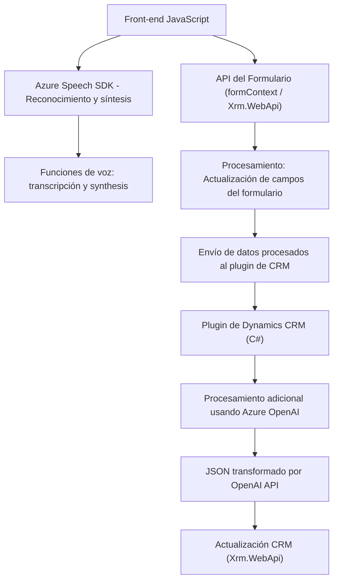

### Breve resumen técnico:

El repositorio representa un **sistema de integración orientado a la accesibilidad y enriquecimiento de datos dentro del entorno Dynamics CRM**. Está organizado para potenciar la interacción de usuarios con formularios mediante entrada de voz y transformación de texto con servicios de Microsoft Azure, como Azure Speech SDK y Azure OpenAI. Existen múltiples piezas: archivos JavaScript para el frontend que manipulan y procesan datos del formulario, y un plugin para Dynamics CRM encargado de enviar datos a la API de procesamiento de lenguaje en Azure.

---

### Descripción de arquitectura:

La arquitectura combina características de una **arquitectura n capas** en el lado del CRM, con un enfoque híbrido de integración de **APIs externas** (Azure Speech, Azure OpenAI). Tiene las siguientes componentes principales:
1. **Front-end basado en JavaScript**: Funcionalidades específicas para leer, transcribir y procesar datos en formularios del CRM ejecutando lógica de cliente.
2. **Backend en forma de plugin para Dynamics CRM**: Codifica lógica de transformación de texto enviada por formularios usando Azure OpenAI. Esto se despliega bajo el esquema plugin del CRM.
3. **Dependencias externas**: Principalmente servicios en la nube de Azure.
4. **Integración modular**: Cada módulo (backend y frontend) cumple una responsabilidad específica, siguiendo principios del diseño modular.

La interacción entre capas ocurre mediante APIs y SDKs, que actúan como intermediarios entre las capas y los servicios externos.

---

### Tecnologías usadas:

1. **Frontend**:
   - Lenguaje principal: JavaScript.
   - Integración con Dynamics CRM mediante la API de cliente (formContext, Xrm.WebApi).
   - Uso de Azure Speech SDK para reconocimiento y síntesis de voz.
   - Uso de promesas y funciones `async/await` para operaciones asíncronas.
   - Patrones aplicados: Modularidad, gestor de dependencias dinámico (carga de SDK por demanda).

2. **Backend**:
   - Lenguaje principal: C# (.NET Framework).
   - SDK utilizado: Microsoft.Xrm.Sdk para el plugin de Dynamics CRM.
   - Servicios: Azure OpenAI API (uso de GPT-4).
   - Dependencias: System.Net.Http (comunicación HTTP), Newtonsoft.JSON y System.Text.Json (serialización y deserialización de JSON).

3. **Servicios Externos**:
   - **Azure Speech SDK** (reconocimiento y síntesis de voz).
   - **Azure OpenAI API** (GPT-4 para procesamiento lingüístico).

---

### Diagrama Mermaid válido para GitHub:

---

### Conclusión final:

Este repositorio implementa una solución que utiliza **tecnología vocal avanzada y procesamiento de lenguaje natural** para mejorar la administración de formularios en un CRM (Dynamics). Muestra una mezcla de arquitecturas como n capas y microservicios debido a su modularidad, y la dependencia de varios sistemas y API externas. Es una estrategia efectiva para proporcionar accesibilidad y automatización en sistemas CRM, especialmente integrando los servicios de Azure. Sin embargo, para mejorar la mantenibilidad y escalabilidad, se podría explorar un enfoque hexagonal o basarlo completamente como servicio independiente con una API RESTful, en lugar de parcial dependencia del modelo de plugins.