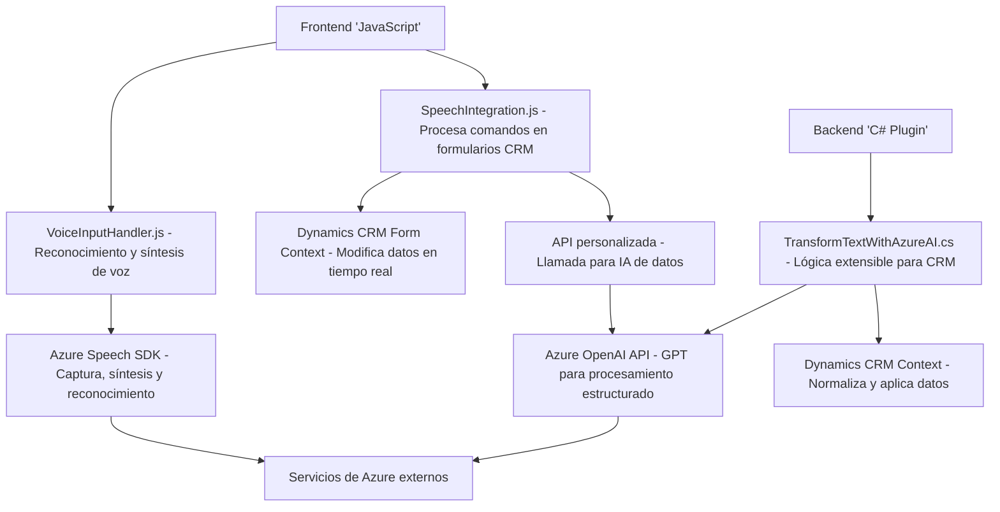

# Análisis Técnico Detallado

### Breve resumen técnico:
El repositorio actual presenta una solución que integra reconocimiento de voz (captura de datos del usuario hablados) con sistemas de formularios, aprovechando el **SDK de Azure Speech** y el modelo **Azure OpenAI GPT** en un entorno de **Dynamics CRM**. Es una arquitectura que combina un frontend basado en JavaScript, un backend extensible mediante plugins de Dynamics CRM, y servicios externos de Azure para IA y síntesis de voz.

---

### Descripción de arquitectura:
#### Solución:
La solución combina la tecnología frontend y backend con servicios externos. Consiste en las siguientes partes:
1. **Frontend**: Scripts en JavaScript que interactúan con el cliente del formulario del sistema CRM mediante reconocimiento de voz y síntesis, usando el **Azure Speech SDK**.
2. **Backend**: Plugins C# integrados en Dynamics CRM, los cuales procesan texto (proveniente de voz) mediante normas específicas usando **Azure OpenAI GPT** (modelo de lenguaje).
3. **Servicios externos**: La solución depende de servicios de Azure, como **Azure Speech SDK** y **Azure OpenAI**.

#### Arquitectura:
La arquitectura general es híbrida, combinando:
1. **Monolítica con plugins**: C# implementa y extiende lógica en Dynamics CRM mediante el patrón de plugins.
2. **Integración de servicios externos**: Usa conceptos **Proxy y APIs REST** para consumir servicios como Azure Speech y Azure OpenAI desde el frontend JavaScript (cliente) y el backend C# (socializando texto transformado).
3. **N capas**:
   - *Capa de presentación*: Archivos JavaScript que interactúan con el usuario.
   - *Lógica de negocio*: Centralizada en plugins del backend que procesan texto con normas específicas.
   - *Capa de integración*: Servicios externos (Speech y AI) que complementan las necesidades del sistema.

---

### Tecnologías usadas:
1. **Frontend (JavaScript)**:
   - **Azure Speech SDK**: Para reconocimiento de voz y síntesis de texto.
   - **Browser APIs**: Manipulación del DOM y dinámica de scripts.
   - **Dynamics CRM Form Context API**: Para obtener y modificar datos del formulario.

2. **Backend (C#)**:
   - **Plugins Dynamics CRM**:
     - `IPlugin`, `IOrganizationService`, y `IOrganizationServiceFactory`: Extensibilidad de Dynamics CRM para eventos del sistema.
     - `System.Net.Http`: Para solicitudes HTTP hacia Azure AI.
     - `Newtonsoft.Json.Linq` y `System.Text.Json`: Manejo y transformaciones de JSON.
   - **Azure OpenAI GPT API**: Procesamiento de texto según reglas específicas.

3. **Servicios Externos**:
   - **Azure Speech SDK**: Procesamiento, síntesis, y reconocimiento de voz.
   - **Azure OpenAI GPT API**: Transformación estructurada y semántica del texto.

4. **Patrones de diseño**:
   - **Proxy Pattern**: Para consumir y manejar dependencias externas (p. ej., Azure Speech y OpenAI).
   - **SRP (Single Responsibility Principle)**: Cada clase y método enfocado en una responsabilidad específica.
   - **Encapsulación funcional en frontend**: Dividido en funciones para tareas individuales, como manipular campos visibles, manejar errores, procesar texto, etc.

---

### Dependencias o componentes externos:
1. **Azure Speech SDK**: Para procesamiento de datos hablados (sintetización y reconocimiento).
2. **Azure OpenAI GPT API**: Para generación de texto procesado basado en IA.
3. **Dynamics CRM Context API**: Interacción con los datos almacenados en formularios.
4. **Newtonsoft.Json y System.Text.Json**: Para manejo de estructuras JSON entre el backend y servicios externos.
5. **Browser runtime APIs**: Para manipular DOM, cargar scripts dinámicamente, etc.

---

### Diagrama Mermaid

---

### Conclusión Final:
Esta solución representa una integración robusta entre tecnologías modernas como reconocimiento de voz (Azure Speech SDK) y procesamiento textual avanzado (Azure OpenAI GPT), configurada en un ambiente corporativo sobre Dynamics CRM. La combinación de frontend JavaScript, backend extensible con C# plugins y servicios novedosos como Azure AI muestra una arquitectura de **n capas**, con integración externa orientada a servicios. La modularidad y extensibilidad del diseño lo hacen apto para ampliaciones futuras bajo un modelo híbrido y empresarial.