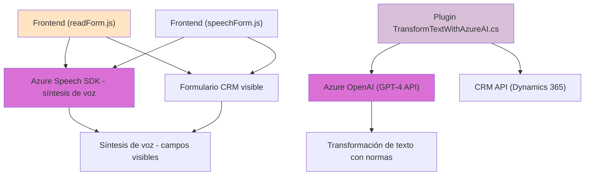

### Breve resumen técnico:
El repositorio analiza soluciones y funcionalidades basadas principalmente en integración con servicios externos como Azure Speech SDK y Azure OpenAI. Los archivos implican una solución mixta entre front-end y plug-ins para plataformas CRM (Dynamics 365). Se presentan funcionalidades de síntesis de voz, entrada de voz y procesamiento de texto inteligente.

---

### Descripción de arquitectura:
La arquitectura de este sistema se puede categorizar como **modular con integración externa**, utilizando tanto componentes front-end como back-end:
1. **Front-end:** 
   - Archivos en la carpeta `FRONTEND` ejecutan interacción directa con elementos de UI, como formularios. Utilizan el SDK de Azure Speech para operaciones de entrada/salida de voz y llaman APIs externas.
2. **Back-end:**
   - La carpeta `Plugins` contiene lógica que interactúa con Dynamics 365, mediante plug-ins que integran dinámicamente servicios de Azure OpenAI para transformar texto en tiempo real.
3. **Estilo de arquitectura:** Entre **n capas** y **microservicios**, depende de cómo se despliegen:
   - **n capas**: Front-end para interacción UI, back-end para plug-ins de Dynamics.
   - **microservicios**: Integración con servicios de nube externos como Azure, delegando tareas específicas.

---

### Tecnologías usadas:
1. **Front-end:**
   - **JavaScript** con integración directa de:
     - Azure Speech SDK.
     - Promesas para manejo asíncrono.
   - Uso de objetos de contexto de Dynamics 365 (Xrm).

2. **Back-end:**
   - **C#** con Dynamics 365 SDK:
     - `IPlugin`: Interfaz para desarrollar plugins.
   - **Azure OpenAI API** para el procesamiento de texto mediante llamadas HTTP.
   - Librerías: `Newtonsoft.Json`, `System.Text.Json`, `System.Net.Http`.

3. **Patrones de arquitectura:**
   - Modularidad: Separación de funcionalidades por responsabilidad en funciones y clases.
   - Callback-based design: SDK de Speech requiere manejo asíncrono.
   - Integración con servicios externos: Interacción directa con Azure Speech y OpenAI.

---

### Dependencias y componentes externos:
1. **Exteriores:**
   - **Azure Speech SDK**: Para operaciones de entrada de voz y síntesis de voz.
   - **Azure OpenAI**: Para procesamiento de texto avanzado.
   - **Dynamics 365 CRM Web API**: Para mapeo y operación de datos en formularios.

2. **Internos:**
   - Xrm API para extracción de datos de formularios CRM.
   - Clases y métodos auxiliares como `getVisibleFieldData`, `processTranscript`.

---

### Diagrama Mermaid válido para GitHub Markdown:

---

### Conclusión final:
Este repositorio representa una solución integrada entre un **front-end accesible** y un **back-end basado en plugins** que interactúa con servicios externos como Azure Speech SDK y OpenAI API. La arquitectura modular con integración externa es adecuada para sistemas CRM avanzados donde la accesibilidad y automatización son clave. Sin embargo, sería conveniente optimizar la arquitectura con procesamiento asíncrono en los plugins y considerar la consolidación operacional para minimizar dependencias externas no críticas.