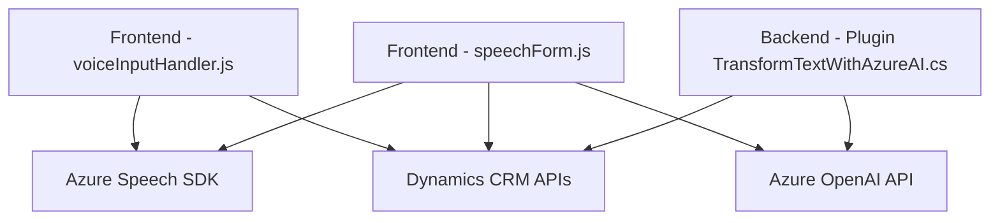

### Breve resumen técnico:
El repositorio contiene una solución orientada a Dynamics 365 CRM, específicamente en el contexto de interacción con formularios y procesamiento de datos mediante reconocimiento y síntesis de voz. Además, emplea un plugin para procesar texto con Azure OpenAI. La solución integra dependencias externas como **Azure Speech SDK** y **Azure OpenAI**, además de utilizar APIs de Dynamics CRM.

---

### Descripción de arquitectura:
La solución refleja un enfoque combinado de arquitectura:
- **Multicapa**: Se aprecia una separación lógica entre backend (Plugins en C#), frontend (archivos JS para formularios) y dependencias externas.
- **Estructura modular**:
  - Cada archivo aborda una responsabilidad específica: generación de voz, entrada por voz y procesamiento avanzado de texto (Azure AI).
- **Microservicios e integración externa**: Las operaciones más complejas delegan la lógica a servicios externos como **Azure Speech SDK** y **Azure OpenAI**.
- **Dinámica y extensibilidad**: Aprovecha la capacidad del SDK de Dynamics CRM para extender y modificar el comportamiento del sistema en tiempo de ejecución.

---

### Tecnologías usadas:
1. **Front-end**:
   - Lenguaje: JavaScript.
   - Dependencias clave:
     - **Azure Speech SDK**: Procesamiento de voz.
     - APIs de navegador para manipulación DOM.
     - Integración con objetos estándar de Dynamics CRM (`executionContext`, `Xrm.WebApi`).

2. **Back-end**:
   - Lenguaje: C# (.NET Framework).
   - Frameworks y herramientas:
     - **Microsoft SDK for Dynamics CRM**: Crear, leer y modificar datos en el CRM.
     - **Azure OpenAI**: Procesamiento de texto avanzado mediante APIs REST.
     - **Newtonsoft.Json.Linq** y `System.Text.Json`: Manipulación y procesamiento de JSON.
     - `System.Net.Http`: Envío de solicitudes HTTP a servicios REST externos.

3. **Patrones de diseño**:
   - Patrón **observable/asíncrono** para cargar SDK y procesar datos desde servicios remotos.
   - **Separación de responsabilidades**: Cada método maneja una tarea precisa.
   - **Interfaz basada en eventos**: Los plugins de Dynamics CRM reaccionan en base a eventos ("trigger").

---

### Diagrama Mermaid válido para GitHub:

---

### Conclusión final:
La solución es un ejemplo sólido de integración de tecnologías cloud (Azure Speech SDK y Azure OpenAI) con Dynamics CRM. Está diseñada para ofrecer una experiencia mejorada de interacción con formularios mediante procesamiento de datos por voz y texto. La arquitectura modular permite la escalabilidad y adaptación a futuros requerimientos. Sin embargo, se podría mejorar la configuración dinámica de valores como claves de API o regiones, para facilitar implementaciones en múltiples ambientes.