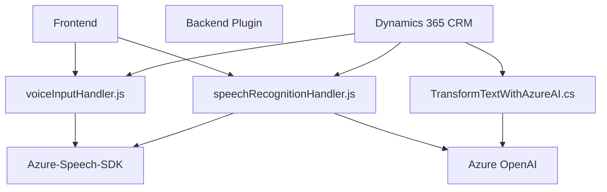

### Breve resumen técnico

La solución implementa una integración entre aplicaciones basadas en formularios web (Dynamics 365, CRM) y servicios cognitivos de Microsoft Azure, principalmente el Azure Speech SDK y servicios de Azure OpenAI. Permite la entrada por voz, reconocimiento de datos, procesamiento con IA, y retorno de resultados como texto o completando campos visibles en formularios.

### Descripción de arquitectura

La solución combina:
1. **Frontend**:
   - Funciones en JavaScript que interactúan con el SDK para reconocimiento y síntesis de voz y que integran la lógica básica en un entorno web.
2. **Backend/Plugin (Dynamics 365)**:
   - C# Plugin que conecta Dynamics CRM con el servicio Azure OpenAI para procesar texto de entrada y transformar los datos en un formato estructurado usable por el sistema.

La arquitectura podría clasificarse como **componente modular**, donde cada módulo (Frontend, SDKs, Plugin en Dynamics 365) tiene roles bien definidos.

- Diseño modular:
  - Encapsula la lógica de síntesis y reconocimiento en el frontend.
  - Aprovecha SDKs y APIs para distribuir la carga hacia servicios en la nube.
- **Service-Oriented Architecture (SOA)**:
  - Azure Speech SDK actúa como un servicio que facilita el reconocimiento y la síntesis de voz.
  - Azure OpenAI es invocado mediante REST APIs para procesamiento avanzado de texto.
- **Integración con Dynamics 365**:
  - La solución está directamente vinculada a los frameworks y patrones de extensibilidad de Dynamics CRM. Se usan Custom APIs y un plugin que sigue el **Patrón Plugin**.

### Tecnologías, frameworks y patrones utilizados

1. **Frontend**:
   - **JavaScript ES6**: Lógica implementada con funciones estructuradas, comentarios y módulo interno.
   - **Azure Speech SDK**: Para reconocimiento y síntesis de voz con datos obtenidos desde un formulario CRM/XRM.
   - **Dynamic Allocation**: Lazy loading del SDK de Azure Speech, cargado en caso de necesitarse.

2. **Backend**:
   - **C# con .NET Framework**: Código implementado como un plugin en Dynamics CRM.
   - **Microsoft.Xrm.Sdk**: Librería oficial para interactuar con objetos del CRM.
   - **JSON Handling**:
     - `System.Text.Json` y parcialmente `Newtonsoft.Json.Linq`.
   - **HTTP Client**: Usado para interactuar con el servicio Azure OpenAI de manera síncrona y gestionar solicitudes JSON.

3. **Patrones aplicados**:
   - **Modular design**: Separación de responsabilidades en distintas funciones dentro de los archivos.
   - **Service-Oriented Architecture (SOA)**: Uso extensivo de Microsoft Cloud Services (Azure Speech y Azure OpenAI).
   - **Plugin Pattern**: En el archivo de C#, implementado directamente con la interfaz `IPlugin`, una práctica común en Dynamics CRM.
   - **SDK Loader Pattern**: Para el cargado dinámico funcional del SDK en el navegador.
   - **Facade Pattern** (frontend): Encapsula la interacción entre datos de un formulario y los SDKs o APIs para simplificar el acceso a estas funcionalidades.

### Dependencias y componentes externos

1. **Azure Speech SDK**: Javascript SDK para síntesis y reconocimiento de voz.
2. **Azure OpenAI Service**: Procesamiento avanzado de texto mediante API REST.
3. **Dynamics 365 WebAPI**:
   - Directamente utilizado en el frontend: `Xrm.WebApi.online.execute`.
   - En el backend (plugin): API de servicios para invocar contextos, plugins y operaciones dentro del CRM.
4. **Custom API**: API creada en Dynamics para integrar respuestas enriquecidas de Azure AI.
5. **System.Almacén.Libraries.NET**:
   - `System.Text.Json`, `System.Net.Http` para trabajo con peticiones y JSON.

### Diagrama Mermaid compatible con GitHub Markdown

### Conclusión final

La solución es una integración compleja de múltiples tecnologías donde:
- La lógica del frontend está basada principalmente en JavaScript, interactuando con Dynamics 365 y utilizando SDKs proporcionados por Microsoft Azure.
- El backend implementa un plugin en C# conectado a Dynamics CRM y utiliza Azure OpenAI para procesamiento avanzado de texto bajo el **Patrón Plugin**.
- Toda la arquitectura sigue principios modularizados con interacción entre componentes mediante APIs y SDKs, lo que le otorga flexibilidad y escalabilidad, esenciales en sistemas orientados a servicios y basados en la nube.

Los principales puntos de mejora incluyen:
- Verificación de dependencias innecesarias en el plugin.
- Establecimiento de un manejo robusto de excepciones en la interacción con servicios externos (Azure SDK, OpenAI).
- Implementación de pruebas unitarias para cada componente del sistema.

