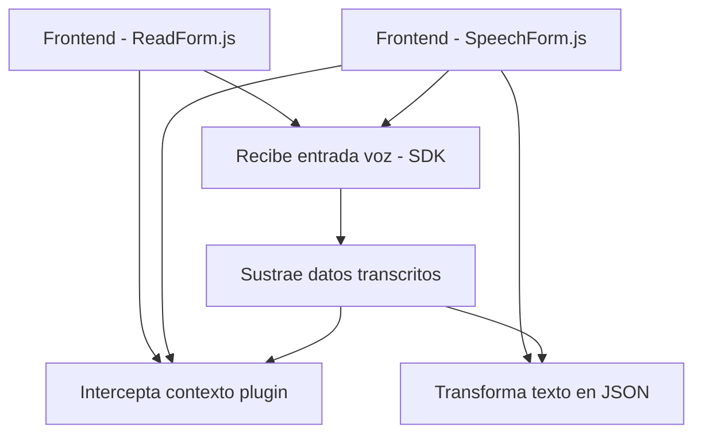

### **Resumen Técnico**
El repositorio contiene tres archivos que forman parte de un sistema integrado entre **Microsoft Dynamics 365** y servicios de Azure, específicamente **Azure Speech SDK** y **Azure OpenAI**. El objetivo principal es habilitar funcionalidades relacionadas con voz y texto como entrada/salida, procesamiento avanzado con IA, y aplicación de datos estructurados a formularios de Dynamics CRM.

---

### **Descripción de la Arquitectura**
1. **Solución Tipo:**
   - Microfrontend para interacción con formularios (implementado principalmente en archivos JavaScript).
   - Plugin especializado en back-office (archivo `.cs`) para procesar texto con Azure AI en la base de datos y sistema de Dynamics.

2. **Diseño Arquitectónico:**
   - **Patrón Modular:** Cada archivo estructura funciones o métodos independientes para cumplir tareas específicas (captura de voz, transformación de datos).
   - **Arquitectura en Capas:**
     - **Capa de Presentación**: Implementada en los módulos de frontend (readForm.js, speechForm.js). Interactúa con los usuarios y dinámicamente con formularios de Dynamics.
     - **Capa Lógica/Aplicativa**: Procesa datos de entrada mediante reglas, SDKs o IA asíncrona.
     - **Capa de Integración**: Los plugins y scripts del sistema utilizan conexiones dependientes de SDKs (Azure Speech SDK), REST APIs externas (Azure OpenAI), y APIs internas (Dynamics 365 Web API).
   - **Microservicios:** El plugin `.cs` a nivel de Dynamics CRM actúa como un componente separado que solo maneja transformación de texto.

3. **Patrones de Diseño Usados:**
   - **Integración Asíncrona**: Manejo de dependencias externas (SDKs, servicios REST) con callbacks y cargas dinámicas.
   - **Validación de Contexto**: Verificaciones en la ejecución del flujo (XML context, Speech SDK presente).
   - **Separación de Responsabilidades**: Sólida definición de módulos/lógica por archivo: Entrada (voz), procesamiento (IA), integración (API).

---

### **Tecnologías y Frameworks Utilizados**
1. **Frontend:**
   - **JavaScript Es6+**
   - **Azure Speech SDK**: Utilizado para captura y síntesis de voz.
   - **Dynamics 365 Web API**: Comunicación directa con formularios y datos internos del CRM.

2. **Backend Plugin:**
   - **C# (.NET)**: Desarrollo de extensiones nativas para Dynamics CRM.
   - **HTTP Client API**: Para peticiones al servicio de Azure OpenAI.
   - **JSON Manipulación**: Librerías como `Newtonsoft.Json.Linq` o `System.Text.Json`.

3. **Servicios Externos:**
   - Azure Speech SDK (voz a texto y síntesis).
   - Azure OpenAI (procesamiento semántico y estructuración de texto).
   - Dynamics 365 Web API.

4. **Herramientas y Dependencias:**
   - **SDK de Microsoft Dynamics**: Manejo del contexto del plugin y ejecución en Dynamics.
   - **REST API (Azure)**: Comunicación con servicios IA.

---

### **Diagrama Mermaid compatible con GitHub Markdown**

---

### **Conclusión Final**
La arquitectura está diseñada para maximizar la integración entre servicios de **Azure** y **Dynamics CRM**, con un enfoque modular y en capas. Utiliza patrones como **instancias dinámicas de SDK**, **integración HTTP REST**, y procesamiento asincrónico para garantizar compatibilidad y escalabilidad. Es ideal para un entorno corporativo que requiere entrada/salida de voz, síntesis avanzada y transformación estructural de datos mediante IA.