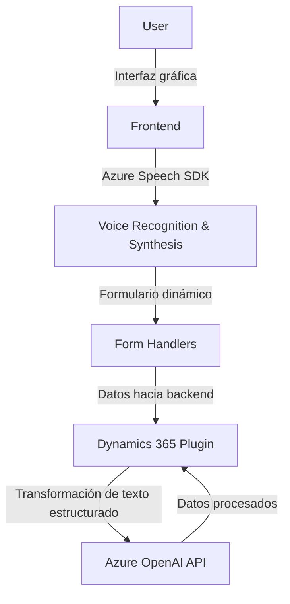

### Breve Resumen Técnico
Los archivos del repositorio indican una solución orientada a transformar formularios y entradas de voz en textos estructurados o en formato hablado, con integración de servicios en la nube como **Azure Speech SDK** y **OpenAI API**. Parece que está relacionada con Dynamics 365 para proporcionar funcionalidades avanzadas como entrada de voz, síntesis de texto y transformación de texto en datos estructurados.

---

### Descripción de Arquitectura
- **Tipo de solución**: Una solución híbrida centrada en la manipulación de formularios dinámicos para sistemas empresariales como Dynamics CRM. Incluye componentes de frontend (JavaScript) y backend (plugin de C#).
- **Arquitectura**: Orientada a servicios (SOA). Cada componente cumple un propósito específico gracias a la comunicación con servicios externos y la implementación de plugins para Dynamics CRM. La separación entre frontend y backend hace que la solución se asemeje a una arquitectura **n capas**.

---

### Tecnologías Usadas
1. **Frontend**:
   - **JavaScript** (ECMAScript).
   - Azure Speech SDK (biblioteca externa para síntesis de voz y reconocimiento de voz).
   - Procesamiento de datos en formularios dinámicos.
2. **Backend**:
   - **.NET Framework**.
   - API de Microsoft Dynamics CRM.
   - **Azure OpenAI API** para transformación avanzada del texto.
   - Serialización/deserialización JSON con `System.Text.Json`.

---

### Dependencias o Componentes Externos Presentes
1. **Azure Speech SDK**: Para síntesis de texto en voz y reconocimiento de voz.
2. **API Azure OpenAI**: Transformación avanzada de texto mediante inteligencia artificial.
3. **Xrm.WebApi**: Para interacción con los servicios y objetos de Dynamics 365.
4. **Dynamics 365 SDK**: Utilizado en plugins como `TransformTextWithAzureAI`.
5. **Servicios HTTP (HttpClient)**: Para enviar solicitudes REST a la API externa de Azure OpenAI.

---

### Diagrama Mermaid Compatible con GitHub Markdown

---

### Conclusión Final
La solución combina **frontend** dinámico en JavaScript con **backend** integrado en Dynamics CRM mediante **plugins** y servicios en la nube. Utiliza una arquitectura orientada a servicios, altamente extensible y modular, ideal para aplicaciones empresariales. Su enfoque de usar el **Azure Speech SDK** y **Azure OpenAI API** demuestra una modernización tecnológica para la interacción y manejo de datos en un contexto inteligente y automatizado.