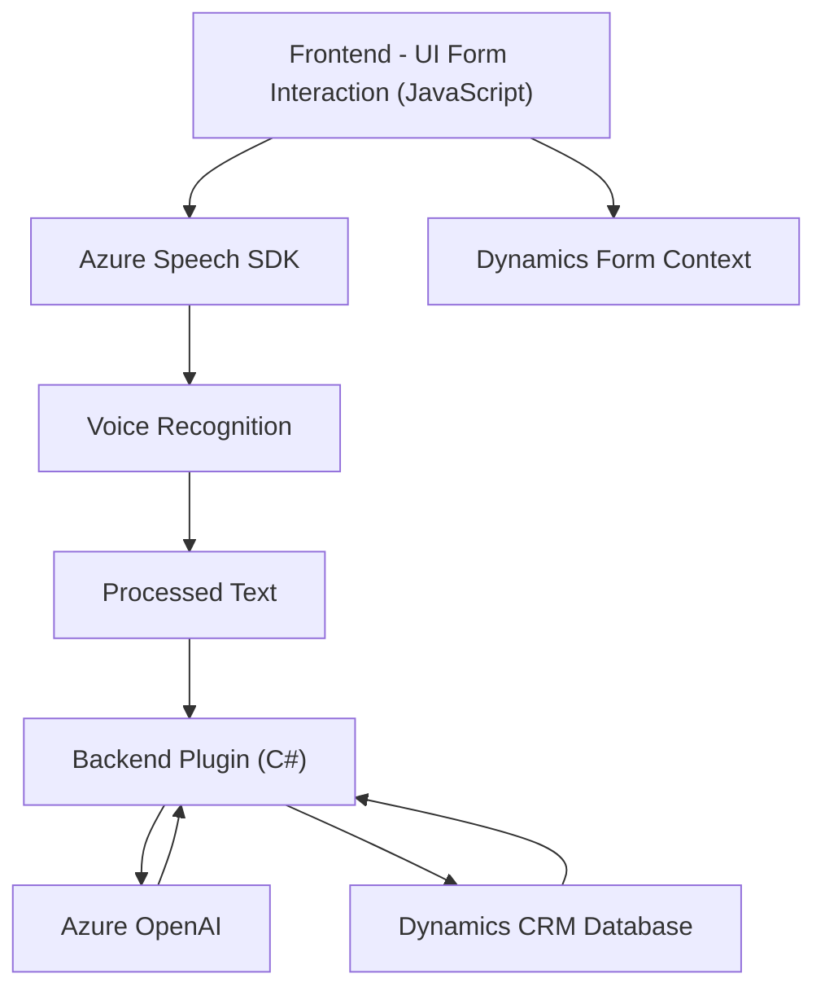

### Breve resumen técnico:
Este repositorio soporta una solución de integración con Microsoft Dynamics CRM que utiliza entrada y salida de voz mediante Azure Speech SDK, manipulación de formularios dinámicos en frontend, y un plugin en el backend basado en .NET, con integración a Azure OpenAI para procesamiento avanzado de texto.

---

### Descripción de arquitectura:
1. **Tipo de solución**: La solución es híbrida:
   - Contiene una capa frontend para la interacción de usuarios con formularios.
   - Tiene integración de procesamiento de datos en el backend con un plugin para Microsoft Dynamics CRM.
   - Interactúa con la nube mediante APIs de Azure (Speech SDK y OpenAI).

2. **Arquitectura**: La solución es una arquitectura **n-capas**, compuesta por:
   - **Frontend**: Modular, con funciones bien definidas para la interacción del usuario y manejo del reconocimiento de voz.
   - **Backend**: Basado en plugins de Dynamics CRM, con comunicación por API y manipulación de datos mediante eventos del sistema.
   - **Servicios externos**: Integración con Azure Speech SDK y Azure OpenAI para reconocimiento de voz y procesamiento de texto avanzado.

3. **Patrones usados**:
   - **Modularización y separación de responsabilidades**: Código dividido en funciones específicas que reducen el acoplamiento.
   - **Callbacks/Event-based programming**: En el frontend, se espera la carga del SDK antes de ejecutar acciones.
   - **Integración con servicios externos**: Los componentes interactúan con APIs externas como Azure Speech y OpenAI mediante comunicación HTTP.
   - **Plugin-based design**: En el backend con Dynamics CRM para actualizar datos y realizar operaciones basadas en eventos.

4. **Dependencias externas identificadas**:
   - **Azure Speech SDK**: Para reconocimiento y síntesis de voz.
   - **Azure OpenAI**: Para procesamiento avanzado de texto.
   - **Microsoft Dynamics CRM SDK**: Extensión y configuración de datos en el entorno del CRM.
   - **Newtonsoft.Json**: Manipulación de datos JSON en el backend.
   - **System.Net.Http**: Llamadas HTTP a servicios externos.

---

### Tecnologías usadas:
1. **Frontend**:
   - **JavaScript**: Uso directo en funciones para interacción con formularios y servicios.
   - **Azure Speech SDK**: Para síntesis de voz y reconocimiento del audio.
   - **Dynamics CRM Form Context**: Utilizado en el frontend para manipulación de datos.

2. **Backend**:
   - **C# y .NET Framework**: Para desarrollo de plugins en Microsoft Dynamics CRM.
   - **HttpClient**: Para llamadas a Azure OpenAI API.
   - **Newtonsoft.Json**: Serialización/deserialización de datos JSON.
   
3. **Servicios externos**:
   - **Azure Speech SDK**: Integración en frontend y backend, permitiendo síntesis y reconocimiento de voz.
   - **Azure OpenAI**: Procesamiento avanzado de texto y transformación en formato estructurado.

---

### Diagrama Mermaid válido para GitHub

---

### Conclusión final:
Este repositorio implementa una solución corporativa modular basada en integración con Azure y Dynamics CRM. Con una arquitectura n-capas, combina interacción fluida en el frontend para entrada de voz, backend para procesamiento de datos decicionables, e integración de servicios externamente acoplados como Azure Speech y OpenAI. El diseño sigue principios modernos: separación de responsabilidades, asincronía, e integración API externa, pero puede mejorarse en aspectos como la gestión de credenciales (evitar claves hardcodeadas).