### Breve Resumen Técnico

El repositorio analizado muestra una solución altamente orientada a la integración entre sistemas externos y un CRM basado en Dynamics, con una fuerte dependencia en servicios de Microsoft Azure. Los archivos se dividen en tres capas: funcionalidades relacionadas con el frontend (Javascript), procesamiento en el backend por medio de plugins de Dynamics (C#), y la integración de servicios API externos. La funcionalidad principal se enfoca en el procesamiento de entrada y salida de voz, transcripción, y transformación de datos orientada a simplificar la interacción con formularios en Dynamics CRM.

---

### Descripción de Arquitectura

1. **Solución Identificada**: Se trata de una combinación entre **frontend para procesar la entrada de voz** y **backend funcional basado en plugins de Dynamics CRM**. Se incluye además la invocación de **Azure OpenAI API** y otros servicios como **Azure Speech SDK** para tareas específicas como reconocimiento y síntesis de voz.

2. **Tipo de Arquitectura**: Aunque tiene una estructura modular, todo el ecosistema está acoplado al modelo de Dynamics CRM, siendo más parecido a un **monolito extendido**. En general, sigue patrones propios del diseño de plugins en Dynamics (basado en el **Plugin Pattern**) mientras que utiliza componentes frontales independientes para interactuar con el backend.

3. **Capas Principales**:
   - **Frontend**: Manejo de entrada de voz, transcripción, y configuración del formulario en Dynamics CRM desde una interfaz.
   - **Backend**: Plugins adherentes al CRM como procesamiento de texto y transformación via Azure OpenAI API.
   - **Servicios Externos/API**: Azure Speech SDK y Azure OpenAI API para síntesis, reconocimiento, y procesamiento avanzado de texto/voz.

---

### Tecnologías Usadas

1. **Frontend**
   - **JavaScript**:
     - Funcionalidades asíncronas (`async/await`) para implementación de dependencias externas.
     - Uso del **Azure Speech SDK** para transcripción y síntesis de voz.
   - **Dynamics SDK** (interfaz del formulario usando `executionContext`, `formContext`).

2. **Backend**
   - **Microsoft Xrm SDK**: Utilizado para integrar las funcionalidades del plugin con Dynamics CRM.
   - **Microsoft Azure OpenAI API**: Para procesamiento de lenguaje natural y generación de respuestas en JSON.
   - **Newtonsoft.Json** y **System.Text.Json**: Manipulación de objetos JSON en C#.

3. **Dependencias externas**
   - Integración directa con **Azure Services**, principalmente **Speech SDK** y **OpenAI API** para la ejecución de tareas avanzadas.
   - HTTP communication library (`System.Net.Http`) usada en los métodos de llamada a servicios externos.

4. **Patrones detectados**:
   - **Encapsulación**: Con distintas funciones encapsulantes para reducir acoplamiento en el frontend y el backend (ej.: `getVisibleFieldData`, `processTranscriptIA`).
   - **Delegación**: Uso extensivo de callbacks y APIs para distribuir la responsabilidad del flujo.
   - **Service Locator Pattern**: Uso de `IServiceProvider` en los plugins muestra una arquitectura flexible para resolver dependencias en el contexto CRM.
   - **Wrapper SDK/API integration**: Abstracción del SDK de Azure Speech y llamadas dinámicas al servicio OpenAI.

---

### Diagrama Mermaid válido para GitHub

```mermaid
graph TD
    A["Frontend - JS"] --> |speechInputHandler.js| B["Azure Speech SDK"]
    A --> |speechForm.js| C["API Custom Integration"]
    C --> |call API: JSON output| D["Custom Plugin - TransformTextWithAzureAI.cs"]
    D --> |process with Azure OpenAI| E["Azure OpenAI API"]
    E --> |return JSON| F["Dynamics Form Context"]
    B --> F
    C --> F
    F --> |Interactive Forms| G["Dynamics CRM"]
```

---

### Conclusión Final

Esta solución combina componentes frontend y backend perfectamente optimizados para trabajar juntos dentro de un ecosistema Dynamics CRM. Las principales tecnologías empleadas son servicios de Azure (Speech SDK y OpenAI API) para maximizar el procesamiento de entrada y salida de voz, y plugins extensibles para Dynamics CRM que transforman y organizan los datos en un formato estructurado.

La arquitectura no es completamente desacoplada, ya que depende fuertemente de Dynamics CRM, pero aprovecha conceptos modernos como el manejo asíncrono y la integración con APIs externas. Esto la convierte en una opción eficiente para aplicaciones orientadas a la productividad corporativa, especialmente aquellas que buscan automatizar la interacción basada en voz y adaptar los datos procesados a un CRM robusto.