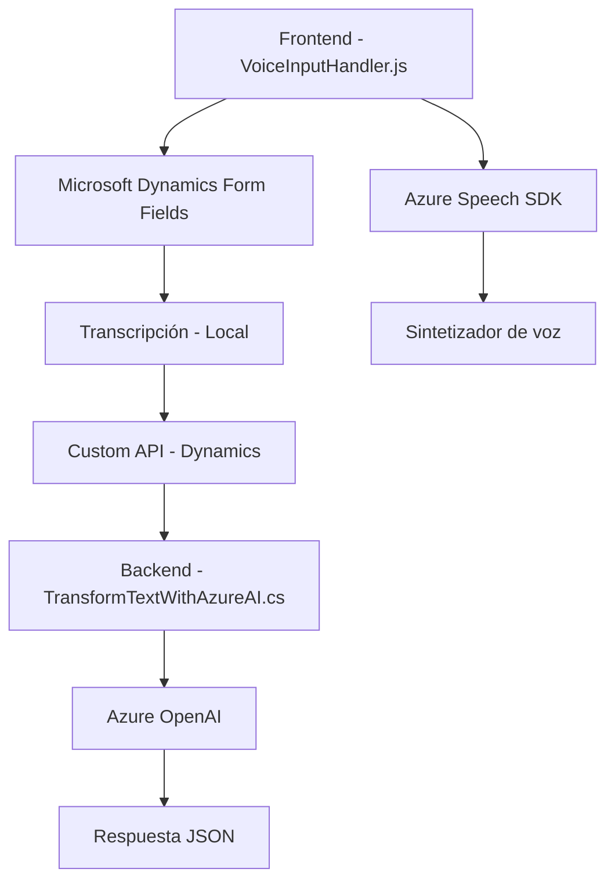

### Breve Resumen Técnico
El repositorio contiene una solución que integra varias componentes, con funcionalidades de entrada y salida de voz, procesamiento de transcripciones por IA, y transformación de texto basado en APIs externas como Azure Speech y Azure OpenAI. La solución parece estar diseñada para integrarse principalmente con Microsoft Dynamics CRM, dado el uso del contexto de formularios y la interfaz de plugins.

---

### Descripción de la Arquitectura
La arquitectura general del repositorio parece orientada hacia un diseño modular, con elementos de integración entre APIs externas (Azure Speech y OpenAI) y Microsoft Dynamics CRM. La solución emplea un enfoque de **procesamiento en capas** con componentes frontend (JavaScript) encargados de la interacción con usuarios y un plugin backend (.NET) que realiza transformaciones más avanzadas. Se observa la coexistencia de patrones como **cargador dinámico de recursos** en el frontend y **orientación a eventos** en el backend.

---

### Tecnologías Usadas
1. **Frontend (JavaScript)**:
   - SDK Azure Speech: Para síntesis de voz y transcripción de entrada.
   - Microsoft Dynamics CRM: Para manipulación de datos del formulario (API interna).
   - Modularidad funcional: Organización del código en funciones independientes con lógica específica.

2. **Backend (.NET)**:
   - SDK Microsoft Dynamics CRM (IPlugin): Para intervención en el flujo de datos en tiempo de ejecución del CRM.
   - API Azure OpenAI: Consumo de servicios de inteligencia artificial para transformación de datos.
   - JSON manipulación: Serialización/deserialización de datos con `System.Text.Json`.

3. **Dependencias Externas**:
   - Azure Speech SDK (Frontend).
   - Azure OpenAI (Backend).
   - APIs y servicios de Dynamics CRM.
   - `Newtonsoft.Json` (para manipulación de APIs).

---

### Diagrama Mermaid
A continuación, el diagrama muestra cómo interactúan los diferentes componentes en la solución, desde el frontend hasta el backend y los servicios externos:

---

### Conclusión Final
El repositorio representa un sistema orientado principalmente a **integraciones empresariales**, donde la capa frontend se encarga de la interacción dinámica con el usuario (lectura y reconocimiento de voz), mientras que el backend procesa y transforma los datos mediante servicios de Azure como OpenAI y APIs personalizadas. La arquitectura está bastante modular, utilizando técnicas de carga dinámica y desacople funcional entre las capas. Sin embargo, aspectos como la seguridad en manejo de claves API y configuraciones podrían necesitar refinamiento.