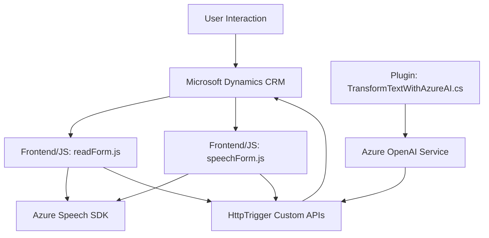

### Resumen Técnico
Este repositorio incluye una solución híbrida que combina funcionalidades de reconocimiento de voz, síntesis de voz y transformación de texto utilizando servicios de **Azure Speech SDK** y **Azure OpenAI**, integrados con **Microsoft Dynamics CRM**. La arquitectura está enfocada en procesar datos, actualizar formularios y realizar transformaciones semánticas con inteligencia artificial en tiempo real.

---

### Descripción de Arquitectura
1. **Tipo de solución**: Principalmente orientada a funcionalidades específicas dentro de un ecosistema existente (Microsoft Dynamics CRM), implementando dos módulos de frontend para interacción con formularios y un plugin backend para procesamiento avanzado mediante IA.
2. **Arquitectura**:
   - **Monolito con componentes distribuidos**: La funcionalidad está agrupada en un solo sistema CRM extendido mediante plugins y archivos externos (JavaScript y API).
   - **N capas**: Separación clara de responsabilidades:
     - Frontend (archivos `.js`).
     - Backend (plugin `.cs`).
     - Servicios externos (Azure Speech y OpenAI).
     - Integración del formulario en Dynamics CRM.
3. **Patrones de diseño utilizados**:
   - **Event-Oriented Programming (EOP)**: Uso intensivo de callbacks y funciones asincrónicas.
   - **Plugin-based Architecture**: Uso de extensiones en Dynamics CRM mediante plugins personalizados.
   - **Modularidad**: Funciones ya segmentadas para tareas específicas.
   - **Dependencias externas**: Servicios de Azure como pilares fundamentales para soluciones avanzadas.

---

### Tecnologías usadas
1. **Frontend**:
   - **JavaScript**:
     - Procesamiento de formularios.
     - Uso de Azure SDK para reconocimiento y síntesis de voz.
     - Manipulación del DOM en Microsoft Dynamics CRM.
   - **Azure Speech SDK**: Para conversión texto-voz y voz-texto.
2. **Backend**:
   - **C# (.NET)**:
     - Extensiones como plugins para Dynamics CRM.
     - Uso de la API de Dynamics CRM para operaciones de datos.
     - Integración con Azure OpenAI mediante solicitudes HTTP.
     - Librerías: `Newtonsoft.Json`, `System.Net.Http`.
   - **Azure OpenAI**: Procesamiento semántico avanzado con text-to-JSON transformations.
3. **Dependencias comunes**:
   - **Microsoft Dynamics CRM API**: Con `executionContext` y `formContext`.
   - Webhooks y endpoints de servicios de Azure para carga dinámica del SDK y procesamiento.

---

### Diagrama Mermaid válido para GitHub Markdown

---

### Conclusión Final
Este repositorio implementa una solución extensible para integrar capacidades avanzadas de procesamiento de voz e inteligencia artificial directamente en formularios de **Microsoft Dynamics CRM**. Los módulos frontend incluyen funciones que interactúan con datos del formulario y hacen uso del servicio de voz de Azure. Por otro lado, el backend utiliza un plugin que permite realizar transformaciones de texto más complejas con **Azure OpenAI**. Aunque la arquitectura principal sigue siendo monolítica, utiliza patrones modernos con dependencias externas para ofrecer funciones sofisticadas enfocadas en UX y procesamiento IA.