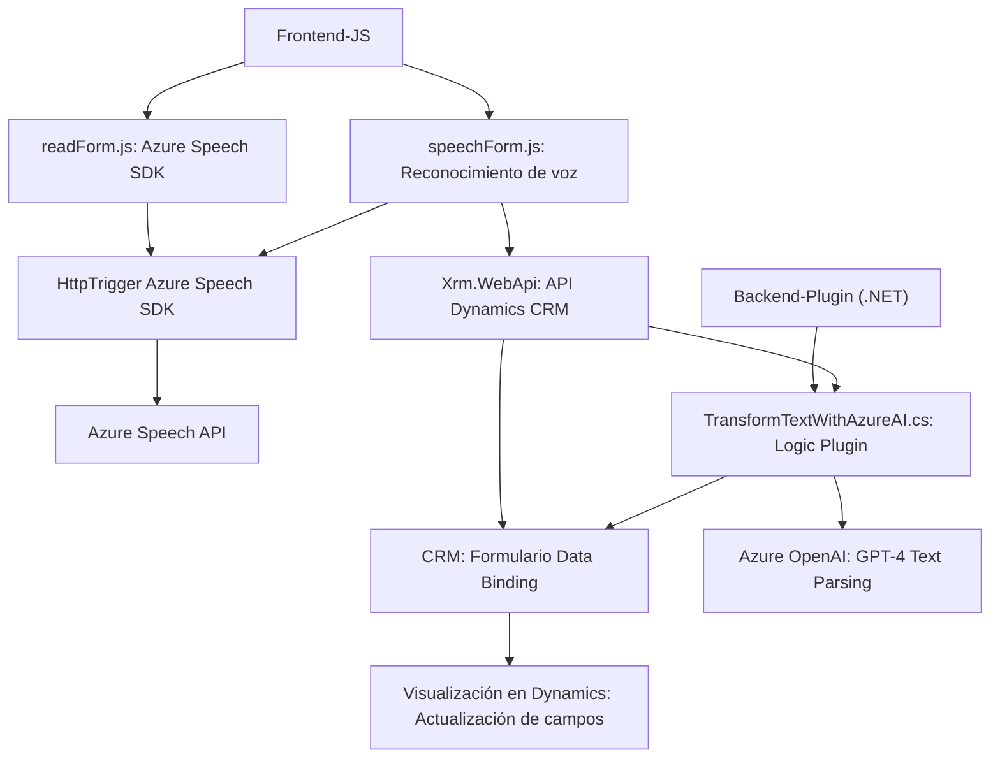

### Resumen Técnico
El repositorio presenta una solución que integra servicios de **Azure Speech SDK** con sistemas **Microsoft Dynamics 365 CRM** y **Azure OpenAI**. Se enfoca en manipular datos de formularios mediante procesamiento de voz, reconocimiento de voz, y transformación de texto, aplicando entradas procesadas directamente al CRM. Es una solución híbrida entre frontend y backend orientada al cliente empresarial.

---

### Descripción de la Arquitectura
Se utiliza una **arquitectura modular** de múltiples capas:
1. **Frontend**: Implementado en **JavaScript**, interactúa directamente con usuarios mediante formularios y servicios de reconocimiento de voz en tiempo real. Procesa texto, activa funciones locales y transfiere datos a sistemas externos.
2. **Backend/Plugin Dynamics**: El archivo C# implementa un plugin para Dynamics CRM que interactúa con **Azure OpenAI**, ejecuta la transformación de texto y retorna resultados al cliente CRM.
3. **Servicios Externos**: Se integran servicios de Azure (Speech SDK y OpenAI) y APIs dinámicas para IA, comunicación robusta y manipulación de datos estructurados.
4. **Capas detectadas**:
   - Capa de presentación con lógica empresarial en el frontend (manipulación del DOM, SDK).
   - Backend con lógica y procesamiento de datos.
   - Comunicación hacia APIs y servicios externos mediante patrones de integración (Gateway/API).

---

### Tecnologías y Frameworks Usados
1. **Frontend**:
   - **JavaScript**: Manipulación del DOM (`executionContext`, `formContext`), manejo de eventos y configuraciones dinámicas.
   - **Azure Speech SDK**: Procesamiento de audio y transcripción con servicios cloud.
   - **Dynamics 365 Web API**: Integración con CRM mediante `Xrm.WebApi`.

2. **Backend**:
   - **C#**: Plugin basado en `IPlugin`, manipulación de JSON y ejecución de peticiones HTTP hacia Azure OpenAI.
   - **Azure OpenAI API**: GPT-4 para transformación de texto y cumplimiento de reglas predefinidas.
   - **JSON Processing**: Uso de **Newtonsoft.Json.Linq** y estructuras de C# (`System.Text.Json`) para manipulación eficiente de contenido.

---

### Componentes Externos y Dependencias
- **Azure Speech SDK**: Procesamiento de audio y generación de texto hablado.
- **Azure OpenAI API**: Transformación de texto con IA avanzada utilizando GPT.
- **Microsoft Dynamics CRM API** (`Xrm.WebApi`): Manipulación de formularios y datos de CRM mediante técnicas de integración.
- **JavaScript SDK Dynamics**: Dependencias del entorno del CRM para cargar datos y atributos del sistema.
- **Newtonsoft.Json & System.Text.Json**: Parsing y creación de JSON eficiente.

---

### Diagrama Mermaid (100% Válido para GitHub Markdown)

---

### Conclusión Final
Este repositorio es una solución híbrida orientada a sistemas empresariales, donde se combinan el reconocimiento de voz, síntesis de voz, y procesamiento de texto basado en IA. La arquitectura modular y multicapa permite interacción fluida entre frontend, backend y servicios externos. 
Se destacan los patrones de integración centralizada mediante APIs (Azure Speech y OpenAI) y lógica de negocio asociada al CRM (Dynamics). Sin embargo, es esencial reforzar estrategias de seguridad para las claves de Azure y revisar la codificación directa de configuraciones sensibles en el código fuente.