### Análisis del repositorio

---

#### **Breve resumen técnico**

Este repositorio presenta una solución integrada que utiliza funciones frontend en **JavaScript** y plugins en **C#** para interactuar de forma dinámica con un sistema como **Dynamics CRM**, utilizando herramientas avanzadas de reconocimiento por voz, síntesis de voz, inteligencia artificial y _Natural Language Processing (NLP)_. Las funcionalidades se implementan mediante el SDK de **Azure Speech** y APIs de **OpenAI** alojadas en Azure. La arquitectura combina un enfoque modular con integración de servicios externos.

---

#### **Descripción de arquitectura**

La solución parece corresponder a una arquitectura de **n-capas**, donde cada capa tiene una responsabilidad específica:
- **Capa de presentación (frontend):** Implementada en JavaScript; interactúa con el usuario, capturando datos de voz y actualizando formularios.
- **Capa de integración/externalización:** Utiliza el SDK de Azure Speech para reconocimiento y síntesis de voz, junto con llamadas a APIs externas como Azure OpenAI y Dynamics Custom API.
- **Capa de lógica empresarial (backend):** Implementada mediante plugins de Dynamics CRM en C#, encargados de realizar transformaciones avanzadas en el texto recibido.

El patrón de diseño más destacado en esta solución es el **Service-Oriented Architecture (SOA)** debido a la alta dependencia de servicios como Azure Speech y OpenAI. Además, ciertos fragmentos aplican **Event-Driven Architecture (EDA)** mediante la captura de eventos de entrada por voz.

---

#### **Tecnologías usadas**
1. **Frontend (JavaScript):**
   - Azure Speech SDK.
   - Integración con Dynamics CRM (`formContext`, Web API).
   - Patrones de modularidad para encapsular lógica en funciones específicas.

2. **Backend (C#):**
   - **Microsoft Dynamics SDK**:
     - `IPlugin`, `IOrganizationService`, etc.
   - **Azure OpenAI** para transformación de texto.
   - JSON manipulación con `System.Text.Json`.

3. **Servicios externos:**
   - Azure SDKs (Speech Services, OpenAI).
   - API REST para comunicación con Dynamics CRM y Azure OpenAI.

---

#### **Dependencias o componentes externos**
1. **Dependencias específicas:**
   - **Azure Speech SDK**: Usado para síntesis y reconocimiento de voz.
   - **Azure OpenAI API**: Transformaciones con modelos de lenguaje avanzado para estructuración de datos.
   - **Dynamics Custom API**: Procesa y actualiza atributos en formularios dinámicos.

2. **Frameworks y librerías clave:**
   - JavaScript nativo con dinámica de carga de SDK.
   - Microsoft Dynamics SDK en C# para plugins.

3. **Modelos de IA**:
   - Uso de **Azure OpenAI** para aplicar inteligencia a los datos ingresados.

---

#### **Diagrama Mermaid** (válido para GitHub)

```mermaid
graph TD
    A["Frontend - JavaScript"] --> B["Azure Speech SDK para reconocimiento y síntesis"]
    A --> C["Dynamics FormContext"]
    C --> D["Form Data Extraction - getVisibleFieldData"]
    B --> D
    B --> E["synthesis - speakText"]

    D --> F["REST API Call - Dynamics Custom API"]
    F --> G["Azure OpenAI"]

    G --> H["Plugin Backend - C#"]
    H --> I["Dynamics CRM - TransformTextWithAzureAI"]
    I --> J["json-output para formularios"]
```

---

#### **Conclusión final**

Este repositorio alberga una solución **multicapa** integrada que combina tecnologías frontend y backend para introducir capacidades avanzadas de voz, procesamiento de lenguaje natural y actualización dinámica de formularios mediante AI. Aunque la arquitectura es robusta, presenta dependencias críticas como claves incrustadas (ejemplo: API de Azure). La modularidad de los componentes, así como la separación de responsabilidad por capas, garantizan un diseño mantenible a largo plazo. Sin embargo, puede considerarse una arquitectura híbrida orientada a servicios, con una implementación parcialmente monolítica por la integración directa en Dynamics CRM.