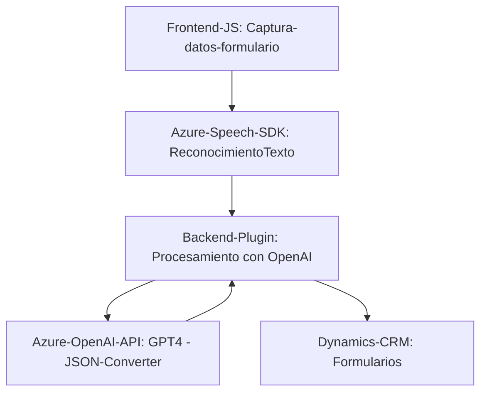

### Breve Resumen Técnico

El conjunto de archivos describe una solución que implementa funcionalidad para integrar servicios de inteligencia artificial y voceo (speech-to-text y text-to-speech) utilizando Azure SDK y API de OpenAI GPT-4 en un sistema basado en un CRM (como Microsoft Dynamics 365). La solución permite tanto la lectura de datos visibles en formularios como la actualización dinámica de los mismos mediante reconocimiento y conversión de voz.

---

### Descripción de arquitectura

Esta solución está diseñada como una **arquitectura n-capas**, donde el frontend en **JavaScript** interactúa con un backend basado en **Plugins** para Dynamics 365. Además, hace uso de servicios externos (Azure Speech SDK y Azure OpenAI API) mediante una arquitectura **orientada a servicios (SOA)**. La interacción con estos servicios se realiza a través de HTTP, enfatizando el desacoplamiento entre la funcionalidad principal y los proveedores externos.

#### Descripción de capas:
1. **Frontend:** Implementado en JavaScript, proporciona interacción directa con el usuario y captura los datos mediante formularios y reconocimiento de voz. Incluye lógica de lectura, síntesis de texto y mapeo de datos del formulario.
2. **Backend:** Un plugin en Dynamics 365 implementa la lógica de integración con Azure OpenAI para transformar el texto a JSON conforme a normas predefinidas.
3. **Servicios Externos:** Azure Speech SDK y Azure OpenAI actúan como proveedores de procesamiento de voz y transformación de texto, respectivamente.

---

### Tecnologías Usadas

#### **Frontend**:
- **Azure Speech SDK**:
  - Para convertir texto en voz y realizar reconocimiento de voz.
- **JavaScript**:
  - Maneja la lógica de interacción con formularios y procesamiento de datos.

#### **Backend**:
- **Microsoft Dynamics 365 SDK**:
  - Manejo de ejecución de plugins y lógica interna en el CRM.
- **Azure OpenAI API**:
  - Procesa texto con GPT-4 para generar JSON estructurado.

#### **Patrones Arquitectónicos**:
1. **N-capas**:
    - Separación entre la lógica de interacción del usuario (Frontend) y la lógica de negocio en el CRM (Backend).
2. **Promesas/Programación Asíncrona**:
    - Utilizada en el frontend y backend para garantizar interacciones no bloqueantes con los servicios externos.
3. **Singleton para Gestión de Dependencias**:
    - El SDK de Azure Speech se carga de manera única para evitar redundancias y mejorar la eficiencia.
4. **Plugin-Based Architecture**:
    - Backend implementado como plugin para actuar en eventos específicos dentro del CRM.

---

### Dependencias o Componentes Externos Probables

1. **Azure Speech SDK**:
   - Utilizado para reconocimiento y síntesis de voz. Se carga dinámicamente en el cliente.
2. **Azure OpenAI API**:
   - JSON-transformación basada en modelos de lenguaje como GPT-4.
3. **Microsoft Dynamics CRM**:
   - Sistema CRM que soporta el enfoque de Plugins y gestión de datos.
4. **DOM API**:
   - En el frontend, se utiliza para manejo de elementos HTML y carga dinámica de librerías.

---

### Diagrama Mermaid

---

### Conclusión Final

Esta solución es una **integración avanzada entre tecnologías frontend (speech-to-text y text-to-speech) y backend (transformación JSON mediante GPT-4)**. Combina tecnologías modernas como Azure Speech y OpenAI GPT-4 con un diseño basado en **n-capas** y **arquitectura orientada a servicios**. El enfoque modular hace posible una fácil ampliación, dado que cada componente está claramente separado y puede ser modificado sin impactar otras partes del sistema. Esto lo convierte en una solución eficiente y adaptable para sistemas de gestión y automatización en el contexto de aplicaciones CRM avanzadas.