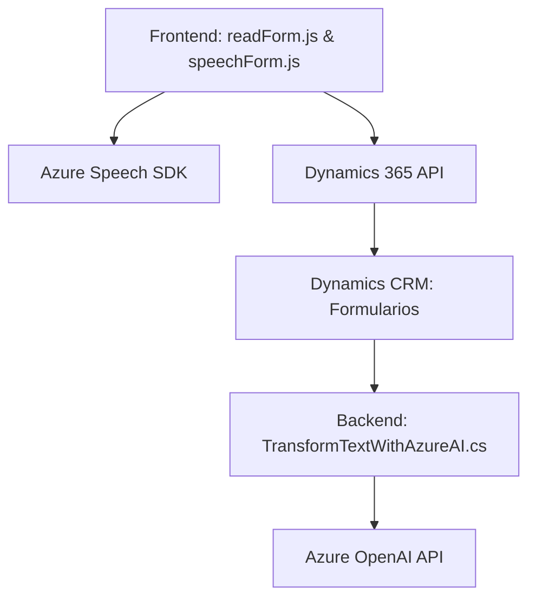

### Breve Resumen Técnico
El repositorio incluye tres componentes clave:
1. **Frontend (JavaScript)**: Dos archivos principales (`readForm.js` y `speechForm.js`) implementan funcionalidades centradas en formularios dinámicos y reconocimiento de voz mediante **Azure Speech SDK**. Están diseñados para interactuar con aplicaciones, posiblemente CRM como Dynamics 365.
2. **Plugin Backend (C#)**: `TransformTextWithAzureAI.cs` se integra con Microsoft Dynamics CRM como un plugin para transformación de texto mediante **Azure OpenAI**.

---

### Descripción de Arquitectura
La solución utiliza una arquitectura **híbrida**:
- **Capa de presentación**: Frontend que interactúa con formularios dinámicos en Dynamics 365 y administra tareas relacionadas con síntesis y reconocimiento de voz.
- **Capa de negocio**: Lógica empresarial representada por el plugin en C#, que utiliza **Azure OpenAI** para tareas específicas.
- **Integración con servicios externos**: Azure Speech SDK para procesamiento de voz y Azure OpenAI para transformación de texto.

El patrón arquitectónico predominante es la **arquitectura de capa**, dado que:
- La capa de presentación maneja la interacción con el usuario.
- La capa lógica/negocio se implementa en el backend.
- Servicios externos quedan integrados desde las capas de negocio y presentación.

Adicionalmente, se observan principios de **event-driven architecture** en el frontend y el uso del patrón **facade** para encapsular complejidad en interacción con APIs como Azure Speech y OpenAI.

---

### Tecnologías Usadas
1. **Frontend**:
   - **JavaScript**: Para la funcionalidad relacionada con formularios y voz.
   - **Azure Speech SDK**: Procesamiento de voz.
   - **Dynamics 365 XRM API**: Interacciones con formularios dinámicos.

2. **Backend**:
   - **C#** (Plugin para Dynamics CRM).
   - **Azure OpenAI (API de GPT-4)**: Transformación de texto usando OpenAI.
   - **Microsoft Dynamics SDK/API**: Para extensiones personalizadas.

3. **Herramientas complementarias**:
   - Manejo dinámico de dependencias (`ensureSpeechSDKLoaded`).
   - Frameworks .NET para plugins como Microsoft.Xrm.Sdk.

---

### Dependencias o Componentes Externos
1. **Azure Services**:
   - Speech SDK (para síntesis y reconocimiento de voz).
   - OpenAI (para transformación avanzada de texto).
2. **Microsoft Dynamics 365**:
   - Xrm.WebApi para solicitudes web desde el frontend.
   - Dynamics SDK para creación de plugins como `TransformTextWithAzureAI`.
3. **Bibliotecas JSON**:
   - Newtonsoft.Json (C#) y herramientas nativas para manejo de JSON.

---

### Diagrama Mermaid para GitHub

---

### Conclusión Final
La solución en el repositorio integra funcionalidades de frontend y backend para habilitar aplicaciones basadas en **Dynamics 365** con capacidades avanzadas como reconocimiento automático de voz (Azure Speech SDK) y transformación de texto mediante IA (Azure OpenAI). Un aspecto destacado es la modularidad y uso de servicios externos, que permite a la solución ser escalable y extensible. La arquitectura es predominantemente de capas, aunque se incluyen principios de manejo dinámico de eventos y patrones como facade en la interacción con APIs.